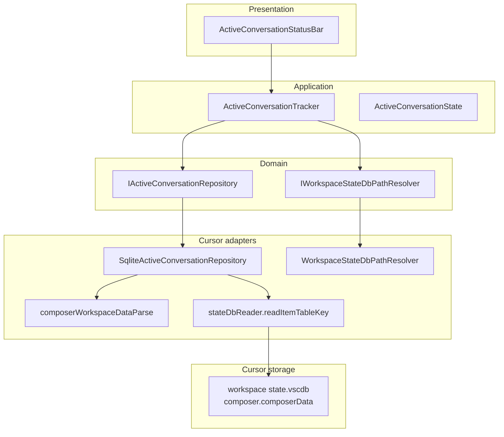

# Active Conversation Detection

How to determine which Composer/Agent chat tab is **focused** in the active Cursor window — without inferring it from `lastUpdatedAt` or proxy traffic.

**Last reviewed:** 2026-06-05

Related: [PROXY-AGENT-IDS-AND-SUBAGENTS.md](PROXY-AGENT-IDS-AND-SUBAGENTS.md), [TOKENS-AND-USAGE.md](TOKENS-AND-USAGE.md), [ARCHITECTURE.md](ARCHITECTURE.md), [CONFIGURATION.md](CONFIGURATION.md)

---

## Problem

When multiple Agent chats are open in the same window, each may update Cursor storage and network traffic concurrently. These signals **do not** indicate which tab the user is looking at:

| Signal | Why it fails for “active tab” |
|--------|-------------------------------|
| `composer.composerHeaders` → `lastUpdatedAt` | Background agents keep writing; latest timestamp ≠ focused tab |
| MITM proxy `request_id` / `token_delta` | Reflects **network activity**, not UI focus |
| `AgentLiveUsageStatusBar` `activeSessionId` | Last session that received traffic |

We need the **UI focus** state Cursor persists when the user clicks a tab or opens a chat from history.

---

## Investigation summary

### No official push event

| Surface | Tab-switch support |
|---------|-------------------|
| VS Code extension API (`vscode.*`) | No composer-focus event |
| Cursor extension API (`vscode.cursor.*`) | MCP/plugins only — no chat focus |
| Cursor Hooks | Agent lifecycle (`beforeSubmitPrompt`, `sessionStart`, …) — **no** tab-focus hook |

Cursor writes focus state to SQLite; extensions must **poll** (or watch the DB file) to observe changes.

### Correct storage location: workspace `state.vscdb`

Active tab state is **per workspace window**, not in the profile-global DB.

```
{userDataDir}/User/workspaceStorage/{workspaceHash}/state.vscdb
```

Resolve `{workspaceHash}` from the extension host:

1. **Primary:** walk up from `ExtensionContext.storageUri` until `state.vscdb` is found (sibling of the hash folder).
2. **Fallback:** match `vscode.workspace.workspaceFolders` against `workspaceStorage/*/workspace.json`.

Cursor may store extension workspace data in any of these layouts:

| `storageUri` ends with | `state.vscdb` location |
|------------------------|-------------------------|
| `.../{hash}/vypdev.cursor-accounts` | `.../{hash}/state.vscdb` (common on Cursor) |
| `.../{hash}/globalStorage/vypdev.cursor-accounts` | `.../{hash}/state.vscdb` (VS Code style) |
| `.../{hash}/workspaceStorage/vypdev.cursor-accounts` | `.../{hash}/state.vscdb` |

The resolver must **not** assume a fixed `globalStorage/` segment — walking ancestors avoids resolving to `workspaceStorage/state.vscdb` (wrong).

Implementation: [`WorkspaceStateDbPathResolver`](../src/cursor/workspaceStateDbPathResolver.ts), [`findStateVscdbAncestor`](../src/cursor/workspaceStateDbPathResolver.ts).

### Authoritative key: `composer.composerData`

| Component | Value |
|-----------|-------|
| **Database** | Workspace `state.vscdb` |
| **Table** | `ItemTable` |
| **Key** | `composer.composerData` |
| **Constant** | `COMPOSER_WORKSPACE_DATA_KEY` in [`activeConversation.ts`](../src/application/types/activeConversation.ts) |

**Observed JSON shape:**

```json
{
  "selectedComposerIds": ["2ba3c59c-e1a9-4d76-88e9-898d6a87993b"],
  "lastFocusedComposerIds": ["2ba3c59c-e1a9-4d76-88e9-898d6a87993b"],
  "hasMigratedComposerData": true,
  "hasMigratedMultipleComposers": true
}
```

| Field | Meaning |
|-------|---------|
| `lastFocusedComposerIds` | Chat tab the user last clicked / focused — **primary signal** |
| `selectedComposerIds` | Tab(s) currently selected in the Composer panel (fallback when focus list is empty) |

### Identity mapping

The UUID in `lastFocusedComposerIds` is the same identifier used elsewhere:

| Location | Field | Same UUID? |
|----------|-------|------------|
| Workspace `composer.composerData` | `lastFocusedComposerIds[0]` | — |
| Global `composer.composerHeaders` | `allComposers[].composerId` | Yes |
| Agent bidi `BidiAppend` | `runRequest.conversationId` | Yes (= `conversation_id`) |
| Extension efficiency poller | `conversationId` in `PromptMetadata` | Yes (`composerId`) |
| Agent transcripts folder | `agent-transcripts/<uuid>/` | Usually parent `conversation_id` |

### What does **not** carry active tab

| Location | Notes |
|----------|-------|
| Global `state.vscdb` `composer.composerHeaders` | Lists all chats; `lastUpdatedAt` is activity, not focus |
| `applicationUser.composerState` | UI settings (modes, allowlists) — no active tab id |
| `workbench.backgroundComposer.persistentData` | Background composer sidebar — empty in desktop captures |
| Proxy JSONL (by default) | `conversation_id` only on `BidiAppend` when agent runs |

---

## Extension implementation (Clean Architecture)



### Layer map

| Layer | Artifact | Responsibility |
|-------|----------|----------------|
| Application | `ActiveConversationState`, `COMPOSER_WORKSPACE_DATA_KEY` | DTO + storage key constant |
| Domain | `IActiveConversationRepository`, `IWorkspaceStateDbPathResolver` | Ports |
| Adapter | `SqliteActiveConversationRepository` | Read `composer.composerData` via SQLite |
| Adapter | `WorkspaceStateDbPathResolver` | Map `storageUri` → workspace DB path |
| Adapter | `composerWorkspaceDataParse` | Parse JSON, map to DTO |
| Application service | `ActiveConversationTracker` | Poll + dedupe + notify listeners |
| Presentation | `ActiveConversationStatusBar` | Status bar item (dev/testing) |

Wiring: [`extension.ts`](../src/extension.ts) (composition root).

### Tracking algorithm

1. Every `cursorAccounts.debug.activeConversationPollIntervalMs` (default **400 ms**), read workspace `state.vscdb`.
2. Query `ItemTable` key `composer.composerData`.
3. Parse `lastFocusedComposerIds[0]` (fallback: `selectedComposerIds[0]`).
4. Compare JSON snapshot to previous; notify listeners only on change.
5. Status bar shows first 8 characters; tooltip shows full UUID and `selectedComposerIds`.

SQLite reads use the existing readonly copy path in [`stateDbReader.ts`](../src/modelEfficiency/stateDbReader.ts) with `SQLITE_BUSY` retries.

---

## Status bar (development / testing)

| Setting | Default | Effect |
|---------|---------|--------|
| `cursorAccounts.debug.showActiveConversationInStatusBar` | `true` | Show/hide the chat-id status bar item |
| `cursorAccounts.debug.activeConversationPollIntervalMs` | `400` | Poll interval (100–5000 ms) |

**Status bar item:** `$(comment-discussion) <first 8 chars of UUID>`

- Priority **98** (left of live agent usage at 99 and quota at 100).
- **Click** → `cursorAccounts.debug.copyActiveConversationId` copies the full UUID.

Disable in production workflows by setting `showActiveConversationInStatusBar` to `false`.

---

## Manual verification

```bash
DB="$HOME/Library/Application Support/Cursor/User/workspaceStorage/<hash>/state.vscdb"
watch -n 0.5 "sqlite3 -readonly \"$DB\" \
  \"SELECT value FROM ItemTable WHERE key='composer.composerData';\""
```

Switch Composer tabs and confirm `lastFocusedComposerIds` updates **without** sending a new prompt.

---

## Future work

| Item | Notes |
|------|-------|
| Filter live proxy status bar by active `conversation_id` | Requires wiring `ActiveConversationTracker` into `AgentLiveUsageStatusBar` |
| `fs.watch` on workspace `state.vscdb` | Could reduce poll frequency; SQLite locking still needs retries |
| Multi-select tabs | Validate behaviour when `selectedComposerIds.length > 1` |
| No workspace open | `storageUri` / `composer.composerData` unavailable — status bar shows “no chat” |

---

## Related documentation

| Document | Topic |
|----------|--------|
| [PROXY-AGENT-IDS-AND-SUBAGENTS.md](PROXY-AGENT-IDS-AND-SUBAGENTS.md) | `conversation_id` vs `request_id` |
| [ARCHITECTURE.md](ARCHITECTURE.md) | Layer diagram + active conversation flow |
| [CONFIGURATION.md](CONFIGURATION.md) | Debug settings |
