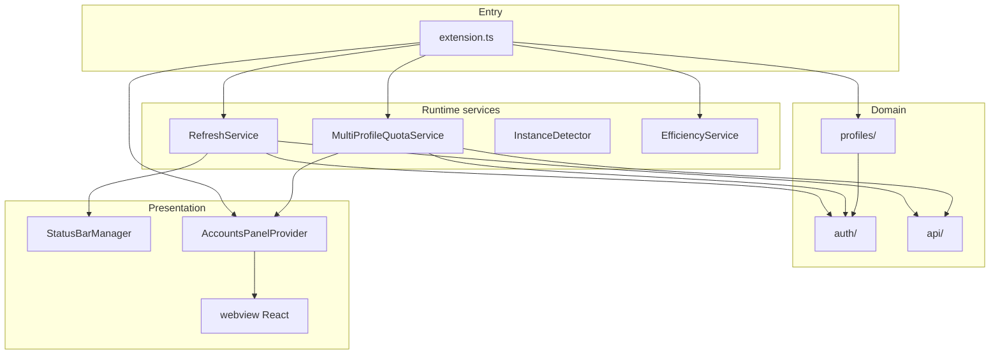
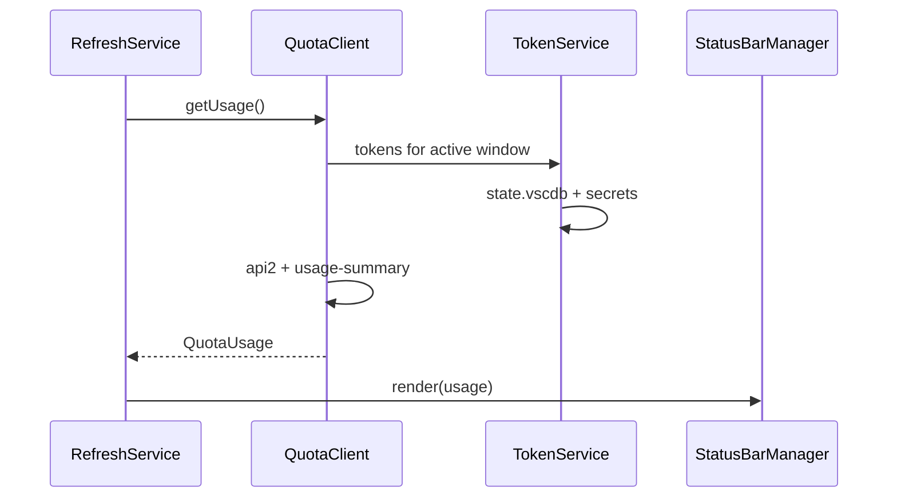
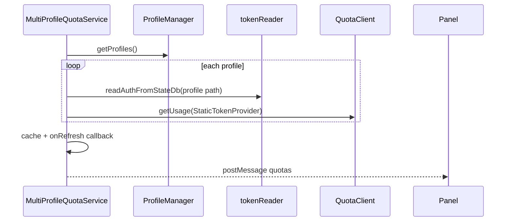

# Architecture — Cursor Accounts

This document describes how the extension is structured, how data flows, and why key decisions were made. For API and quota research, see [RESEARCH.md](RESEARCH.md). For multi-profile product behavior, see [FEATURE-MULTI-PROFILE.md](FEATURE-MULTI-PROFILE.md).

**Last reviewed:** 2026-05-29

## Overview

Cursor Accounts is a VS Code/Cursor extension (`vypdev.cursor-accounts`) that:

1. Shows **plan quota** in the status bar for the **active window**
2. Manages **multiple Cursor logins** via separate `--user-data-dir` profiles
3. Optionally runs **model efficiency analysis** on Composer prompts (`@cursor/sdk`)

There is no backend service. Everything runs in the **Extension Host**, with network calls only to `api2.cursor.sh` and `cursor.com`.

## High-level structure

### Layer responsibilities

| Layer | Path | Responsibility |
|-------|------|----------------|
| Composition root | `src/extension.ts` | `activate`/`deactivate`, DI wiring, migrations from `cursorQuota`, command registration |
| HTTP / types | `src/api/` | Quota, usage summary, user, team metadata, leaderboard clients |
| Local auth | `src/auth/` | Read `state.vscdb`, OAuth refresh, `TokenProvider` abstraction |
| Profiles | `src/profiles/` | Config JSON, CRUD, detect active dir, launch instances, import/export |
| Scheduling | `src/services/` | Interval refresh for status bar and all-profile quotas |
| UI (host) | `src/ui/` | Status bar items, webview provider and message routing |
| Efficiency | `src/modelEfficiency/` | Composer DB poll, SDK classify, output channel |
| Webview | `webview/src/` | React Accounts panel (profiles, quotas, actions) |

## Architectural patterns

- **Modular layers**, not MVC: services + providers + typed message bus
- **Manual dependency injection** in `extension.ts` (no DI framework)
- **Polling workers** (`RefreshService`, `MultiProfileQuotaService`, `InstanceDetector`) with callbacks instead of a global event bus
- **Host–webview protocol**: discriminated unions `ToWebviewMessage` / `FromWebviewMessage` in `src/profiles/types.ts`
- **TokenProvider strategy**: `TokenService` for active window; `StaticTokenProvider` per profile when reading other `userDataDir` trees

## Two quota pipelines

Quota for the **current window** and quota for **all configured profiles** are intentionally separate.

| Pipeline | Service | Token source | UI consumer |
|----------|---------|--------------|-------------|
| Active window | `RefreshService` | `TokenService` + active `state.vscdb` | Status bar |
| All profiles | `MultiProfileQuotaService` | Per-profile `state.vscdb` | Accounts webview |

## Multi-profile model

- **Config:** `~/.cursor-accounts/config.json` — profile metadata only (no tokens)
- **Isolation:** each profile uses its own `--user-data-dir` (e.g. `~/.cursor-{slug}`)
- **Detection:** `ProfileDetector` derives the active directory from `context.globalStorageUri` (preferred) with env/argv fallbacks
- **Launch:** `ProfileLauncher` spawns Cursor per platform (`open -na` on macOS)
- **Running instances:** `InstanceDetector` parses OS process lists for `--user-data-dir`

Implementation references:

| Concern | Primary modules |
|---------|-----------------|
| Types and messages | `src/profiles/types.ts` |
| CRUD | `src/profiles/profileManager.ts`, `profileStorage.ts` |
| Launch / detect | `src/profiles/profileLauncher.ts`, `profileDetector.ts`, `instanceDetector.ts` |
| Panel orchestration | `src/ui/accountsPanel.ts` |
| Commands | `src/commands/profileCommands.ts` |

## Webview integration

1. `AccountsPanelProvider` implements `WebviewViewProvider`
2. Built assets served from `webview-dist/` (esbuild)
3. CSP with nonce; no arbitrary remote scripts
4. User actions (`launch`, `addProfile`, `setEfficiency`, etc.) are messages handled in the provider, which delegates to domain services

React UI: `webview/src/App.tsx` and components under `webview/src/components/`.

## Model efficiency (optional feature)

Scoped submodule under `src/modelEfficiency/`:

- `ApiKeyManager` — creates Cursor API key via session
- `ComposerDbPoller` — polls active profile `state.vscdb` for new user bubbles
- `EfficiencyAnalyzer` / `SdkClassifier` — `@cursor/sdk`
- `OutputPresenter` — VS Code output channel

Enabled only for the **active window’s profile**; secrets live in that window’s extension host.

## External dependencies

| Dependency | Role |
|------------|------|
| `@cursor/sdk` | Model efficiency classification only |
| Bundled SQLite 3.53.1 (`bin/`) | Read locked/large `state.vscdb` copies |
| VS Code API | Status bar, webview, secrets, configuration |

## Security boundaries

- Read-only access to each profile’s `state.vscdb`
- `validateUserDataPath()` before reading or launching under a profile directory
- No SQLite snapshot swapping between accounts
- Network: only Cursor endpoints (see RESEARCH.md)

## Error handling conventions

- **Multi-item operations** use `Promise.allSettled` (quota fetch, import) — partial success is shown, not rolled back
- **Atomic config writes** via temp file + rename in `ProfileStorage`
- User messages should be specific and actionable (profile name + failure reason)

## Testing layout

- **Runner:** Node.js `node:test` on compiled `out/test/**/*.test.js`
- **Mocks:** `src/test/registerVscodeMock.ts` for `vscode` module
- **Fixtures:** process output samples under `src/test/fixtures/`
- **Gaps:** minimal coverage for `extension.ts`, full `StatusBarManager`, and webview React (prefer extracting pure handlers for tests)

## Known maintainability notes

These are documented for contributors; they are not blockers for users.

- `extension.ts` concentrates wiring and migrations (~200 lines)
- `accountsPanel.ts` and `instanceDetector.ts` are large orchestration files
- HTTP clients in `src/api/` share similar fetch/error patterns (candidate for a small internal helper)
- `RefreshService` creates an `AbortController` that is not wired to in-flight fetch cancellation today

## Related documentation

- [README.md](../README.md) — install, settings, troubleshooting
- [CONTRIBUTING.md](../CONTRIBUTING.md) — dev setup and PR process
- [RESEARCH.md](RESEARCH.md) — quota APIs and account-switching limits
- [FEATURE-MULTI-PROFILE.md](FEATURE-MULTI-PROFILE.md) — product flows and terminology
