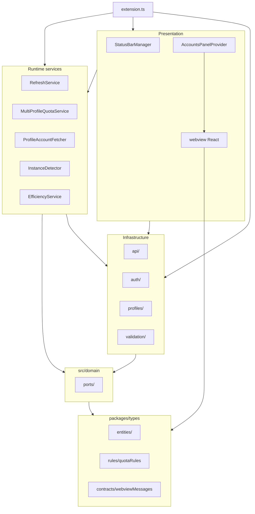
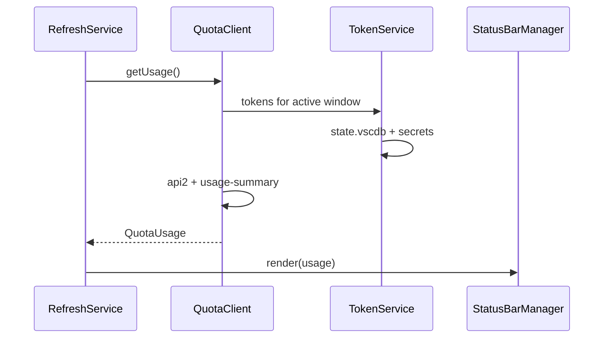
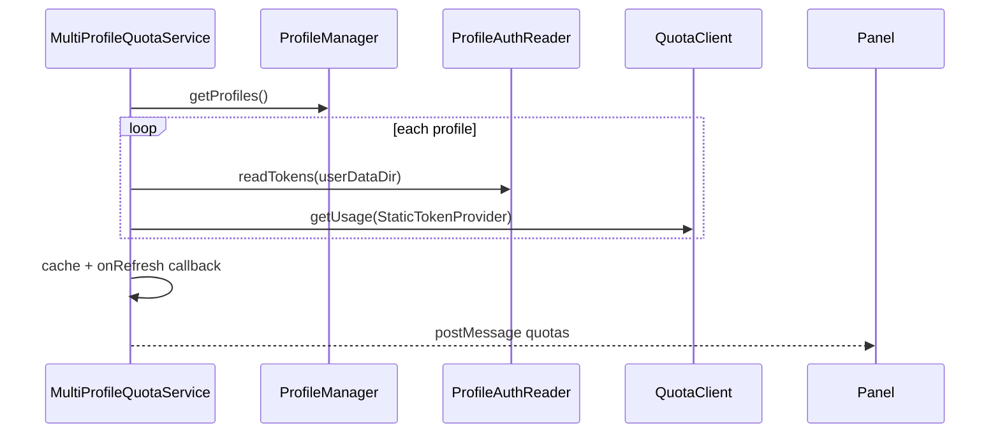

# Architecture — Cursor Accounts

This document describes how the extension is structured, how data flows, and why key decisions were made. For API and quota research, see [RESEARCH.md](RESEARCH.md). For multi-profile product behavior, see [FEATURE-MULTI-PROFILE.md](FEATURE-MULTI-PROFILE.md).

**Last reviewed:** 2026-06-01

## Overview

Cursor Accounts is a VS Code/Cursor extension (`vypdev.cursor-accounts`) that:

1. Shows **plan quota** in the status bar for the **active window**
2. Manages **multiple Cursor logins** via separate `--user-data-dir` profiles
3. Optionally runs **model efficiency analysis** on Composer prompts (`@cursor/sdk`)

There is no backend service. Everything runs in the **Extension Host**, with network calls only to `api2.cursor.sh` and `cursor.com`.

## Monorepo layout

| Package | Path | Role |
|---------|------|------|
| Extension host | `src/` | VS Code extension (TypeScript → `out/`) |
| Shared types | `packages/types` (`@cursor-accounts/types`) | Entities, quota rules, webview contracts |
| Webview UI | `webview/` | React Accounts panel (bundled to `webview-dist/`) |

The shared types package has **no dependencies** on VS Code or Node APIs. Extension and webview both consume it; the webview talks to the host only via `postMessage`.

## High-level structure

### Layer responsibilities

| Layer | Path | Responsibility |
|-------|------|----------------|
| Composition root | `src/extension.ts` | `activate`/`deactivate`, DI wiring, migrations from `cursorQuota`, command registration |
| Domain ports | `src/domain/ports/` | `IQuotaService`, `ITokenProvider`, `IProfileStorage`, `IProfileAuthReader`, `IUserService`, `IActivityLeaderboardService` |
| Shared kernel | `packages/types/` | Entities, quota business rules, webview message contracts |
| HTTP / adapters | `src/api/` | Quota, usage summary, user, team metadata, leaderboard clients; DTO→domain mappers in `quotaMappers.ts` |
| Local auth | `src/auth/` | Read `state.vscdb`, OAuth refresh, `ProfileAuthReader`, token providers |
| Profiles | `src/profiles/` | Config JSON, CRUD, detect active dir, launch instances, import/export |
| Validation | `src/validation/` | Zod schemas for IDE OAuth and export payloads |
| Migrations | `src/migrations/` | Settings/secrets migration from legacy `cursor-quota` |
| Scheduling | `src/services/` | Interval refresh for status bar and all-profile quotas |
| UI (host) | `src/ui/` | Status bar items, webview provider and message routing |
| Efficiency | `src/modelEfficiency/` | Composer DB poll, SDK classify, output channel |
| Webview | `webview/src/` | React Accounts panel (profiles, quotas, actions) |

## Architectural patterns

- **Hexagonal / ports-and-adapters**: domain ports implemented by infrastructure (`QuotaClient`, `UserClient`, `ActivityLeaderboardService`, `ProfileStorage`, `ProfileAuthReader`, `TokenService`)
- **Shared kernel**: `@cursor-accounts/types` for entities, rules, and host↔webview contracts (`contracts/webviewMessages.ts`)
- **Manual dependency injection** in `extension.ts` (no DI framework)
- **Polling workers** (`RefreshService`, `MultiProfileQuotaService`, `InstanceDetector`) with callbacks instead of a global event bus
- **TokenProvider strategy**: `TokenService` for active window; `StaticTokenProvider` per profile when reading other `userDataDir` trees via `IProfileAuthReader`
- **Service composition**: `RefreshService` and `MultiProfileQuotaService` depend on domain ports; `extension.ts` wires concrete adapters (`QuotaClient`, `UserClient`, `ActivityLeaderboardService`)

## Dependency rules (enforced by ESLint)

| Layer | May import from |
|-------|-----------------|
| `packages/types` | TypeScript only |
| `src/domain` | `@cursor-accounts/types`, local ports |
| `src/api`, `src/auth`, `src/profiles` | `domain`, `@cursor-accounts/types`, utilities |
| `src/services`, `src/ui` | `domain`, infrastructure modules, `@cursor-accounts/types` |
| `extension.ts` | All layers (composition root) |

**Not allowed:** `api` → `ui`; `profiles` → `ui`; `domain` → outer layers.

ESLint enforces import boundaries for `domain`, `api`, `profiles`, and `services`. `ui/` relies on convention and code review.

## Structural migration (2026-06)

Earlier refactors introduced a short-lived `src/application/` layer (mappers and profile models). That layer was removed in favor of:

| Former location | Current location |
|-----------------|------------------|
| `src/application/mappers/quotaMappers.ts` | `src/api/quotaMappers.ts` |
| `src/application/models/profileModels.ts` | `@cursor-accounts/types` entities + `src/profiles/types.ts` re-exports |
| `packages/types/src/messages/webviewMessages.ts` | `packages/types/src/contracts/webviewMessages.ts` |

There is **no** `src/application/` directory. DTO mappers live alongside HTTP clients in `src/api/`. Runtime services in `src/services/` orchestrate workflows and receive port implementations from `extension.ts`.

## Two quota pipelines

Quota for the **current window** and quota for **all configured profiles** are intentionally separate.

| Pipeline | Service | Token source | UI consumer |
|----------|---------|--------------|-------------|
| Active window | `RefreshService` | `TokenService` + active `state.vscdb` | Status bar |
| All profiles | `MultiProfileQuotaService` | `IProfileAuthReader` per profile | Accounts webview |

## Multi-profile model

- **Config:** `~/.cursor-accounts/config.json` — profile metadata only (no tokens)
- **Isolation:** each profile uses its own `--user-data-dir` (e.g. `~/.cursor-{slug}`)
- **Detection:** `ProfileDetector` derives the active directory from `context.globalStorageUri` (preferred) with env/argv fallbacks
- **Launch:** `ProfileLauncher` spawns Cursor per platform (`open -na` on macOS)
- **Running instances:** `InstanceDetector` parses OS process lists for `--user-data-dir`

Implementation references:

| Concern | Primary modules |
|---------|-----------------|
| Shared types and contracts | `packages/types/src/` |
| Domain ports | `src/domain/ports/` |
| CRUD | `src/profiles/profileManager.ts`, `profileStorage.ts` |
| Launch / detect | `src/profiles/profileLauncher.ts`, `profileDetector.ts`, `instanceDetector.ts` |
| Panel orchestration | `src/ui/accountsPanel.ts`, `src/ui/accountsPanelHandlers.ts` |
| Account metadata | `src/services/profileAccountFetcher.ts` |
| Commands | `src/commands/profileCommands.ts` |

## Webview integration

1. `AccountsPanelProvider` implements `WebviewViewProvider`
2. Built assets served from `webview-dist/` (esbuild)
3. CSP with nonce; no arbitrary remote scripts
4. User actions (`launch`, `add`, `edit`, `delete`, `export`, `import`, `toggleEfficiency`, etc.) are messages defined in `packages/types/src/contracts/webviewMessages.ts`

React UI: `webview/src/App.tsx` and components under `webview/src/components/`.

Type sync is validated in CI via `pnpm run test:types-sync`.

## Model efficiency (optional feature)

Scoped submodule under `src/modelEfficiency/`:

- `ApiKeyManager` — creates Cursor API key via session
- `ComposerDbPoller` — polls active profile `state.vscdb` for new user bubbles
- `EfficiencyAnalyzer` / `SdkClassifier` — `@cursor/sdk`
- `OutputPresenter` — VS Code output channel

Enabled only for the **active window’s profile**; secrets live in that window’s extension host.

## External dependencies

| Dependency | Role |
|------------|------|
| `@cursor-accounts/types` | Shared entities, rules, webview contracts |
| `@cursor/sdk` | Model efficiency classification only |
| `zod` | API response validation (IDE usage, OAuth, export) |
| Bundled SQLite 3.53.1 (`bin/`) | Read locked/large `state.vscdb` copies |
| VS Code API | Status bar, webview, secrets, configuration |

## Security boundaries

- Read-only access to each profile’s `state.vscdb`
- `validateUserDataPath()` before reading or launching under a profile directory
- No SQLite snapshot swapping between accounts
- Network: only Cursor endpoints (see RESEARCH.md)

## Error handling conventions

- **Multi-item operations** use `Promise.allSettled` (quota fetch, import) — partial success is shown, not rolled back
- **Atomic config writes** via temp file + rename in `ProfileStorage`
- User messages should be specific and actionable (profile name + failure reason)

## Testing layout

- **Runner:** Node.js `node:test` on compiled `out/test/**/*.test.js`
- **Mocks:** `src/test/registerVscodeMock.ts` for `vscode` module
- **Fixtures:** process output samples under `src/test/fixtures/`
- **CI:** `pnpm test`, `pnpm run test:types-sync`, `pnpm --dir webview test`, ESLint layer rules
- **Canonical quota rule tests:** `src/test/domain/quotaRules.test.ts` (imports `@cursor-accounts/types` directly)

## Known maintainability notes

- `extension.ts` concentrates wiring and migrations (~270 lines)
- `accountsPanel.ts` delegates webview user actions to `accountsPanelHandlers.ts`; `instanceDetector.ts` remains a large orchestration file (candidate for further extraction)
- HTTP clients in `src/api/` share similar fetch/error patterns (candidate for a small internal helper)
- `RefreshService` creates an `AbortController` that is not wired to in-flight fetch cancellation today

## Related documentation

- [HOW-IT-WORKS.md](HOW-IT-WORKS.md) — user-facing technical overview
- [FEATURE-MULTI-PROFILE.md](FEATURE-MULTI-PROFILE.md) — product flows and terminology
- [RESEARCH.md](RESEARCH.md) — quota APIs and account-switching limits
- [README.md](../README.md) — project overview and documentation index
- [CONTRIBUTING.md](../CONTRIBUTING.md) — dev setup and PR process
