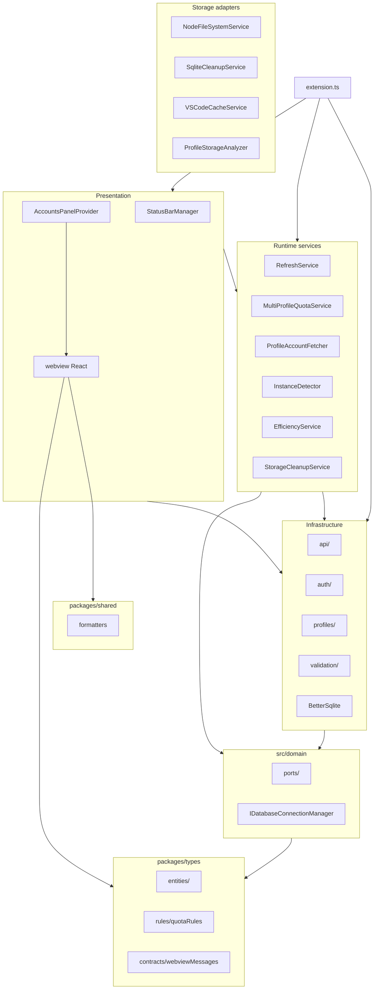
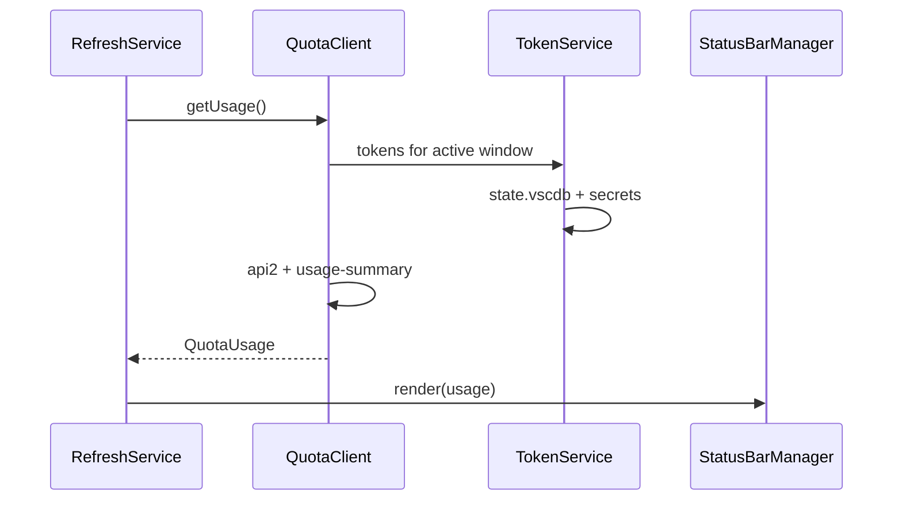
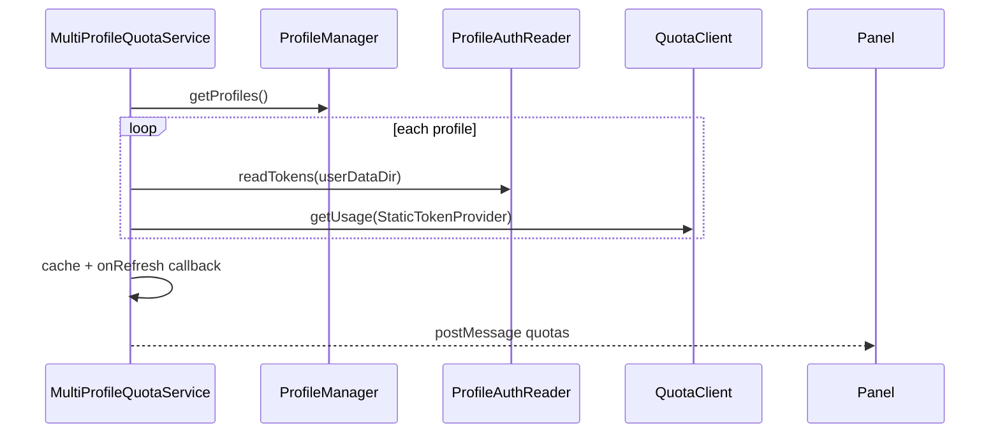
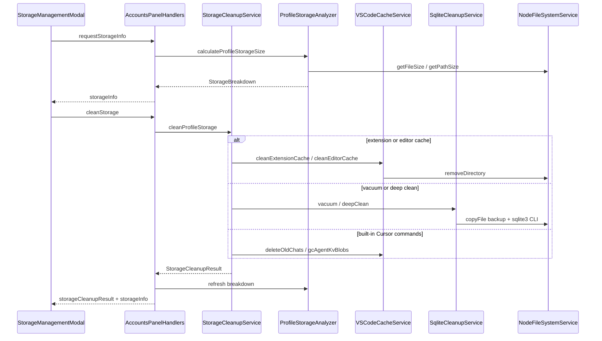
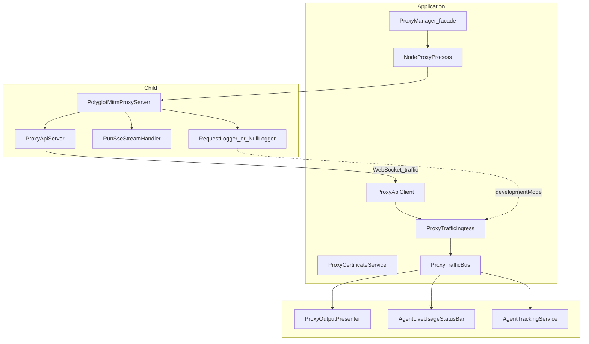
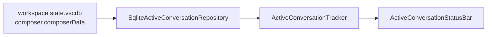

# Architecture — Cursor Accounts

This document describes how the extension is structured, how data flows, and why key decisions were made. For API and quota research, see [RESEARCH.md](RESEARCH.md). For multi-profile product behavior, see [FEATURE-MULTI-PROFILE.md](FEATURE-MULTI-PROFILE.md).

**Last reviewed:** 2026-08-24

## Overview

Cursor Accounts is a VS Code/Cursor extension (`vypdev.cursor-accounts`) that:

1. Shows **plan quota** in the status bar for the **active window**
2. Manages **multiple Cursor logins** via separate `--user-data-dir` profiles
3. Optionally runs **model efficiency analysis** on Composer prompts (`@cursor/sdk`)

There is no backend service. Everything runs in the **Extension Host**, with network calls to `api2.cursor.sh` and `cursor.com`. An optional **localhost MITM proxy** (child process) can intercept Cursor traffic for research; see [PROXY-SETUP.md](PROXY-SETUP.md) and [TOKENS-AND-USAGE.md](TOKENS-AND-USAGE.md).

## Monorepo layout

| Package | Path | Role |
|---------|------|------|
| Extension host | `src/` | VS Code extension (TypeScript → `out/`) |
| Shared types | `packages/types` (`@cursor-accounts/types`) | Entities, quota rules, webview contracts |
| Shared utilities | `packages/shared` (`@cursor-accounts/shared`) | Pure presentation helpers (e.g. `formatBytes`, `formatMembershipType`) with no VS Code/Node deps |
| Webview UI | `webview/` | React Accounts panel (bundled to `webview-dist/`) |

The shared types package has **no dependencies** on VS Code or Node APIs. `@cursor-accounts/shared` is likewise dependency-free and safe for both extension and webview. Extension and webview both consume `types`; formatters live in `shared`. The webview talks to the host only via `postMessage`.

## Database Architecture (better-sqlite3)

Agent tracking uses **`better-sqlite3`** with persistent connections:

- **Implementation**: `better-sqlite3` native module with persistent connections
- **Architecture**: Clean Architecture with dependency inversion
  - **Domain port**: `src/domain/ports/IDatabaseConnectionManager.ts`
  - **Infrastructure adapter**: `src/persistence/betterSqlite/betterSqliteConnectionManager.ts`
  - **Repositories**: `BetterSqliteAgentTrackingRepository`
- **Benefits**: WAL mode + busy_timeout eliminates lock errors, supports transactions, 10-100x faster
- **Multi-window**: Each VS Code window maintains its own connection; SQLite WAL handles concurrent access

Efficiency stats (`EfficiencyDatabase`) still uses the CLI subprocess model temporarily.

See [ADR-001](adr/001-migrate-to-better-sqlite3.md) and [ADR-002](adr/002-connection-manager-design.md) for detailed rationale.

## High-level structure

### Layer responsibilities

| Layer | Path | Responsibility |
|-------|------|----------------|
| Composition root | `src/extension.ts`, `src/composition/` | `activate`/`deactivate`, DI wiring, storage service factory, migrations from `cursorQuota`, command registration |
| Domain ports | `src/domain/ports/` | `IQuotaService`, `ITokenProvider`, `IProfileStorage`, `IProfileManager`, `IProfileDetector`, `IProfileLauncher`, `IInstanceDetector`, `IProfileAuthReader`, `IUserService`, `IActivityLeaderboardService`, `IStorageCleanupService`, `IFileSystemService`, `IDatabaseCleanupService`, `ICacheCleanupService`, `IProfileStorageAnalyzer`, `IProxyManager`, `IProxyServer`, `IProtocolAdapter`, `IAgentTrackingRepository`, `ITokenTurnDetectionService`, `IActiveConversationRepository`, `IWorkspaceStateDbPathResolver` |
| Application types | `src/application/types/` | Cross-layer DTOs (`AgentSessionInfo`, `ProxyServerConfig`, `ProxyLogEntry`, agent persistence records) |
| Shared kernel | `packages/types/` | Entities, quota business rules, webview message contracts |
| HTTP / adapters | `src/api/` | Quota, usage summary, user, team metadata, leaderboard clients; DTO→domain mappers in `quotaMappers.ts` |
| Local auth | `src/auth/` | Read `state.vscdb`, OAuth refresh, `ProfileAuthReader`, token providers |
| Profiles | `src/profiles/` | Config JSON, CRUD, detect active dir, launch instances, import/export |
| Validation | `src/validation/` | Zod schemas for IDE OAuth and export payloads |
| Migrations | `src/migrations/` | Settings/secrets migration from legacy `cursor-quota` |
| Scheduling | `src/services/` | Interval refresh for status bar and all-profile quotas; storage cleanup orchestration |
| Storage adapters | `src/storage/` | Filesystem, SQLite maintenance, VS Code cache/command cleanup, profile storage analysis |
| UI (host) | `src/ui/` | Status bar items, webview provider and message routing |
| Active conversation | `src/cursor/`, `src/services/activeConversationTracker.ts` | Read workspace `composer.composerData`, poll focus changes |
| Efficiency | `src/modelEfficiency/` | Composer DB poll, SDK classify, output channel, model catalog + pricing adapters |
| Pricing (display) | `src/services/modelPricingService.ts` | Combine catalog + official per-model pricing for Accounts panel modal |
| Proxy (optional) | `src/proxy/`, `src/services/proxyManager.ts` | MITM child process, decode, traffic tail, live usage status bar |
| Webview | `webview/src/` | React Accounts panel (profiles, quotas, actions) |

## Architectural patterns

- **Hexagonal / ports-and-adapters**: domain ports implemented by infrastructure (`QuotaClient`, `UserClient`, `ActivityLeaderboardService`, `ProfileStorage`, `ProfileAuthReader`, `TokenService`)
- **Shared kernel**: `@cursor-accounts/types` for entities, rules, and host↔webview contracts (`contracts/webviewMessages.ts`)
- **Manual dependency injection** in `extension.ts` (no DI framework)
- **Polling workers** (`RefreshService`, `MultiProfileQuotaService`, `InstanceDetector`) with callbacks instead of a global event bus
- **TokenProvider strategy**: `TokenService` for active window; `StaticTokenProvider` per profile when reading other `userDataDir` trees via `IProfileAuthReader`
- **Service composition**: `RefreshService` and `MultiProfileQuotaService` depend on domain ports; `extension.ts` wires concrete adapters (`QuotaClient`, `UserClient`, `ActivityLeaderboardService`)

## Dependency rules (enforced by ESLint)

| Layer | May import from |
|-------|-----------------|
| `packages/types` | TypeScript only |
| `packages/shared` | TypeScript only |
| `src/domain` | `@cursor-accounts/types`, local ports |
| `src/api`, `src/auth`, `src/profiles` | `domain`, `@cursor-accounts/types`, `@cursor-accounts/shared`, utilities |
| `src/services`, `src/ui` | `domain`, infrastructure modules, `@cursor-accounts/types`, `@cursor-accounts/shared` |
| `extension.ts` | All layers (composition root) |

**Not allowed:** `api` → `ui`; `profiles` → `ui`; `domain` → outer layers.

ESLint enforces import boundaries for `domain`, `api`, `profiles`, and `services`. The reproducible `pnpm run check:architecture` gate also scans relative imports, rejects forbidden inward-boundary violations, and fails on static import cycles. `ui/` relies on convention and code review.

## Structural migration (2026-06)

Earlier refactors introduced a short-lived `src/application/` layer (mappers and profile models). That layer was removed in favor of:

| Former location | Current location |
|-----------------|------------------|
| `src/application/mappers/quotaMappers.ts` | `src/api/quotaMappers.ts` |
| `src/application/models/profileModels.ts` | `@cursor-accounts/types` entities + `src/profiles/types.ts` re-exports |
| `packages/types/src/messages/webviewMessages.ts` | `packages/types/src/contracts/webviewMessages.ts` |

There is **no** `src/application/` directory. DTO mappers live alongside HTTP clients in `src/api/`. Runtime services in `src/services/` orchestrate workflows and receive port implementations from `extension.ts`.

## Two quota pipelines

Quota for the **current window** and quota for **all configured profiles** are intentionally separate.

| Pipeline | Service | Token source | UI consumer |
|----------|---------|--------------|-------------|
| Active window | `RefreshService` | `TokenService` + active `state.vscdb` | Status bar |
| All profiles | `MultiProfileQuotaService` | `IProfileAuthReader` per profile | Accounts webview |

## Multi-profile model

- **Config:** `~/.cursor-accounts/config.json` — profile metadata only (no tokens)
- **Isolation:** each profile uses its own `--user-data-dir` (e.g. `~/.cursor-{slug}`)
- **Detection:** `ProfileDetector` derives the active directory from `context.globalStorageUri` (preferred) with env/argv fallbacks
- **Launch:** `ProfileLauncher` spawns Cursor per platform (`open -na` on macOS)
- **Running instances:** `InstanceDetector` parses OS process lists for `--user-data-dir`

Implementation references:

| Concern | Primary modules |
|---------|-----------------|
| Shared types and contracts | `packages/types/src/` |
| Domain ports | `src/domain/ports/` |
| CRUD | `src/profiles/profileManager.ts`, `profileStorage.ts` |
| Launch / detect | `src/profiles/profileLauncher.ts`, `profileDetector.ts`, `instanceDetector.ts` |
| Panel orchestration | `src/ui/accountsPanel.ts`, `src/ui/accountsPanelHandlers.ts` |
| Account metadata | `src/services/profileAccountFetcher.ts` |
| Commands | `src/commands/profileCommands.ts` |

## Webview integration

1. `AccountsPanelProvider` implements `WebviewViewProvider`
2. Built assets served from `webview-dist/` (esbuild)
3. CSP with nonce; no arbitrary remote scripts
4. User actions (`launch`, `add`, `edit`, `delete`, `export`, `import`, `toggleEfficiency`, `requestStorageInfo`, `cleanStorage`, etc.) are messages defined in `packages/types/src/contracts/webviewMessages.ts`

React UI: `webview/src/App.tsx` and components under `webview/src/components/`.

Type sync is validated in CI via `pnpm run test:types-sync`.

## Model efficiency (optional feature)

Scoped submodule under `src/modelEfficiency/`:

- `ApiKeyManager` — creates Cursor API key via session
- `ComposerDbPoller` — polls active profile `state.vscdb` for new user bubbles
- `EfficiencyAnalyzer` / `SdkClassifier` — `@cursor/sdk`
- `OutputPresenter` — VS Code output channel
- `CursorModelPricingProvider` / `StateDbModelCatalogRepository` — official model pricing + catalog for Accounts **Prices** modal

Enabled only for the **active window’s profile**; secrets live in that window’s extension host.

## Storage management

The Accounts panel **File Management** modal lets users inspect per-profile disk usage and run cleanup actions.

| Component | Path | Role |
|-----------|------|------|
| Domain entities | `packages/types/src/entities/StorageInfo.ts` | `StorageBreakdown`, `StorageCleanupOptions`, `StorageCleanupResult` |
| Ports | `src/domain/ports/IStorageCleanupService.ts`, `IFileSystemService.ts`, etc. | Hexagonal boundaries for cleanup orchestration |
| Orchestrator | `src/services/storageCleanupService.ts` | Validates profile state, dispatches cleanup actions |
| Filesystem adapter | `src/storage/nodeFileSystemService.ts` | Node.js `fs/promises` implementation |
| SQLite adapter | `src/storage/sqliteCleanupService.ts` | `VACUUM` and deep clean via bundled `sqlite3` |
| Cache adapter | `src/storage/vscodeCacheService.ts` | Editor cache dirs + extension globalState + VS Code commands |
| Size analyzer | `src/storage/profileStorageAnalyzer.ts` | Per-profile storage breakdown |
| UI | `webview/src/components/StorageManagementModal.tsx` | Breakdown table and cleanup actions |

**Cleanup action requirements:**

| Action | Profile state | Data loss risk |
|--------|---------------|----------------|
| `cleanExtensionCache` | Any | None (extension cache only) |
| `deleteOldChats` | Must be active in current window | Old chats only |
| `gcAgentKvBlobs` | Must be active in current window | None |
| `cleanEditorCache` | Must be closed | None (cache rebuilds on launch) |
| `vacuumDatabase` | Must be closed | None (compacts DB) |
| `deepCleanDatabase` | Must be closed | Deletes composer/agent KV rows; backup created first |

**Security:** All profile paths are validated with `validateUserDataPath()` in `src/utils/pathUtils.ts` before filesystem or SQLite access. Database paths are additionally checked with `validateStateDbPath()` in the same module (not in `auth/`).

## External dependencies

| Dependency | Role |
|------------|------|
| `@cursor-accounts/types` | Shared entities, rules, webview contracts |
| `@cursor/sdk` | Model efficiency classification only |
| `zod` | API response validation (IDE usage, OAuth, export) |
| Bundled SQLite 3.53.1 (`bin/`) | Read locked/large `state.vscdb` copies |
| VS Code API | Status bar, webview, secrets, configuration |

## Security boundaries

- Read-only access to each profile’s `state.vscdb`
- `validateUserDataPath()` before reading or launching under a profile directory
- No SQLite snapshot swapping between accounts
- Network: only Cursor endpoints (see RESEARCH.md)

## Error handling conventions

- **Multi-item operations** use `Promise.allSettled` (quota fetch, import) — partial success is shown, not rolled back
- **Atomic config writes** via temp file + rename in `ProfileStorage`
- User messages should be specific and actionable (profile name + failure reason)

## Testing layout

- **Runner:** Node.js `node:test` on compiled `out/test/**/*.test.js`
- **Mocks:** `src/test/registerVscodeMock.ts` for `vscode` module
- **Fixtures:** process output samples under `src/test/fixtures/`
- **CI:** `pnpm test`, `pnpm run test:types-sync`, ESLint layer rules
- **Canonical quota rule tests:** `src/test/domain/quotaRules.test.ts` (imports `@cursor-accounts/types` directly)
- **Webview protocol tests:** `src/test/accountsPanel.test.ts` (extension-side webview messaging and HTML setup)
- **Storage tests:** `src/test/storageSize.test.ts`, `src/test/storageCleanupService.test.ts`, `src/test/storageCleanupService.full.test.ts`, `src/test/accountsPanelHandlers.storage.test.ts`, `src/test/fileSystemErrors.test.ts`
- **Model pricing tests:** `src/test/modelEfficiency/cursorModelPricingProvider.test.ts`, `src/test/services/modelPricingService.test.ts`, `src/test/modelPricingIntegration.test.ts`

## Optional MITM proxy subsystem

When enabled, a **single shared child Node process** runs [`PolyglotMitmProxyServer`](../src/proxy/polyglotMitmProxyServer.ts) on `127.0.0.1:8080` for all profiles. The proxy detects profile (JWT) and workspace (protobuf), filters agent-only traffic, and persists metrics via [`SqliteAgentTrackingDbPool`](../src/persistence/betterSqlite/sqliteAgentTrackingDbPool.ts). See [SHARED-PROXY.md](SHARED-PROXY.md).

Decoded traffic summaries and lifecycle control use a **localhost HTTP/WebSocket API** (`src/proxy/api/`) so any VS Code window can attach independently. JSONL is written when per-profile development logging is enabled. See [PROXY-API-REFERENCE.md](PROXY-API-REFERENCE.md), [HTTP2-PROXY-IMPLEMENTATION.md](HTTP2-PROXY-IMPLEMENTATION.md), and [CLEAN-ARCHITECTURE-PRINCIPLES.md](CLEAN-ARCHITECTURE-PRINCIPLES.md).

| Component | Path | Role |
|-----------|------|------|
| Facade | `src/services/proxyManager.ts` | Coordinates process, certs, settings, API attach, traffic bus |
| Process | `src/proxy/nodeProxyProcess.ts` (`IProxyProcess`) | Spawn child (no IPC); readiness via API health poll; stop via API + SIGTERM/SIGKILL |
| API server | `src/proxy/api/proxyApiServer.ts` (`IProxyApiServer`) | Localhost REST + WebSocket control plane in child |
| API client | `src/proxy/api/proxyApiClient.ts` (`IProxyApiClient`) | Extension-side HTTP/WS consumer (multi-window) |
| Certificates | `src/services/proxyCertificateService.ts` | CA trust and install guide |
| Traffic bus | `src/application/services/proxyTrafficBus.ts` | Pub/sub for `ProxyTrafficSummary` |
| Traffic ingress | `src/proxy/proxyTrafficIngress.ts` | WebSocket API attach + optional JSONL tail |
| MITM | `src/proxy/polyglotMitmProxyServer.ts` | HTTP/1.x + HTTP/2 capture (`IProxyServer`) |
| DB pool | `src/persistence/betterSqlite/sqliteAgentTrackingDbPool.ts` (`IAgentTrackingDbPool`) | Per-profile better-sqlite3 connections in shared proxy child |
| Agent ingress | `src/proxy/proxyAgentTrackingIngress.ts` | Filters agent metrics; persists via pool in child |
| RunSSE | `src/proxy/capture/runSseStreamHandler.ts` | Live `token_delta` / `turn_ended` summaries |
| Logging | `src/proxy/requestLogger.ts` | JSONL when development logging is enabled |
| Presentation | `src/ui/presentation/`, `src/ui/agentLiveUsageStatusBar.ts` | Output channels and status bar |

Token semantics and billing channels: [TOKENS-AND-USAGE.md](TOKENS-AND-USAGE.md). JSONL schema: [PROXY-JSONL-SCHEMA.md](PROXY-JSONL-SCHEMA.md). Agent/subagent IDs and parallel workers: [PROXY-AGENT-IDS-AND-SUBAGENTS.md](PROXY-AGENT-IDS-AND-SUBAGENTS.md). User setup: [PROXY-SETUP.md](PROXY-SETUP.md).

The live usage status bar keys sessions by bidi `request_id` and **sums** all active sessions (including parallel subagents, each with its own id). Parent/child subagent linkage is extracted from nested Agent messages when present (`runRequest`, `subagent_result`, etc.) and persisted via `AgentTrackingService`.

### Live agent tokens and turn persistence

**Live UI (primary):** [`StreamingAgentDecoder`](../src/proxy/streamingAgentDecoder.ts) in `mitmProxyServer` emits incremental `token_delta` summaries (`isLiveTokenUpdate`) and billing-grade `turn_ended` rows (`isTurnEnded`) to the proxy API WebSocket. [`AgentLiveUsageStatusBar`](../src/ui/agentLiveUsageStatusBar.ts) sums active sessions; [`AgentTrackingService`](../src/services/agentTrackingService.ts) persists `turn_ended` snapshots without requiring `turn_index`.

**Batch / offline heuristic (secondary):** [`TokenTurnDetectionService`](../src/domain/services/tokenTurnDetectionService.ts) applies peak/reset thresholds (≥300 / ≤150) only when `AgentTrackingService` ingests traffic with `allTokenFrames[]` (e.g. full RunSSE body replay). It is **not** used for live status bar updates.

See [TOKENS-AND-USAGE.md](TOKENS-AND-USAGE.md) and [DATABASE-SCHEMA.md](DATABASE-SCHEMA.md).

## Active Composer chat focus

Cursor does not expose a tab-focus event. The extension reads workspace-scoped `composer.composerData` (`lastFocusedComposerIds`) from `{workspaceStorage}/{hash}/state.vscdb` and polls for changes.

| Component | Path | Role |
|-----------|------|------|
| Ports | `IActiveConversationRepository`, `IWorkspaceStateDbPathResolver` | Domain boundaries |
| Adapters | `src/cursor/sqliteActiveConversationRepository.ts`, `workspaceStateDbPathResolver.ts` | SQLite read + path from `storageUri` |
| Service | `src/services/activeConversationTracker.ts` | Poll, dedupe, notify |
| UI | `src/ui/activeConversationStatusBar.ts` | Dev status bar (`cursorAccounts.debug.*`) |

Full investigation and identity mapping (`composerId` = Agent `conversation_id`): [ACTIVE-CONVERSATION-DETECTION.md](ACTIVE-CONVERSATION-DETECTION.md).

## Known maintainability notes

- `extension.ts` concentrates wiring and migrations (~400 lines)
- `accountsPanel.ts` delegates webview user actions to `accountsPanelHandlers.ts`; `instanceDetector.ts` remains a large orchestration file (candidate for further extraction)
- HTTP clients in `src/api/` share similar fetch/error patterns (candidate for a small internal helper)
- `RefreshService` creates an `AbortController` that is not wired to in-flight fetch cancellation today

## Related documentation

- [HOW-IT-WORKS.md](HOW-IT-WORKS.md) — user-facing technical overview
- [TOKENS-AND-USAGE.md](TOKENS-AND-USAGE.md) — token signals and billing channels
- [CLI-vs-EXTENSION.md](CLI-vs-EXTENSION.md) — Cursor CLI vs extension matrix and gap backlog
- [CLI-vs-IDE-TOKENS.md](CLI-vs-IDE-TOKENS.md) — CLI / IDE / extension token UI
- [CLI-AGENT-COMMUNICATION.md](CLI-AGENT-COMMUNICATION.md) — CLI Agent wire process
- [PROXY-JSONL-SCHEMA.md](PROXY-JSONL-SCHEMA.md) — MITM JSONL log format
- [PROXY-AGENT-IDS-AND-SUBAGENTS.md](PROXY-AGENT-IDS-AND-SUBAGENTS.md) — Agent session IDs and parallel subagents
- [ACTIVE-CONVERSATION-DETECTION.md](ACTIVE-CONVERSATION-DETECTION.md) — focused Composer tab (`lastFocusedComposerIds`)
- [DATABASE-SCHEMA.md](DATABASE-SCHEMA.md) — agent tracking tables and turn_index
- [PROXY-SETUP.md](PROXY-SETUP.md) — MITM proxy setup
- [PROXY-API-REFERENCE.md](PROXY-API-REFERENCE.md) — Localhost REST/WebSocket API
- [FEATURE-MULTI-PROFILE.md](FEATURE-MULTI-PROFILE.md) — product flows and terminology
- [RESEARCH.md](RESEARCH.md) — quota APIs and account-switching limits
- [README.md](../README.md) — project overview and documentation index
- [CONTRIBUTING.md](../CONTRIBUTING.md) — dev setup and PR process
