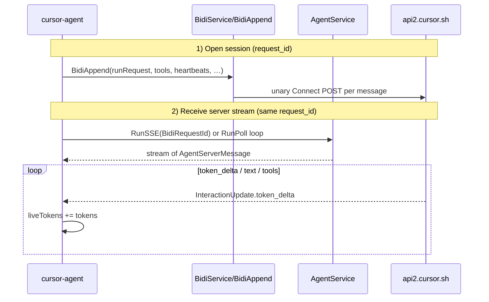

# Cursor CLI — Agent communication process (wire + client)

How `cursor-agent` talks to Cursor’s Agent backend: RPCs, transports, framing, and where `token_delta` enters the TUI. Use this as the reference before comparing with the **cursor-accounts** MITM proxy pipeline.

**Last reviewed:** 2026-06-04

Related: [CLI-vs-IDE-TOKENS.md](CLI-vs-IDE-TOKENS.md), [TOKENS-AND-USAGE.md](TOKENS-AND-USAGE.md), [PROXY-AGENT-IDS-AND-SUBAGENTS.md](PROXY-AGENT-IDS-AND-SUBAGENTS.md)

---

## Scope

This document describes **CLI → server** only (not IDE UI, not dashboard billing APIs). Sources:

- Bundled CLI `index.js` / `7434.index.js` (`agent-cli@2026.06.03-0bbb28e`)
- Protos in `proto/agent/v1/agent.proto`, `proto/aiserver/v1/aiserver.proto`
- Empirical proxy JSONL (when Cursor/CLI traffic is routed through the extension MITM)

---

## High-level session model

One Agent chat session uses **two coupled channels**:



| Channel | RPC | Direction | Payload |
|---------|-----|-----------|---------|
| **Control / input** | `aiserver.v1.BidiService/BidiAppend` | Client → server (unary) | `BidiAppendRequest`: nested `AgentClientMessage` in `data` |
| **Server stream** | `agent.v1.AgentService/RunSSE` or `RunPoll` | Server → client (stream) | `AgentServerMessage` frames (see below) |

The CLI **does not** use a separate “token API”. Tokens visible in the TUI come from **`InteractionUpdate.token_delta`** on the **same** `AgentServerMessage` stream as text and tools.

---

## Proto: AgentService methods (relevant)

From `proto/agent/v1/agent.proto`:

| RPC | Request | Response stream element |
|-----|---------|-------------------------|
| `Run` | (bidi session) | `AgentServerMessage` — **BiDi** in proto |
| `RunSSE` | `aiserver.v1.BidiRequestId` | **`AgentServerMessage`** (direct) |
| `RunPoll` | `aiserver.v1.BidiPollRequest` | **`aiserver.v1.BidiPollResponse`** (wrapper) |

`BidiPollResponse` carries nested agent bytes in `data` (same inner message as RunSSE, but **one poll chunk per HTTP response** on HTTP/1).

Inner server message fields used for tokens:

| Field | Message | Role |
|-------|---------|------|
| `interaction_update.token_delta.tokens` | `InteractionUpdate` | Live counter (CLI sums into `liveTokens`) |
| `interaction_update.turn_ended` | `InteractionUpdate` | Per-turn billing breakdown |
| `conversation_checkpoint_update.token_details` | checkpoint | Context window % (prompt bar) |

---

## What the CLI client actually calls

### 1. `Run` is mapped to `RunSSE` on the wire

In `index.js`, a Connect method mapper rewrites the high-level bidi method:

```text
if (method.name === AgentService.Run)
  → wire RPC: RunSSE (ServerStreaming, input BidiRequestId, output AgentServerMessage)
```

So the CLI’s logical **`AgentService/Run`** stream is implemented as **`AgentService/RunSSE`** over Connect, not as raw HTTP/1 `RunPoll` polling in the common path.

`RunPoll` remains in the generated service descriptor but is the **alternate** server-stream shape (`BidiPollResponse` per chunk).

### 2. Input path: `BidiAppend` only

`BidiService` exposes unary **`BidiAppend`** (`BidiAppendRequest` with `request_id`, `append_seqno`, `data`).

Typical client messages inside `data`:

- `runRequest` (start turn, model, conversation_id, …)
- `clientHeartbeat`
- tool results, user actions, etc.

### 3. Transport: Connect + protobuf

- Content-Type: `application/connect+proto`
- Framing: **5-byte Connect envelope** (flags + length) + protobuf payload
- Compression: often **gzip** (`connect-content-encoding: gzip`)

### 4. HTTP version and proxy

The CLI bundle includes:

- `@connectrpc/connect` (Connect protocol)
- **`proxy-http2-session-manager.ts`** — builds an **HTTP/2** session to `authority` through `HTTPS_PROXY` (CONNECT + TLS + `node:http2`)

So when `HTTPS_PROXY` / `HTTP_PROXY` points at the extension MITM:

- TLS is terminated by the proxy (custom CA)
- The CLI may still speak **HTTP/2** inside the tunnel to `api2.cursor.sh`
- Logged URLs still look like `https://api2.cursor.sh/agent.v1.AgentService/RunSSE` (path-level RPC)

The IDE (Electron) is usually launched with **`--proxy-server=http://127.0.0.1:<port>`** (Chromium HTTP proxy). Recent IDE captures show **`RunSSE`** on `api2.cursor.sh` with **no `RunPoll`** lines in the same session.

---

## Server stream framing (RunSSE)

For **`RunSSE`**, each HTTP response body is a **long-lived byte stream** of **many** Connect frames, each decoding to one **`AgentServerMessage`**.

```text
[flags:1][length:4][protobuf payload]  (repeated)
  → AgentServerMessage
      → interaction_update { token_delta: { tokens: N } }
      → interaction_update { text_delta: … }
      → …
```

CLI client stack (simplified):

1. Connect `run` / `runSSE` stream reader yields messages
2. **`agent-ui-state` reducer** handles event `tokenDelta`:
   - `liveTokens = liveTokens + message.value.tokens`
3. React TUI reads `liveTokens` (throttled) and formats with `utils/tokens.ts` → `"326 tokens"` next to **Working**

---

## Server stream framing (RunPoll) — alternate path

For **`RunPoll`**, each **HTTP response** is typically **one** Connect message decoding to **`BidiPollResponse`**, with **one** nested `AgentServerMessage` in `data` (hex/binary).

```text
HTTP response body
  → BidiPollResponse { seqno, data: <AgentServerMessage bytes> }
      → AgentServerMessage
          → interaction_update.token_delta
```

Many poll responses per second ⇒ many HTTP transactions, each possibly carrying one `token_delta`.

Empirical proxy logs:

| Log era | Dominant RPC | `token_delta` (decoded) |
|---------|--------------|-------------------------|
| 2026-06-03 (IDE, mixed) | **RunPoll** (~3316 responses) + some RunSSE | **688** inner (RunPoll) + **665** (RunSSE scan) |
| 2026-06-04 (IDE) | **RunSSE only** (~10 long responses) | **~1589** (RunSSE scan), **0** RunPoll |

So **`token_delta` is not “HTTP/2-only” or “RunSSE-only”** — it appears on both shapes when decoded. The IDE **migrated** from many `RunPoll` HTTP responses to few long **`RunSSE`** streams.

---

## CLI live token UI (client-only)

| Piece | Responsibility |
|-------|----------------|
| `agent-ui-state` | Accumulate `liveTokens` on each `tokenDelta` event |
| `subagentTokenStore` | Add subagent `token_delta` via `onSubagentTokenDelta` |
| Chat `topStatus` | `unshownTokenEstimate = liveTokens + subagentTokens` |
| Throttle | Copy estimate to display state every `de.Zx` ms |
| Format | `Tt.ap(n)` → `"N tokens"` beside **Working** |

This is **independent** of dashboard `get-filtered-usage-events`.

---

## End-of-turn usage (`stream-json` / `turnEnded`)

Non-interactive mode (`-p --output-format stream-json`) prints **no** per-frame token line. At turn end, the CLI maps **`turnEnded`** / **`result.usage`** to JSON with `inputTokens`, `outputTokens`, `cacheReadTokens`, `cacheWriteTokens` (same shape as dashboard rows).

---

## Checklist: capture CLI traffic through our proxy

To compare CLI vs IDE in JSONL:

1. Start extension MITM proxy and trust CA.
2. Launch **CLI** with `HTTPS_PROXY=http://127.0.0.1:<port>` (and `NODE_EXTRA_CA_CERTS` to panel CA if needed).
3. Run a short agent prompt; inspect `~/.cursor-accounts/proxy/logs/*.jsonl` for:
   - `BidiAppend` requests (client)
   - `RunSSE` and/or `RunPoll` responses
   - Decode with `scanAgentServerStream` / `decodeBidiAgentInner` (not RunPoll-only scripts)

If the CLI is run **without** proxy env, the extension will see **IDE-only** traffic — CLI will still show tokens while proxy logs stay empty for that process.

---

## Summary table (CLI)

| Topic | CLI behavior |
|-------|----------------|
| Primary stream RPC | `Run` → wire **`RunSSE`** (`AgentServerMessage`) |
| Input RPC | **`BidiAppend`** (unary) |
| Alternate stream | **`RunPoll`** → `BidiPollResponse.data` |
| HTTP | Often **HTTP/2** via `proxy-http2-session-manager` when using `HTTPS_PROXY` |
| `token_delta` handling | **Sum** every delta into `liveTokens` |
| Live UI | `topStatus` + `Tt.ap(liveTokens)` |
| Billing-shaped | `turn_ended` / `result.usage` at turn end |

Next: [CLI-vs-IDE-TOKENS.md § Proxy comparison](CLI-vs-IDE-TOKENS.md) — how **cursor-accounts** decode and emit differs from this client behavior.
