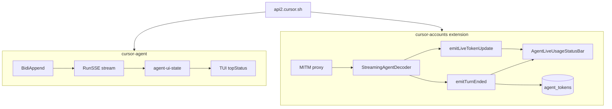

# Cursor CLI vs cursor-accounts — Comparison hub

Structured reference for **how `cursor-agent` behaves** versus **what this extension implements** on top of MITM proxy decode. Use this page as the entry point; deep dives live in linked docs.

**Last reviewed:** 2026-06-04

---

## Document map (reading order)

| Order | Document | Focus |
|-------|----------|--------|
| 1 | [CLI-AGENT-COMMUNICATION.md](CLI-AGENT-COMMUNICATION.md) | CLI wire: `BidiAppend`, `RunSSE`, framing, HTTP/2 |
| 2 | [CLI-vs-IDE-TOKENS.md](CLI-vs-IDE-TOKENS.md) | CLI vs native IDE vs extension (tokens + UI) |
| 3 | **This file** | CLI vs extension implementation matrix + backlog |
| 4 | [TOKENS-AND-USAGE.md](TOKENS-AND-USAGE.md) | Billing channels, glossary, limitations |
| 5 | [PROXY-AGENT-IDS-AND-SUBAGENTS.md](PROXY-AGENT-IDS-AND-SUBAGENTS.md) | `request_id`, chats, parallel workers |
| 6 | [PROXY-SETUP.md](PROXY-SETUP.md) | Capture CLI/IDE traffic through MITM |



---

## Executive comparison

| Topic | Cursor CLI | Extension (proxy enabled) | Status |
|-------|------------|---------------------------|--------|
| **Wire protocol** | Connect + proto; `Run` → `RunSSE` | Same bytes via MITM | Observed |
| **Live `token_delta`** | Sum every frame → `liveTokens` | Sum every frame → `accumulatedTokens` → status bar | **Aligned** |
| **Live UI throttle** | React copy every `de.Zx` ms (bundle) | `DISPLAY_THROTTLE_MS = 150` | Approximate |
| **Turn billing** | `turn_ended` + `stream-json` `result.usage` | `emitTurnEnded` → DB + status bar | **Aligned** (when event on wire) |
| **Turn boundary inference** | Server `turn_ended` | Server `turn_ended` (no peak/reset in live path) | **Aligned** |
| **Context `%`** | In-memory `tokenDetails` + model fallback | `token_details` on wire only | **Gap** |
| **Context pager** | Full breakdown UI | Not implemented | **Gap** |
| **Subagent live tokens** | `subagentTokenStore` + parent sum | Sum all `request_id` sessions | **Partial** |
| **Subagent tree / labels** | Native TUI session model | IDs extracted; UI does not label parent/child | **Gap** |
| **Incremental decode** | In-process stream reader | **RunSSE only** (`processRunSSEChunk`) | **Gap** for RunPoll-era |
| **Capture CLI traffic** | Requires `HTTPS_PROXY` + CA | IDE: `--proxy-server` by default | See [capture](#capture-cli-vs-ide-traffic) |
| **Period quota ($)** | Not primary in TUI | `StatusBarManager` (Channel A) | Different product surface |
| **Dashboard reconciliation** | N/A in TUI | Not implemented live | **Gap** |

---

## Layer 1 — Capture and transport

### Capture: CLI vs IDE traffic

| Process | Routed through extension MITM? | Env / launch |
|---------|--------------------------------|--------------|
| **Cursor IDE** (profile launch) | Yes | `--proxy-server` + `http.proxy` |
| **`cursor-agent` terminal** | Only if proxy env set | `HTTPS_PROXY=http://127.0.0.1:<port>` + trust CA (`NODE_EXTRA_CA_CERTS`) |

If you compare **CLI TUI tokens** with **JSONL from an IDE-only session**, you are comparing **two different clients**. See [CLI-AGENT-COMMUNICATION.md § Checklist](CLI-AGENT-COMMUNICATION.md#checklist-capture-cli-traffic-through-our-proxy).

### HTTP version and RPC shape

| Aspect | CLI | Extension observation |
|--------|-----|------------------------|
| HTTP | Often **HTTP/2** through `HTTPS_PROXY` | Decrypted bytes; path still `…/RunSSE` |
| Primary stream | **`RunSSE`** (`AgentServerMessage` per Connect frame) | Same |
| Legacy IDE path | May use **`RunPoll`** (one inner message per HTTP response) | Batch decode at response end; **no** incremental `isLiveTokenUpdate` |
| Inner payload | Same protobuf | Same — not “richer on HTTP/2” |

Empirical logs: 2026-06-04 IDE sessions are **RunSSE-only**; 2026-06-03 mixed RunPoll + RunSSE. See [CLI-vs-IDE-TOKENS.md § Transport](CLI-vs-IDE-TOKENS.md#transport-differences-same-inner-payload-different-carriers).

---

## Layer 2 — Decode and event emission

### Signal handling (live RunSSE)

| Server signal | CLI client | Extension |
|---------------|------------|-----------|
| `token_delta` | `liveTokens += tokens` | `accumulatedTokens += tokens` → `isLiveTokenUpdate` |
| `turn_ended` | UI + `stream-json` mapping | `isTurnEnded` → persist `turn_ended` + status bar |
| `token_details` | Prompt `%`, context pager | Status bar context % when present |
| `conversation_checkpoint_update` | State store | Merged in batch scan; rare on live SSE |

Implementation:

| Component | Role |
|-----------|------|
| [`StreamingAgentDecoder`](../src/proxy/streamingAgentDecoder.ts) | Incremental Connect frames; `FeedChunkResult` |
| [`MitmProxyServer.processRunSSEChunk`](../src/proxy/mitmProxyServer.ts) | `emitLiveTokenUpdate` / `emitTurnEnded` |
| [`AgentTrackingService`](../src/services/agentTrackingService.ts) | Skips live; persists `turn_ended` |
| [`AgentLiveUsageStatusBar`](../src/ui/agentLiveUsageStatusBar.ts) | `liveAccumulated` + `billedTokens` |

### RunPoll / batch path (not incremental)

When the IDE still uses **RunPoll**, each HTTP response triggers **one** `buildTrafficSummary` at `onResponseEnd` — no per-frame status bar updates during the poll loop.

| Path | Live status bar during stream | Persistence |
|------|----------------------------|-------------|
| **RunSSE** + decoder | Yes (`isLiveTokenUpdate`) | `turn_ended` incremental |
| **RunPoll** / full-body scan | Only if batch insights include tokens at response end | `allTokenFrames` + deprecated `TokenTurnDetectionService` offline |

---

## Layer 3 — UI and semantics

### Live counter (CLI `topStatus`)

CLI (`7434.index.js`):

```text
unshownTokenEstimate = liveTokens + subagentTokens
display = Tt.ap(throttledEstimate)  // "326 tokens"
```

Extension:

```text
display ≈ sum(liveAccumulated per request_id) or billedTokens after turn_ended
throttle = 150ms on isLiveTokenUpdate
```

| Difference | CLI | Extension |
|------------|-----|-----------|
| Subagent bucket | Explicit `subagentTokenStore` | Each subagent = separate `request_id` in `sessions` Map |
| Parent + child label | TUI knows session roles | Tooltip shows session id prefix only |
| Monotonic vs sum | **Sum** deltas | **Sum** deltas (aligned since 2026-06-04) |

### Context window %

| Source | CLI | Extension |
|--------|-----|-----------|
| `token_details` on wire | Used when present | Status bar `used/max` % |
| In-memory conversation state | **Primary** for `tokenPercentLabel` | Not available (no hook into Cursor/CLI state) |
| Model metadata fallback | Yes when checkpoint missing | No equivalent |

### `turn_ended` display

| Field | CLI (`stream-json`) | Extension |
|-------|---------------------|-----------|
| Raw proto | Maps `turnEnded` | Stores raw in SQLite |
| Display adjustment | May adjust `inputTokens` for presentation (cache handling) | Shows raw `input`/`output`/`cache*` in status bar |

Verify adjustment in CLI bundle when implementing parity; extension currently does **not** mirror display-only cache subtraction.

### Surfaces CLI has, extension does not

| CLI feature | Extension |
|-------------|-----------|
| Interactive TUI (`cursor-agent`) | VS Code status bar item |
| Context pager (files/rules breakdown) | Not planned in status bar |
| `stream-json` CI output | N/A (use proxy logs + scripts) |
| `generating-status` verbs (Working / Thinking / tool) | Not shown |

### Surfaces extension has, CLI does not

| Extension feature | CLI |
|-------------------|-----|
| Period quota bar (`GetCurrentPeriodUsage`) | Not primary in agent TUI |
| Multi-profile MITM logs | Single-user CLI session |
| SQLite `agent_tokens` history | Local agent store (different schema) |

---

## Layer 4 — Subagents and attribution

See [PROXY-AGENT-IDS-AND-SUBAGENTS.md](PROXY-AGENT-IDS-AND-SUBAGENTS.md).

| Behavior | CLI | Extension |
|----------|-----|-----------|
| Parallel workers | Own bidi `request_id` each | Same on wire |
| Live token display | Parent estimate **includes** subagent store | **Sums** all active `request_id`s |
| Double-count risk | Designed sum | Summing peaks/deltas across workers can overstate vs dashboard |
| `runRequest` linkage | Native | `conversationId`, `conversationGroupId`, `parentRequestId` extracted |
| `subagent_result` on parent `BidiAppend` | Native completion UX | `agent_id` → `subagentRequestId` in extractor; **not** shown in status bar |
| `transcript_path` | IDE path in message | Not extracted to insights |
| Status bar session key | N/A | `request_id` (bidi); falls back to `'active'` |

---

## Layer 5 — Persistence and offline tools

| Concern | CLI | Extension |
|---------|-----|-----------|
| Live deltas | Memory only | Not persisted (`isLiveTokenUpdate` early return) |
| Turn rows | Internal store | `agent_tokens.token_type = 'turn_ended'` |
| Offline turn split | N/A | `TokenTurnDetectionService` **deprecated** for live; batch logs only |
| Scripts | `stream-json` | `summarize-session-tokens.mjs`, `calibrate-proxy-tokens.mjs` |

---

## Gap backlog (investigation → implementation)

Prioritized differences to study or close. Status: **open** unless noted.

| ID | Gap | CLI reference | Extension today | Priority |
|----|-----|---------------|-----------------|----------|
| G1 | **RunPoll incremental live** | Poll loop updates UI | Batch at response end only | Medium (legacy IDE) |
| G2 | **Subagent-aware display** | `liveTokens + subagentTokens` | Flat sum per `request_id` | High |
| G3 | **Context % without wire checkpoint** | In-memory + model fallback | Only `token_details` frames | Medium |
| G4 | **Context pager** | `context-pager.tsx` | None | Low |
| G5 | **`turn_ended` display math** | stream-json cache adjustment | Raw proto fields | Low |
| G6 | **`transcript_path` / subagent_result UI** | Subagent completion | Partial extract, no UI | Medium |
| G7 | **Parent-only vs total toggle** | Implicit in TUI | Always global sum | Medium |
| G8 | **Auto `GetTokenUsage` for `usage_uuid`** | CLI may resolve differently | Logged only | Low |
| G9 | **Throttle constant parity** | `de.Zx` in bundle | 150ms fixed | Low |
| G10 | **Dashboard `get-filtered-usage-events`** | N/A | Documented, not called | Medium (billing truth) |

### Recently closed

| ID | Item | Closed |
|----|------|--------|
| C1 | Sum every `token_delta` for live UI | 2026-06-04 — `StreamingAgentDecoder` + status bar |
| C2 | Trust server `turn_ended` for persistence | 2026-06-04 — removed live peak/reset heuristic |
| C3 | RunSSE-only scripts missing deltas | 2026-06-04 — `summarize-session-tokens.mjs` scans RunSSE |

---

## Investigation procedures

### 1. Confirm CLI traffic in JSONL

```bash
# Terminal running cursor-agent
export HTTPS_PROXY=http://127.0.0.1:8080
export NODE_EXTRA_CA_CERTS="$HOME/.cursor-accounts/ca.pem"  # path from extension panel

cursor-agent "Short prompt"
```

Expect lines with `RunSSE`, `BidiAppend`, and decoded `token_delta` counts.

### 2. Compare live counter semantics

```bash
pnpm run calibrate:proxy-tokens -- ~/.cursor-accounts/proxy/logs/proxy-*.jsonl
node scripts/summarize-session-tokens.mjs ~/.cursor-accounts/proxy/logs/<file>.jsonl
```

Compare **sum of `token_delta`** vs **max peak** per `request_id` — CLI-like behavior matches **sum**.

### 3. Compare end-of-turn billing

```bash
cursor-agent -p --trust --output-format stream-json "One sentence."
# Last JSON line: type=result, usage.{input,output,cache*}
```

Match against proxy-decoded `turn_ended` rows in SQLite or batch decode.

### 4. Subagent session

Run a Task with parallel subagents; in JSONL count distinct `request_id`s and compare parent vs worker `token_delta` totals ([PROXY-AGENT-IDS-AND-SUBAGENTS.md § recipes](PROXY-AGENT-IDS-AND-SUBAGENTS.md#compare-parent-vs-subagent-streaming-counters)).

---

## Code index (extension)

| File | CLI analogue |
|------|----------------|
| [`streamingAgentDecoder.ts`](../src/proxy/streamingAgentDecoder.ts) | Connect stream reader + `tokenDelta` reducer |
| [`mitmProxyServer.ts`](../src/proxy/mitmProxyServer.ts) | Client transport + event dispatch |
| [`proxyInsightExtractor.ts`](../src/proxy/proxyInsightExtractor.ts) | Proto → `AgentSessionInfo` |
| [`agentLiveUsageStatusBar.ts`](../src/ui/agentLiveUsageStatusBar.ts) | `topStatus` + `tokenPercentLabel` |
| [`agentTrackingService.ts`](../src/services/agentTrackingService.ts) | Agent store persistence |
| [`tokenTurnDetectionService.ts`](../src/domain/services/tokenTurnDetectionService.ts) | *(deprecated)* peak/reset for offline batch |

---

## Related documentation

| Document | Topic |
|----------|--------|
| [CLI-AGENT-COMMUNICATION.md](CLI-AGENT-COMMUNICATION.md) | CLI wire process |
| [CLI-vs-IDE-TOKENS.md](CLI-vs-IDE-TOKENS.md) | Three-way token UI comparison |
| [TOKENS-AND-USAGE.md](TOKENS-AND-USAGE.md) | Billing channels |
| [ARCHITECTURE.md](ARCHITECTURE.md) | Extension structure |
