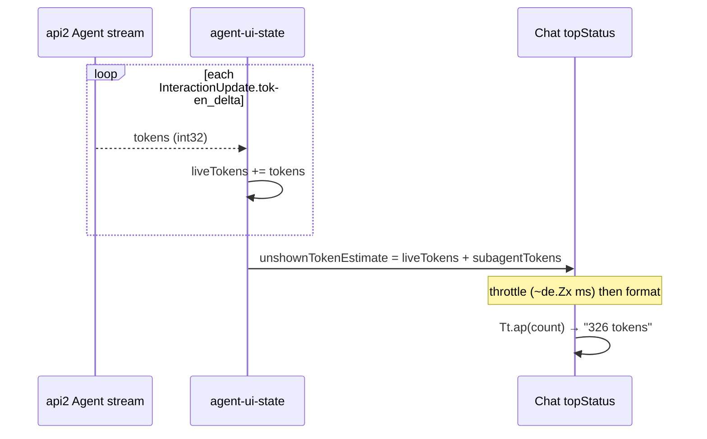
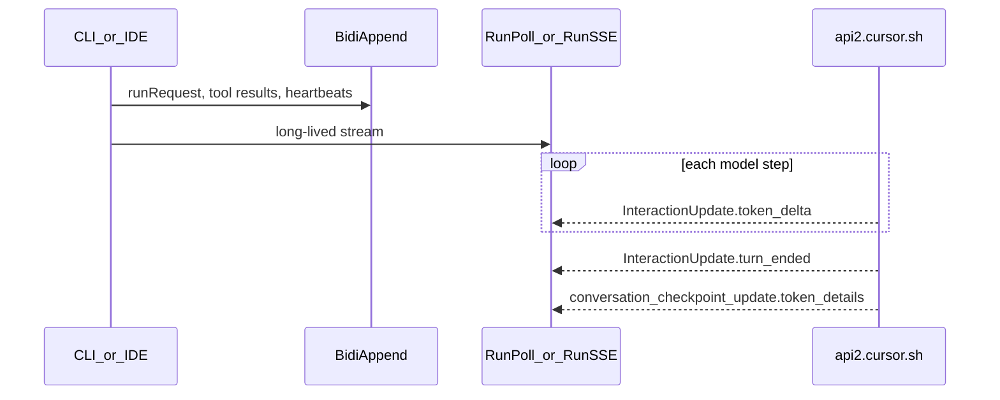
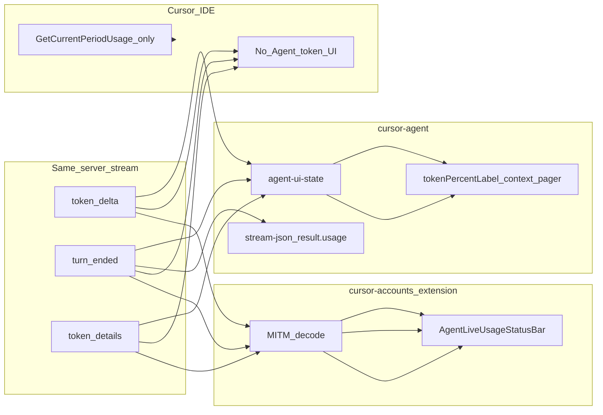
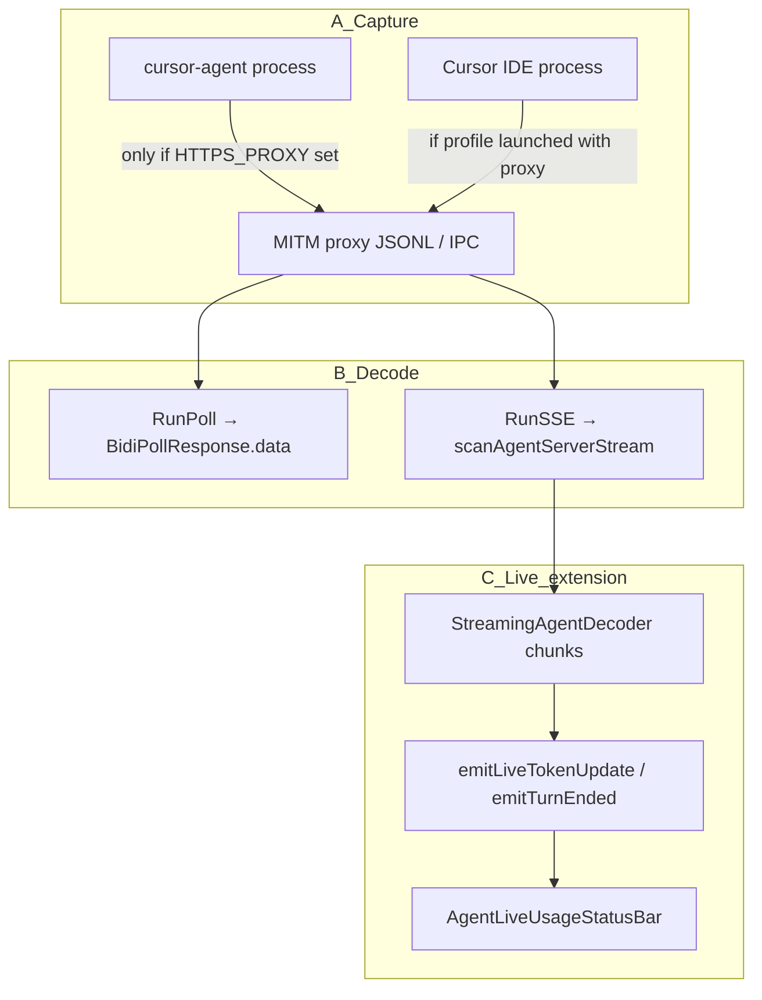

# CLI vs IDE — Token Usage on the Wire and in the UI

How **Cursor CLI** (`cursor-agent`) surfaces token usage during Agent sessions compared to **Cursor IDE**, where the divergence happens, and how the **cursor-accounts** extension can approximate CLI behavior via MITM proxy decode.

**Last reviewed:** 2026-06-04

Related: [CLI-AGENT-COMMUNICATION.md](CLI-AGENT-COMMUNICATION.md) (CLI wire process), [TOKENS-AND-USAGE.md](TOKENS-AND-USAGE.md), [PROXY-AGENT-IDS-AND-SUBAGENTS.md](PROXY-AGENT-IDS-AND-SUBAGENTS.md)

---

## Executive summary

| Layer | CLI | IDE (native) | Extension (proxy enabled) |
|-------|-----|--------------|---------------------------|
| **Wire protocol** | Agent `BidiAppend` + `RunPoll` or `RunSSE` | Same | Observed via MITM |
| **`token_delta`** (live counter) | Wired to UI state | Received, **not shown** | `AgentLiveUsageStatusBar` |
| **`turn_ended`** (billing-grade turn) | Wired to UI + `stream-json` `result.usage` | Received, **not shown** | Status bar when decoded |
| **`token_details`** (context window %) | Prompt bar `%` + context pager | Often absent on wire; **not shown** | Status bar when decoded |
| **Period quota ($ / %)** | Not primary in TUI | Status bar / Settings | `StatusBarManager` |

**The server sends the same Agent messages to both clients.** The gap is almost entirely **client-side UI wiring**, not a different billing API.

---

## What the CLI shows

### Live counter next to “Working” (e.g. `326 tokens`)

This is the line in your screenshot: green spinner + **Working** + dim **`326 tokens`**.

It is **not** billing from the dashboard API. It is wired like this in the bundled CLI (`7434.index.js`):



| Step | What happens |
|------|----------------|
| 1. Wire | Same `AgentServerMessage` → `interaction_update.token_delta.tokens` as IDE (RunPoll / RunSSE). |
| 2. Reducer | On event `tokenDelta`: `liveTokens: state.liveTokens + message.value.tokens` (accumulator in conversation state `kt`). |
| 3. Subagents | `onSubagentTokenDelta` → `subagentTokenStore.addTokens(n)`; summed as `Dn`. |
| 4. Estimate shown | `unshownTokenEstimate = kt.liveTokens + Dn` passed into the chat view as `je`. |
| 5. Throttle | React state `Zn` copies `je` at most every `de.Zx` ms so the label does not flicker on every frame. |
| 6. Render | When status is `generating`: spinner + label (`Working` / `Thinking` / tool verb via `generating-status.ts`) + `(0,Tt.ap)(Zn)` → `"326 tokens"` (`utils/tokens.ts`: `"N token"` / `"N tokens"`). |

Relevant UI snippet (minified names preserved):

- Status row: `"generating"===e` → spinner `L.U` + bold label + `(0,Tt.ap)(Zn)` dim suffix.
- Label text: `generating-status` → `"Working"` (or `"Composing"` for composer models).
- Count source: `unshownTokenEstimate: kt.liveTokens + Dn`.

**Important:** the CLI **sums** each `token_delta.tokens` value. That matches a server that sends **increments** per frame. The extension proxy often treats the same field as a **monotonic counter** per turn (peak + reset heuristic). Both read the same RPC; the **client math** differs.

The IDE native client receives the same `token_delta` frames but **does not render** this `topStatus` row.

### Interactive TUI (`cursor-agent` without `-p`)

From the bundled CLI (`7434.index.js`, `agent-ui-state`):

1. **Prompt bar — `tokenPercentLabel`**
   - Computed from `agentStore.getConversationStateStructure().tokenDetails`:
     - `usedTokens / maxTokens → percent` (one decimal, e.g. `42.3%`)
   - Fallback when checkpoint details are missing: model-context helper on the selected model.

2. **Context pager (`context-pager.tsx`)**
   - Categories of context usage: `totalTokensUsed`, `contextWindowSize`, percent full, breakdown by source (files, rules, etc.).

3. **Live streaming**
   - `onSubagentTokenDelta` → `addTokens(n)` accumulates subagent streaming counters while tools/subagents run.

### Non-interactive / CI (`cursor-agent -p --output-format stream-json`)

During generation the stream emits `system`, `user`, `thinking`, `assistant` events — **no incremental usage fields**.

At **end of turn**, the final `result` event includes billing-shaped usage:

```json
{
  "type": "result",
  "usage": {
    "inputTokens": 9,
    "outputTokens": 44,
    "cacheReadTokens": 0,
    "cacheWriteTokens": 27007
  }
}
```

The CLI maps `InteractionUpdate.turn_ended` from the Agent stream into this shape (adjusting `inputTokens` by subtracting cache read/write for display).

---

## What the IDE shows (native)

| UI surface | Data source | Token detail |
|------------|-------------|--------------|
| Settings / account | `GetCurrentPeriodUsage`, `usage-summary` | Period **cents / %** only — no input/output split |
| Agent chat panel | — | **No** per-turn or live token counter |
| Composer (legacy) | Sometimes `metadata.token_usage` on stream | Not exposed as a dedicated counter |

The IDE **does** open the same Agent RPCs as the CLI. Empirical decode of IDE proxy logs (`proxy-2026-06-04-*.jsonl`, `RunSSE` path):

| Signal | Count (example session) |
|--------|-------------------------|
| `token_delta` | 692 |
| `turn_ended` | 2 |
| `conversation_checkpoint_update.token_details` | 0 |

So the IDE **receives** live and turn-final usage on the wire; it simply **does not render** them in the product UI.

---

## Where tokens appear on the wire (shared protocol)

All paths nest inside `agent.v1.AgentServerMessage`:



| Proto field | Message | Billing-grade? | CLI uses for UI | IDE native |
|-------------|---------|----------------|-----------------|------------|
| `token_delta.tokens` | `InteractionUpdate` | No (progress counter) | Live accumulation | Ignored |
| `turn_ended.*_tokens` | `InteractionUpdate` | Yes (when present) | Turn total + `stream-json` | Ignored |
| `token_details.used_tokens` / `max_tokens` | `ConversationCheckpointUpdate` | No (context snapshot) | Prompt `%`, context pager | Ignored |

Proto reference: [`proto/agent/v1/agent.proto`](../proto/agent/v1/agent.proto) — `TokenDeltaUpdate`, `TurnEndedUpdate`, `ConversationTokenDetails`.

### Transport differences (same inner payload, different carriers)

Full CLI process: [CLI-AGENT-COMMUNICATION.md](CLI-AGENT-COMMUNICATION.md).

| Client | Stream RPC on wire | HTTP | Framing per “read” |
|--------|-------------------|------|---------------------|
| **CLI** | `Run` → **`RunSSE`** (`AgentServerMessage` direct) | Often **HTTP/2** via `proxy-http2-session-manager` when `HTTPS_PROXY` is set | Many Connect frames in one H2 stream |
| **CLI (alt)** | `RunPoll` → `BidiPollResponse.data` | Same host | One inner message per poll HTTP response |
| **IDE (recent)** | **`RunSSE`** only (no `RunPoll` in log) | HTTP proxy (`--proxy-server`) | Few long `text/event-stream` bodies |
| **IDE (older)** | **RunPoll** dominant | Same | Many short poll responses |

**Not** a richer protobuf on HTTP/2: the **same** `InteractionUpdate.token_delta` lives inside `AgentServerMessage`. What changes is **how many HTTP transactions** carry those bytes and **how our tools decode them**.

| Myth | Fact |
|------|------|
| “HTTP/2 body has extra token fields” | No — extra framing is H2/Connect transport; inner proto is unchanged |
| “CLI gets token_deltas, proxy does not” | Proxy JSONL **does** contain them when traffic is captured and **RunSSE** is scanned |
| “HTTP/1 never has token_deltas” | Older IDE logs show **hundreds** on **RunPoll** inner decode |

Offline scripts that only scan **`RunPoll`** report **0** on modern IDE sessions that use **only RunSSE** (`summarize-session-tokens.mjs` was fixed to scan both). Use `scanAgentServerStream` ([`scripts/calibrate-proxy-tokens.mjs`](../scripts/calibrate-proxy-tokens.mjs)).

---

## Divergence map



**Divergence point (UI):** after protobuf decode, the CLI **`agent-ui-state`** reducer runs on **every** `tokenDelta` (`liveTokens += tokens`). The IDE does not render that. The extension can decode the same bytes from MITM but **does not yet mirror CLI live-update semantics** (see below).

---

## Why the proxy “does not show” `token_delta` (three layers)

Confusion usually mixes **(A) capture**, **(B) offline decode**, and **(C) live extension UI**.



### A — Capture: is CLI traffic in the log?

| Process | Routed through extension MITM? |
|---------|-------------------------------|
| Cursor IDE (profile launch) | Yes — `--proxy-server` + `http.proxy` |
| `cursor-agent` in a normal terminal | **No** — unless `HTTPS_PROXY=http://127.0.0.1:<port>` and CA trusted |

If you compare **CLI TUI (326 tokens)** with **proxy logs from an IDE-only session**, you are comparing **two different clients**. The CLI can show tokens while the log only contains IDE traffic.

### B — Offline decode: RunPoll-only tools lie on modern IDE

| Log | RunPoll responses | RunSSE responses | `token_delta` (full decode) |
|-----|-------------------|------------------|----------------------------|
| `proxy-2026-06-03-*.jsonl` | ~3316 | ~11 | **688** (Poll inner) + **665** (SSE) |
| `proxy-2026-06-04-*.jsonl` | **0** | ~10 | **0** (Poll) + **~1589** (SSE) |

So tokens **are on the wire** in MITM captures; the gap was **script path** (Poll-only), not missing server data.

Implementation reference:

| RPC | Extension decode entry |
|-----|------------------------|
| `RunSSE` / `StreamBidi` | [`enrichInsightsFromAgentStream`](../src/proxy/proxyDecode.ts) + [`StreamingAgentDecoder`](../src/proxy/streamingAgentDecoder.ts) |
| `RunPoll` / `BidiAppend` response | [`enrichInsightsFromBidi`](../src/proxy/proxyDecode.ts) → nested `data` → `extractAgentInnerInsights` |

### C — Live UI: aligned with CLI “every delta”

| Aspect | CLI | cursor-accounts (extension) |
|--------|-----|------------------------------|
| When `token_delta` arrives | **Every** frame → reducer updates `liveTokens` | RunSSE: [`StreamingAgentDecoder`](../src/proxy/streamingAgentDecoder.ts) emits **`LiveTokenUpdate`** on every frame → `emitLiveTokenUpdate` |
| Counter semantics | **Sum** `tokens` per frame | **Sum** `accumulatedTokens += tokens` (same as CLI) |
| Status bar refresh | Throttle ~`de.Zx` ms | Throttle **150ms** in [`AgentLiveUsageStatusBar`](../src/ui/agentLiveUsageStatusBar.ts) |
| Turn billing | `turn_ended` from server | `emitTurnEnded` → persist `turn_ended` rows only (not each `token_delta`) |
| RunPoll era | N/A (CLI uses RunSSE) | Each poll response → full `buildTrafficSummary` (batch path unchanged) |

Relevant code:

- Live emit: [`mitmProxyServer.processRunSSEChunk`](../src/proxy/mitmProxyServer.ts) → `emitLiveTokenUpdate` / `emitTurnEnded`
- Decoder: [`streamingAgentDecoder.ts`](../src/proxy/streamingAgentDecoder.ts) — no peak/reset heuristic
- Persistence: [`AgentTrackingService.ingestTraffic`](../src/services/agentTrackingService.ts) skips `isLiveTokenUpdate`, persists `isTurnEnded`
- Status bar: [`AgentLiveUsageStatusBar.ingest`](../src/ui/agentLiveUsageStatusBar.ts) uses `liveTokenData.accumulatedTokens`

**Why trust `turn_ended` over heuristics:** server `turn_ended` is billing-grade (input/output/cache). Peak/reset inference (`TokenTurnDetectionService`) is **deprecated** for live RunSSE; kept only for offline batch decode of historical logs.

---

## Extension vs CLI — communication comparison

| Stage | CLI | Extension MITM |
|-------|-----|----------------|
| Protocol | Connect + proto, `@connectrpc/connect` | Observes same bytes after TLS terminate |
| Stream RPC | `Run` mapped to **`RunSSE`** | Logs `…/AgentService/RunSSE` |
| Input RPC | **`BidiAppend`** | Logs `…/BidiService/BidiAppend` |
| HTTP | **HTTP/2** common with `HTTPS_PROXY` | Sees decrypted stream; IDE often HTTP/1 via Chromium proxy |
| Client token math | `liveTokens += token_delta.tokens` | `accumulatedTokens += token_delta.tokens` |
| Live UI hook | React `topStatus` + `Tt.ap` | `onTraffic(isLiveTokenUpdate)` → `AgentLiveUsageStatusBar` |
| Persistence | Local agent store / DB | `turn_ended` rows via `AgentTrackingService` (not per delta) |

---

## Approximating CLI behavior in the extension

Enable MITM proxy ([PROXY-SETUP.md](PROXY-SETUP.md)) and `cursorAccounts.proxy.showLiveUsageInStatusBar`.

| CLI behavior | Extension equivalent | Implementation |
|--------------|---------------------|----------------|
| Live counter during generation | **Implemented:** sum every `token_delta` like CLI | [`AgentLiveUsageStatusBar`](../src/ui/agentLiveUsageStatusBar.ts), [`StreamingAgentDecoder`](../src/proxy/streamingAgentDecoder.ts) |
| Context window `%` | `usedTokens / maxTokens` from `token_details` when present | Same status bar (context segment) |
| Turn billing breakdown | `turn_ended` input/output/cache fields | Same status bar + SQLite via `AgentTrackingService` |
| Context pager breakdown | Not yet | Future: webview from `token_details.breakdown` |
| Dashboard-grade reconciliation | Not live | `get-filtered-usage-events` (see [USAGE-EVENTS-API.md](USAGE-EVENTS-API.md)) |

### Priority order (matches CLI mentally)

1. **`turn_ended`** — show input/output/cache when a turn completes (billing-shaped).
2. **`token_details`** — show context `%` (`used / max`) like `tokenPercentLabel`.
3. **`token_delta`** — show streaming counter while generating (not comparable to dashboard dollars).

### Known gaps vs CLI

- **`token_details` checkpoints** may be rare on IDE `RunSSE` captures; CLI may also derive context from in-memory conversation state between checkpoints.
- **`token_delta` ≠ billed tokens** — ratios of 100×+ vs dashboard are normal ([TOKENS-AND-USAGE.md](TOKENS-AND-USAGE.md)).
- **Parallel subagents** — CLI `addTokens` and extension sum can double-count unless keyed by `request_id` / parent links ([PROXY-AGENT-IDS-AND-SUBAGENTS.md](PROXY-AGENT-IDS-AND-SUBAGENTS.md)).
- **Native IDE** will not show tokens without extension + proxy; there is no supported hook into Cursor's closed-source UI.

---

## Verification recipes

### Decode IDE RunSSE log (offline)

```bash
pnpm run calibrate:proxy-tokens -- ~/.cursor-accounts/proxy/logs/proxy-YYYY-MM-DD-*.jsonl
```

### Compare CLI stream-json usage

```bash
cursor-agent -p --trust --output-format stream-json "Say hello in one sentence."
# Inspect final line: type=result, field usage
```

### Session report (RunPoll + RunSSE)

```bash
node scripts/summarize-session-tokens.mjs ~/.cursor-accounts/proxy/logs/<log>.jsonl
```

---

## References in this repo

| File | Role |
|------|------|
| [`src/proxy/streamingAgentDecoder.ts`](../src/proxy/streamingAgentDecoder.ts) | Incremental `RunSSE` frame decode |
| [`src/proxy/proxyInsightExtractor.ts`](../src/proxy/proxyInsightExtractor.ts) | `token_delta`, `turn_ended`, `token_details` extraction |
| [`src/ui/agentLiveUsageStatusBar.ts`](../src/ui/agentLiveUsageStatusBar.ts) | IDE-side CLI-like status bar |
| [`scripts/calibrate-proxy-tokens.mjs`](../scripts/calibrate-proxy-tokens.mjs) | Proxy vs dashboard calibration |
