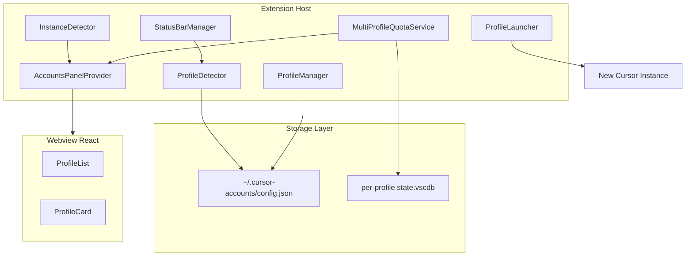
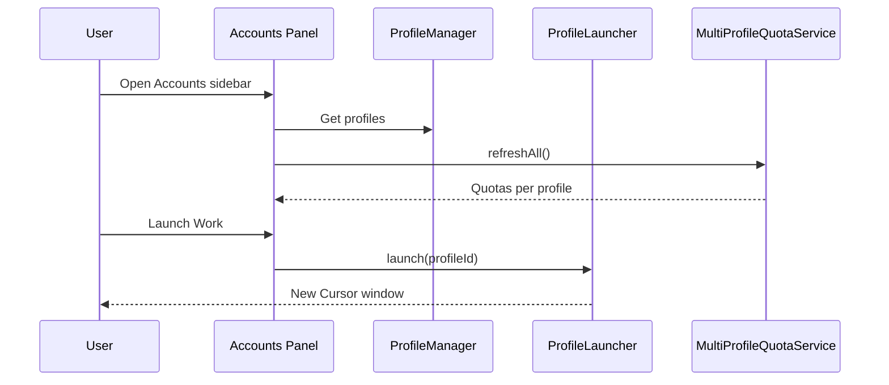

# Multi-Profile Account Management

Design reference for the multi-profile feature in **Cursor Accounts** (`vypdev.cursor-accounts`). This document describes product intent, architecture, and behavior. **Implementation details live in source code** — see the module map below and [ARCHITECTURE.md](ARCHITECTURE.md).

**Status:** Shipped (all planned capabilities are implemented in `src/` and the Accounts webview).

**Last reviewed:** 2026-06-01

## Overview

Users manage multiple Cursor accounts (personal, work, clients) through separate `--user-data-dir` profiles, with integrated quota monitoring, a visual Accounts panel, export/import of profile metadata, and optional model efficiency analysis per active profile.

## Goals

1. **Multi-account workflows** — work across accounts without unsupported in-window switching
2. **Quota visibility** — usage for all configured profiles, not only the active window
3. **Security** — official `--user-data-dir` isolation; no SQLite auth swapping
4. **UX** — launch and monitor profiles from the sidebar and status bar
5. **Collaboration** — export/import profile configuration (metadata only)

## Non-goals

- In-place account switching inside one window
- Swapping or copying `state.vscdb` between profiles
- Automatic session migration between profiles
- Modifying Cursor’s authentication flow

## User personas

| Persona | Needs |
|---------|--------|
| Multi-account developer | Separate work/personal subscriptions; quota at a glance |
| Agency developer | Client isolation; shared profile configs |
| Freelancer | Quick visual cues; dashboard of quotas |

## Architecture overview

### End-to-end flow (launch + quotas)

## Implementation map (source of truth)

| Component | Responsibility | Primary files |
|-----------|----------------|---------------|
| ProfileManager | CRUD, validation, slug/path rules | `src/profiles/profileManager.ts` |
| ProfileStorage | Atomic JSON persistence, backup | `src/profiles/profileStorage.ts` |
| ProfileDetector | Active `--user-data-dir` | `src/profiles/profileDetector.ts` |
| ProfileLauncher | Spawn Cursor per OS | `src/profiles/profileLauncher.ts` |
| InstanceDetector | Running instances by path | `src/profiles/instanceDetector.ts` |
| MultiProfileQuotaService | Parallel quota per profile | `src/services/multiProfileQuotaService.ts` |
| AccountsPanelProvider | Webview host + messages | `src/ui/accountsPanel.ts` |
| StatusBarManager | Quota + profile indicator | `src/ui/statusBarManager.ts` |
| Import/export | Profile bundles | `src/profiles/profileExporter.ts`, `profileImporter.ts` |
| Types / protocol | `Profile`, webview messages | `src/profiles/types.ts` |
| Path safety | Normalization, validation | `src/utils/pathUtils.ts` |
| UI | React panel | `webview/src/` |

## Data model (summary)

Profiles are stored in `~/.cursor-accounts/config.json`:

- **Profile:** `id`, `email`, `slug`, `displayName`, `userDataDir`, `created`, optional `lastLaunched`, `theme`, `color`, `metadata`
- **Settings:** `autoDetectRunning`, `showProfileInStatusBar`, `refreshAllInterval`, `confirmBeforeLaunch`, etc.

Full TypeScript definitions: `src/profiles/types.ts`.

**Tokens are never stored in config.json.** Each profile’s session lives in that profile’s `User/globalStorage/state.vscdb`.

## User flows

### Add first profile

1. User opens Accounts panel or runs **Cursor Accounts: Add Profile**
2. Enters email and optional display name
3. Extension creates profile directory slug under home (`~/.cursor-{slug}`)
4. User may launch immediately; new window uses `--user-data-dir`

### Switch between profiles

1. User launches another profile from the panel or command palette
2. A **new** Cursor window opens (existing windows stay on their profile)
3. User focuses the desired window; status bar reflects that window’s quota and profile

### Open a recent project from the Accounts panel

When the user clicks **Open** on a recent project under a profile card:

1. If that project is already open in the **current** window, nothing happens.
2. If the project belongs to the **same profile** as the active window, it opens in the **current** window (`vscode.openFolder`, same as native recent projects—including when another folder is already open, which replaces the workspace).
3. If the project belongs to a **different profile**, or the active window is not a managed profile (default Cursor user data dir), the extension spawns a **new** Cursor instance with that profile’s `--user-data-dir` and the project path. It never opens another profile’s project in the current window.

Routing logic: `src/profiles/recentProjectLaunchRouter.ts`, wired from `src/ui/accountsPanelHandlers.ts`.

### Accounts panel on startup (no project open)

The Accounts panel opens automatically when:

1. The window has **no** managed profile assigned (default Cursor user data dir), or
2. The window uses a managed profile (`--user-data-dir`) but **no** folder or `.code-workspace` is open (welcome / empty state).

If the user closes the last open folder while the panel is not visible, the extension opens the panel again so they can pick a recent project. The current profile card shows a short hint when no project is open in that window.

Logic: `src/ui/accountsPanelStartup.ts` (`shouldAutoOpenAccountsPanel`), used from `src/extension.ts` and `src/ui/accountsPanel.ts`.

### View all quotas

1. Accounts panel loads profile list
2. `MultiProfileQuotaService` reads each profile’s DB and fetches usage in parallel
3. Cards show usage, errors (e.g. not signed in), and enterprise extras where applicable

### Export / import for teams

1. Export selected profiles (optional `settings.json` from each user data dir)
2. JSON bundle contains metadata only — no tokens
3. Import uses best-effort: successes kept, failures reported per profile

## Commands

See [COMMANDS.md](COMMANDS.md#profiles) for profile-related commands (add, launch, list, delete, export, import, show current).

## Webview message protocol

Bidirectional messages are discriminated unions shared between host and webview:

- **Host → webview:** `init`, `quotas`, `runningInstances`, `error`, etc.
- **Webview → host:** `ready`, `launch`, `addProfile`, `refresh`, `exportProfiles`, `importProfiles`, `setEfficiency`, etc.

Definitions: `src/profiles/types.ts` (`ToWebviewMessage`, `FromWebviewMessage`).

## Security

- Read-only `state.vscdb` access
- Path validation before read/launch (`validateUserDataPath`)
- Process isolation per profile instance
- Document that extensions in a profile can access that profile’s tokens (CursorJacking awareness)

## Performance

- Parallel quota fetch with per-request timeout and caching
- Instance detection on a configurable interval (default 30s)
- Atomic config writes; in-memory config cache in `ProfileManager`
- Webview: load profiles first, quotas as they arrive

## Error handling

**Philosophy:** best effort for multi-item work — show partial success, do not roll back successful imports or quota fetches.

| Scenario | User-facing behavior |
|----------|----------------------|
| Missing `state.vscdb` | “Not configured” / offer launch |
| Expired token | Login required for that card |
| Quota timeout | Stale cache + retry |
| Import partial failure | Report imported vs failed counts |
| Delete while running | Blocked when instance detector sees profile active |

Config save failures should use backup/restore in `ProfileStorage` (see tests in `src/test/profileStorage.test.ts`).

## Accessibility and localization

- Keyboard navigation in webview UI
- Status bar tooltips and commands available from Command Palette
- User-facing strings externalized in `locales/*.json` and `package.nls.json` (25+ languages); validate with `pnpm run validate:l10n`

## Terminology

| Term | Use |
|------|-----|
| **Profile** | Code, types, commands (`ProfileManager`, `cursorAccounts.addProfile`) |
| **Account** | User-facing panel name (“Accounts”) where it reads more naturally |
| **Launch** | Starting a new Cursor instance with a profile |
| **User data directory** | Full phrase in prose; `userDataDir` in code; `--user-data-dir` in CLI |

## Testing

- Unit tests: `src/test/profileManager.test.ts`, `profileStorage.test.ts`, `pathUtils.test.ts`, `instanceDetector.test.ts`, `multiProfileQuotaService.test.ts`, etc.
- Run: `pnpm test` (see [CONTRIBUTING.md](../CONTRIBUTING.md))
- Manual: multi-window launch, enterprise vs personal quota, export/import round-trip

## Future enhancements (not committed)

- Profile templates and bulk launch
- Profile groups, search, CLI
- Usage alerts; optional cloud sync of profile config
- Deeper Cursor Teams integration if public APIs expand

## Open decisions (recorded)

| Question | Decision |
|----------|----------|
| Auto-create profile on detected email? | No — explicit add only |
| Duplicate email, different paths? | Allowed with warning |
| Rename profile directories? | No — `displayName` only |
| Delete profile data dir on remove? | No — manual deletion with warning |

## Related documentation

- [COMMANDS.md](COMMANDS.md) — full command reference
- [FEATURES.md](FEATURES.md) — feature overview
- [CONFIGURATION.md](CONFIGURATION.md) — profile-related settings
- [TROUBLESHOOTING.md](TROUBLESHOOTING.md) — account and profile issues
- [ARCHITECTURE.md](ARCHITECTURE.md) — technical structure and quota pipelines
- [RESEARCH.md](RESEARCH.md) — APIs and why in-window switching is not supported
- [README.md](../README.md) — project overview and documentation index
- [CONTRIBUTING.md](../CONTRIBUTING.md) — how to change the codebase
