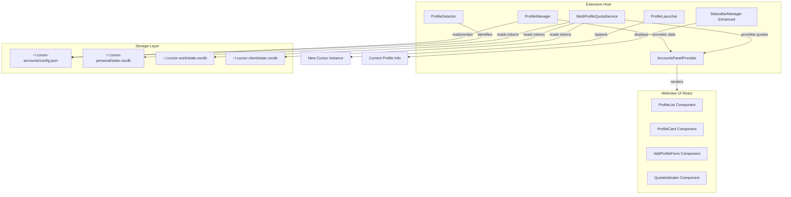
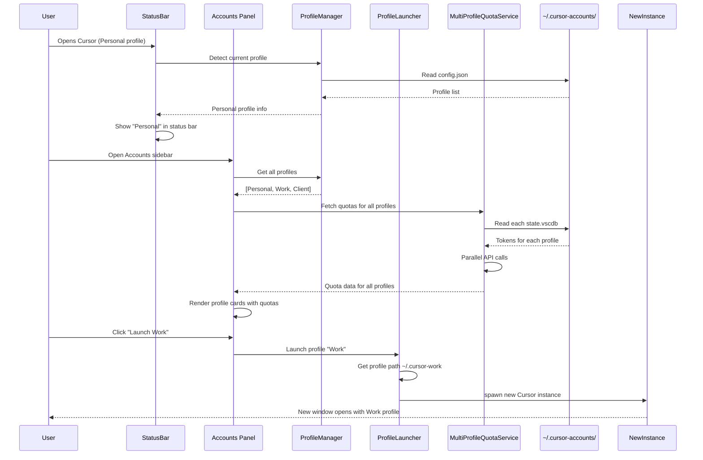
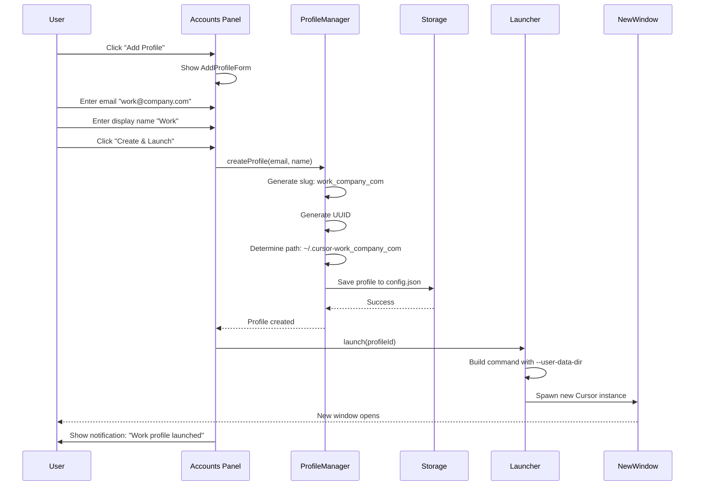
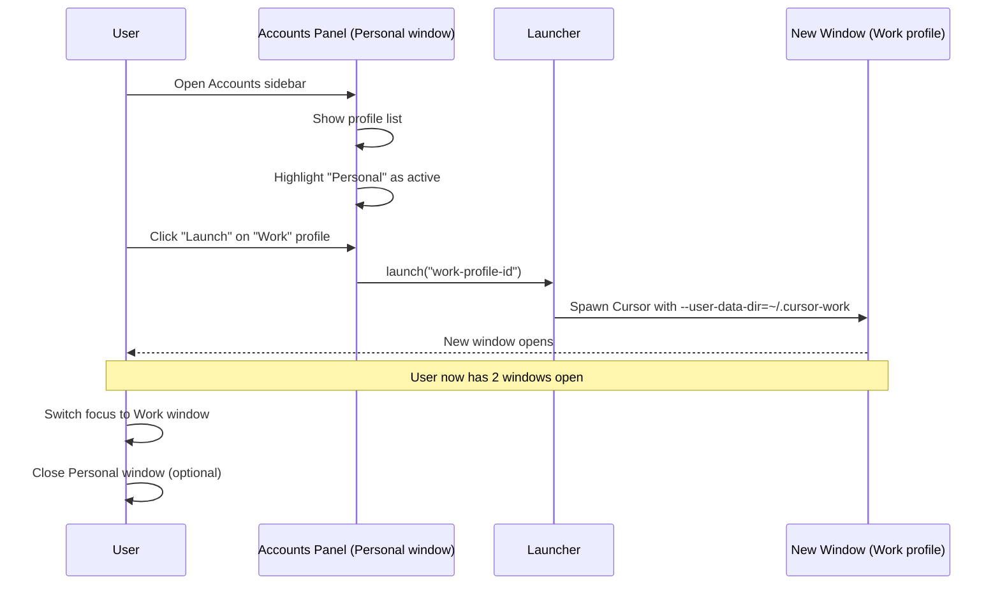
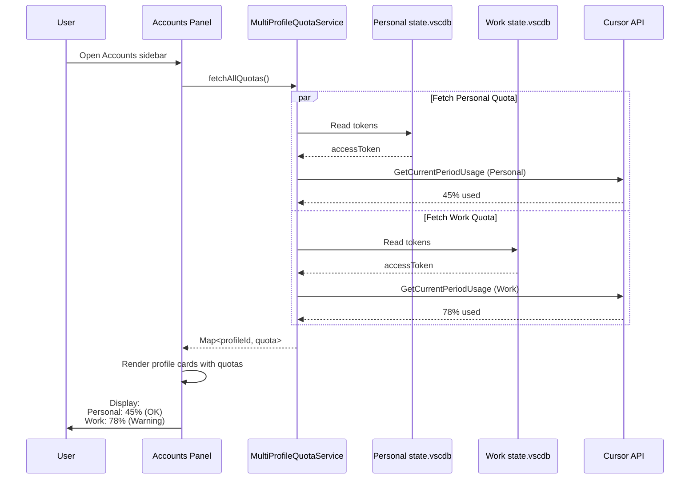
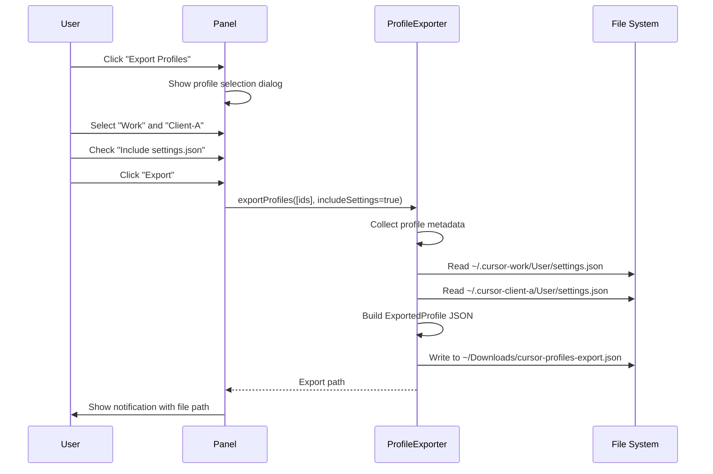

# Multi-Profile Account Management - Feature Specification

## Overview

This document provides the complete specification for the Multi-Profile Account Management feature in the `cursor-quota` extension. This feature enables users to manage multiple Cursor accounts (personal, work, client accounts) through separate `--user-data-dir` profiles, with integrated quota monitoring, visual profile management UI, and profile export/import capabilities.

## Goals

1. **Enable multi-account workflows**: Allow users to seamlessly work with multiple Cursor accounts without manual re-authentication
2. **Maintain quota visibility**: Show quota usage for all configured profiles, not just the active one
3. **Preserve security**: Use the officially supported `--user-data-dir` approach, avoiding risky SQLite database swapping
4. **Provide excellent UX**: Make profile switching as simple as clicking a button
5. **Support team collaboration**: Enable sharing profile configurations across teams

## Non-Goals

- In-place account switching (not possible due to Electron/VS Code architecture)
- SQLite database swapping (security risk, unsupported by Cursor)
- Automatic session migration between profiles
- Modifying Cursor's authentication flow

## User Personas

### Primary: Multi-Account Developer
- Works for a company with separate Cursor subscription
- Has personal Cursor account for side projects
- Needs to keep work and personal usage separate
- Wants to see quota status for both accounts at a glance

### Secondary: Agency Developer
- Works on multiple client projects with different Cursor accounts
- Needs strong data separation between clients
- Must track quota usage across all client accounts
- Shares profile configurations with team members

### Tertiary: Freelancer
- Multiple clients, each may provide their own Cursor subscription
- Needs quick visual indicators to avoid using wrong account
- Wants to see all account quotas in a dashboard view

## Architecture Overview

### High-Level Component Diagram



### Data Flow



## Core Components

### 1. ProfileManager

**Responsibility**: Central orchestrator for profile CRUD operations.

**API Surface**:
```typescript
class ProfileManager {
  constructor(context: vscode.ExtensionContext)
  
  // CRUD operations
  async getProfiles(): Promise<Profile[]>
  async getProfile(id: string): Promise<Profile | undefined>
  async createProfile(email: string, customName?: string): Promise<Profile>
  async updateProfile(id: string, updates: Partial<Profile>): Promise<Profile>
  async deleteProfile(id: string): Promise<void>
  
  // Search and filtering
  async findProfileByEmail(email: string): Promise<Profile | undefined>
  async findProfileByPath(path: string): Promise<Profile | undefined>
  
  // Validation
  validateEmail(email: string): boolean
  isProfilePathValid(path: string): boolean
}
```

**Implementation Details**:
- Delegates persistence to `ProfileStorage`
- Validates all inputs before delegating to storage
- Emits events when profiles change (for UI refresh)
- Maintains in-memory cache of profiles

### 2. ProfileStorage

**Responsibility**: Low-level file I/O for profile configuration.

**API Surface**:
```typescript
class ProfileStorage {
  constructor(configPath: string)
  
  async load(): Promise<ProfileConfig>
  async save(config: ProfileConfig): Promise<void>
  async backup(): Promise<string>
  async restore(backupPath: string): Promise<void>
}
```

**Storage Format** (`~/.cursor-accounts/config.json`):
```json
{
  "version": "1.0.0",
  "profiles": [
    {
      "id": "uuid-v4-generated",
      "email": "efraespada@gmail.com",
      "slug": "efraespada_gmail_com",
      "displayName": "Personal",
      "userDataDir": "/Users/efrain/.cursor-efraespada_gmail_com",
      "created": "2026-05-28T09:30:00.000Z",
      "lastLaunched": "2026-05-28T11:00:00.000Z",
      "theme": "Default Dark+",
      "color": "#3b82f6",
      "metadata": {
        "source": "manual",
        "notes": "Personal projects"
      }
    },
    {
      "id": "uuid-v4-generated",
      "email": "efrain.espada@feverup.com",
      "slug": "efrain_espada_feverup_com",
      "displayName": "Work",
      "userDataDir": "/Users/efrain/.cursor-efrain_espada_feverup_com",
      "created": "2026-05-28T09:35:00.000Z",
      "lastLaunched": "2026-05-28T10:30:00.000Z",
      "theme": "Light+",
      "color": "#ef4444",
      "metadata": {
        "source": "manual",
        "notes": "FeverUp work account"
      }
    }
  ],
  "settings": {
    "autoDetectRunning": true,
    "showProfileInStatusBar": true,
    "refreshAllInterval": 300,
    "defaultTheme": "Dark+",
    "confirmBeforeLaunch": false
  }
}
```

### 3. ProfileDetector

**Responsibility**: Identify which profile the current extension instance is running under.

**API Surface**:
```typescript
class ProfileDetector {
  constructor(profileManager: ProfileManager)
  
  async detectCurrentProfile(): Promise<Profile | null>
  getCurrentUserDataDir(): string
  isDefaultProfile(): boolean
}
```

**Detection Algorithm**:
1. Get current VS Code user data directory via environment/process info
2. Compare against known profile paths in config
3. If match found, return profile
4. If no match and path is default Cursor location, return null (default profile)
5. Otherwise, return unknown profile indicator

### 4. ProfileLauncher

**Responsibility**: Launch new Cursor instances with specified profiles.

**API Surface**:
```typescript
class ProfileLauncher {
  constructor(profileManager: ProfileManager)
  
  async launch(profileId: string): Promise<LaunchResult>
  async launchWithPath(path: string): Promise<LaunchResult>
  getExecutablePath(): string
  buildLaunchCommand(profile: Profile): string[]
}

interface LaunchResult {
  success: boolean
  pid?: number
  error?: string
}
```

**Launch Implementation**:
- Platform detection (darwin/win32/linux)
- Executable path resolution:
  - macOS: `/Applications/Cursor.app/Contents/MacOS/Cursor`
  - Windows: `%LOCALAPPDATA%\Programs\Cursor\Cursor.exe`
  - Linux: `/usr/bin/cursor` or `~/.local/bin/cursor`
- Command construction: `open -na "/Applications/Cursor.app" --args --user-data-dir="{path}"`
- Process spawning via `child_process.spawn` (detached mode)
- Error handling for missing executable, permission errors

### 5. MultiProfileQuotaService

**Responsibility**: Fetch quota data for all configured profiles in parallel.

**API Surface**:
```typescript
class MultiProfileQuotaService {
  constructor(
    context: vscode.ExtensionContext,
    profileManager: ProfileManager
  )
  
  async fetchAllQuotas(): Promise<Map<string, ProfileQuota>>
  async fetchQuotaForProfile(profileId: string): Promise<ProfileQuota | null>
  async refreshAll(): Promise<void>
  
  // Caching
  getCachedQuota(profileId: string): ProfileQuota | undefined
  clearCache(): void
}

interface ProfileQuota {
  profileId: string
  quota: QuotaUsage | null
  error?: string
  fetchedAt: number
}
```

**Implementation Strategy**:
1. Read tokens from each profile's `state.vscdb` file
2. For each profile with valid tokens, create a `QuotaClient` instance
3. Fetch quotas in parallel using `Promise.allSettled`
4. Cache results in extension global state
5. Return map of profileId → quota data
6. Handle profiles with expired/missing tokens gracefully

### 6. InstanceDetector

**Responsibility**: Detect which profiles currently have running Cursor instances.

**API Surface**:
```typescript
class InstanceDetector {
  constructor(profileManager: ProfileManager)
  
  async detectRunningInstances(): Promise<Map<string, InstanceInfo>>
  async isProfileRunning(profileId: string): Promise<boolean>
  startAutoDetection(intervalMs: number): void
  stopAutoDetection(): void
}

interface InstanceInfo {
  profileId: string
  pid: number
  startTime: number
  userDataDir: string
}
```

**Detection Strategy**:
- Use `child_process.exec` with platform-specific commands:
  - macOS/Linux: `ps aux | grep Cursor | grep user-data-dir`
  - Windows: `tasklist /FI "IMAGENAME eq Cursor.exe" /V`
- Parse output to extract PIDs and user-data-dir paths
- Match paths against known profiles
- Poll at configurable interval (default 30s)

### 7. AccountsPanelProvider

**Responsibility**: WebView provider for the Accounts sidebar panel.

**API Surface**:
```typescript
class AccountsPanelProvider implements vscode.WebviewViewProvider {
  constructor(
    context: vscode.ExtensionContext,
    profileManager: ProfileManager,
    quotaService: MultiProfileQuotaService,
    instanceDetector: InstanceDetector
  )
  
  resolveWebviewView(
    webviewView: vscode.WebviewView,
    context: vscode.WebviewViewResolveContext,
    token: vscode.CancellationToken
  ): void
  
  // Message handling
  private handleMessage(message: WebviewMessage): Promise<void>
  
  // Data updates
  async refresh(): Promise<void>
  private async sendProfiles(): Promise<void>
  private async sendQuotas(): Promise<void>
}
```

**Webview Message Protocol**:
```typescript
// Extension → Webview
type ToWebviewMessage =
  | { type: 'profiles', data: Profile[] }
  | { type: 'quotas', data: Map<string, ProfileQuota> }
  | { type: 'runningInstances', data: Map<string, InstanceInfo> }
  | { type: 'currentProfile', data: Profile | null }
  | { type: 'error', message: string }

// Webview → Extension
type FromWebviewMessage =
  | { type: 'launch', profileId: string }
  | { type: 'addProfile', email: string, displayName?: string }
  | { type: 'editProfile', profileId: string, updates: Partial<Profile> }
  | { type: 'deleteProfile', profileId: string }
  | { type: 'refresh' }
  | { type: 'exportProfiles', profileIds: string[] }
  | { type: 'importProfiles', data: string }
```

### 8. Enhanced StatusBarManager

**Responsibility**: Show current profile information alongside quota data.

**Changes**:
- Add new status bar item with priority 102 (left of quota items)
- Display current profile name/email
- Clicking opens Accounts panel
- Show visual indicator if profile unknown

**Visual Design**:
```
Before: $(graph) ▓▓▓▓▓▓░░░░ 45% included | $(pulse) ▓▓▓▓▓▓░░░░ 45% plan

After:  👤 Personal | $(graph) ▓▓▓▓▓▓░░░░ 45% included | $(pulse) ▓▓▓▓▓▓░░░░ 45% plan
```

## Data Models

### Profile

```typescript
interface Profile {
  id: string;                    // UUID v4
  email: string;                 // Cursor account email
  slug: string;                  // URL-safe identifier (from email)
  displayName: string;           // User-friendly name
  userDataDir: string;           // Absolute path to --user-data-dir
  created: string;               // ISO 8601 timestamp
  lastLaunched?: string;         // ISO 8601 timestamp
  theme?: string;                // VS Code theme name
  color?: string;                // Hex color (#rrggbb) for UI identification
                                 // Used for: profile card left border (primary),
                                 // future: status bar indicator, quick-pick decoration
                                 // Purely cosmetic - no functional impact
  metadata?: {
    source?: 'manual' | 'imported' | 'detected';
    notes?: string;
    tags?: string[];
  };
}
```

### ProfileConfig

```typescript
interface ProfileConfig {
  version: string;               // Schema version for migrations
  profiles: Profile[];
  settings: ProfileSettings;
}

interface ProfileSettings {
  autoDetectRunning: boolean;
  showProfileInStatusBar: boolean;
  refreshAllInterval: number;    // seconds
  defaultTheme?: string;
  confirmBeforeLaunch: boolean;
}
```

### ProfileQuota

```typescript
interface ProfileQuota {
  profileId: string;
  quota: QuotaUsage | null;     // Reuses existing QuotaUsage type
  error?: string;                // Error message if fetch failed
  fetchedAt: number;             // Unix timestamp
}
```

### ExportedProfile

```typescript
interface ExportedProfile {
  version: string;               // Export format version
  exportedAt: string;            // ISO 8601 timestamp
  profiles: {
    email: string;
    displayName: string;
    theme?: string;
    color?: string;
    settings?: Record<string, unknown>;  // VS Code settings.json
    metadata?: Profile['metadata'];
  }[];
}
```

## User Flows

### Flow 1: Adding First Profile



### Flow 2: Switching Between Profiles



### Flow 3: Viewing Multi-Profile Quotas



### Flow 4: Exporting Profiles for Team



## Best Practices

### Profile Naming Conventions

**Recommended naming patterns** for profile display names:

- **Descriptive and specific**: "Work (Acme Corp)", "Personal Projects", "Client - ABC Inc"
  - ✅ Good: Clear context, easy to identify
  - ❌ Avoid: "Profile 1", "Test", "New", "asdf"

- **Keep names concise** (< 20 characters recommended)
  - Reason: Status bar space is limited
  - ✅ Good: "Work", "Personal", "Freelance"
  - ⚠️ Acceptable but long: "Work - Acme Corporation Development Team"

- **Consider emojis for visual recognition** (optional)
  - ✅ Examples: "🏢 Work", "🏠 Personal", "🚀 Startup", "👥 Client Projects"
  - Benefit: Instant visual identification in UI
  - Note: Works well in combination with color field

- **Consistency across team** (for shared documentation)
  - If documenting multi-profile setup for team, use consistent naming
  - Example: "Company Name - Dev", "Company Name - Staging"

**Examples by use case**:

| Use Case | Good Names | Avoid |
|----------|-----------|-------|
| Work vs Personal | "Work", "Personal" | "Profile1", "Main" |
| Multiple Clients | "Client - ABC", "Client - XYZ" | "Client1", "New Client" |
| Testing | "Development", "Testing", "Production Mirror" | "Test", "Test2" |
| Experimentation | "Experiments", "Beta Features" | "Temp", "Delete Me" |

## Security Considerations

### Token Handling
- **Never store tokens in config.json**: Only profile metadata stored
- **Read-only access**: Extension only reads from `state.vscdb`, never writes
- **Secure deletion**: When deleting profile, user data directory is NOT deleted (requires manual confirmation)

### Process Isolation
- Each profile runs in completely separate Cursor instance
- No cross-profile data sharing except via config.json
- Extension isolation prevents one profile's extensions from accessing another's data

### User Data Directory Permissions
- Validate all paths before launching to prevent directory traversal
- Only allow user-data-dir within user's home directory
- Warn when profile path points to system directories

### CursorJacking Mitigation
- Document that ALL extensions in ANY profile can read that profile's tokens
- Recommend users audit extensions in each profile separately
- Consider adding "Audit Mode" that lists all extensions per profile

## Performance Considerations

### Quota Fetching
- Fetch quotas in parallel using `Promise.allSettled` to avoid blocking
- Cache quota results for 5 minutes per profile
- Show stale data immediately while refreshing in background
- Timeout individual requests after 15 seconds

### Instance Detection
- Poll running processes at 30-second intervals (configurable)
- Cache process list between polls
- Debounce UI updates to avoid flicker

### File I/O
- Read config.json on demand, cache in memory
- Debounce writes to avoid excessive disk I/O
- Create atomic writes (write to temp file, rename)

### Webview Performance
- Virtualize profile list if > 20 profiles
- Lazy-load quota data (show profiles first, quotas as they arrive)
- Throttle message passing between webview and extension

## Error Handling

### Error Recovery Strategy

**Philosophy**: Use "best effort" approach for multi-item operations - complete as much as possible, report failures without rolling back successes.

**Rationale**: Users prefer partial success over complete failure. If 3 of 5 profiles succeed, show those 3 and report the 2 failures.

### Scenarios and Recovery

| Error | Detection | Recovery | Rollback? |
|-------|-----------|----------|-----------|
| Config file corrupted | JSON parse fails | Restore from automatic backup (if exists), or reset to empty config | N/A - user informed, must choose |
| Profile state.vscdb not found | File doesn't exist | Show "Not configured" in UI, offer to launch profile | No - expected state |
| Token expired | API returns 401 | Show "Login required" in quota display | No - cache cleared |
| Cursor executable not found | Launch fails | Show error with installation instructions | No - no state changed |
| Permission denied on user-data-dir | mkdir/access fails | Show error with permission fix guide | No - no state changed |
| Quota API timeout | Request exceeds 15s | Show "Timeout" in UI, allow manual retry | No - cache stale data |
| Another instance already using profile | Launch fails with lock error | Detect and show "Already running" indicator | No - valid state |
| Partial quota fetch failure | 3 of 5 profiles succeed | Cache and display 3 successful, show error for 2 failed | **No** - keep successes |
| Partial import failure | 5 of 10 profiles imported | Create 5 profiles, report 5 failures with reasons | **No** - keep successes |
| Profile deletion while running | Detected via instance detector | Block deletion, show "Cannot delete running profile" | N/A - prevented |

### Multi-Item Operation Handling

**Quota Fetching** (Phase 4):
```typescript
// Strategy: Promise.allSettled - continue despite individual failures
const results = await Promise.allSettled(
  profiles.map(p => fetchQuotaForProfile(p))
);

// Process all results, keeping successes
results.forEach((result, index) => {
  if (result.status === 'fulfilled') {
    quotaMap.set(profiles[index].id, result.value);
  } else {
    quotaMap.set(profiles[index].id, {
      profileId: profiles[index].id,
      quota: null,
      error: result.reason.message,
      fetchedAt: Date.now()
    });
  }
});

// Always cache and display partial results
await this.saveCache(quotaMap);
return quotaMap;
```

**Profile Import** (Phase 6):
```typescript
// Strategy: Continue importing, accumulate errors
const result: ImportResult = {
  success: false,
  imported: [],
  skipped: [],
  errors: []
};

for (const exported of exportData.profiles) {
  try {
    const profile = await profileManager.createProfile(exported);
    result.imported.push(profile);
  } catch (error) {
    result.errors.push({
      profile: exported,
      error: error.message
    });
  }
}

// Success if at least one imported without errors
result.success = result.imported.length > 0 && result.errors.length === 0;

// UI shows: "Imported 5 of 10 profiles. 3 duplicates skipped. 2 errors."
return result;
```

### Rollback Exceptions

**Only roll back when atomicity is critical**:

1. **Config file write failure**: If saving config fails mid-write, restore from backup
   ```typescript
   await this.storage.backup();  // Before changes
   try {
     await this.storage.save(config);
   } catch (error) {
     await this.storage.restore(backupPath);  // Rollback on failure
     throw error;
   }
   ```

2. **Profile creation failure**: If createProfile fails after partial creation, clean up
   ```typescript
   try {
     const profile = {  id, slug, userDataDir, ... };
     config.profiles.push(profile);
     await storage.save(config);
     return profile;
   } catch (error) {
     // Rollback: remove from in-memory config
     config.profiles = config.profiles.filter(p => p.id !== id);
     throw error;
   }
   ```

### User Communication

**Error message requirements**:
- Be specific: "Failed to fetch quota for Work profile: Network timeout" not "Error fetching quotas"
- Be actionable: "Cursor executable not found at /Applications/Cursor.app. Please install Cursor or check installation path."
- Preserve context: Show successful operations alongside failures
- Offer retry: Include "Retry" button for transient failures (timeouts, network errors)
- Suggest help: Link to troubleshooting docs for complex errors

## Accessibility

- All webview UI must support keyboard navigation
- Status bar items must have descriptive ARIA labels
- Color indicators must have text fallbacks (not color-only)
- All commands accessible via Command Palette

## Localization

- Phase 1: English only
- Future: Externalize all user-facing strings to `package.nls.json`
- Support for common languages: Spanish, French, German, Japanese

## Testing Strategy

### Unit Tests
- `emailToSlug.test.ts`: Email conversion edge cases
- `profileStorage.test.ts`: File I/O, backup/restore
- `profileManager.test.ts`: CRUD operations, validation
- `profileDetector.test.ts`: Path matching logic
- `multiProfileQuotaService.test.ts`: Parallel fetching, caching

### Integration Tests
- End-to-end profile creation and launch
- Multi-profile quota fetching
- Export/import round-trip

### Manual Testing Checklist
- [ ] Create profile on macOS/Windows/Linux
- [ ] Launch profile on each platform
- [ ] Verify quota fetching for 3+ profiles
- [ ] Test with expired tokens
- [ ] Test with missing state.vscdb
- [ ] Export and import profiles
- [ ] Verify instance detection

## Future Enhancements

### Phase 7: Advanced Features (Post-Launch)
- Profile templates (pre-configured extension sets)
- Bulk operations (launch all, refresh all)
- Profile groups/categories
- Search and filter profiles
- Keyboard shortcuts for profile switching
- CLI for profile management
- Profile sync across machines (optional cloud storage)

### Potential Integrations
- Cursor Teams API (if/when available)
- Usage alerts (Slack, email notifications)
- Cost tracking and budgeting
- Profile activity logs

## Open Questions

1. **Should we auto-create profile on first launch if email detected?**
   - Pro: Seamless onboarding
   - Con: Might confuse users who don't need multi-profile
   - Decision: No auto-creation; user must explicitly add profiles

2. **How to handle profile conflicts (same email, different paths)?**
   - Decision: Allow duplicates but warn user; show both with different display names

3. **Should we support renaming profile directories?**
   - Decision: No; too risky. Allow changing displayName only

4. **Should deleted profiles have their user-data-dir removed?**
   - Decision: No; require manual deletion with warning. Too dangerous to auto-delete

## Success Metrics

- **Adoption**: % of extension users who create at least one profile
- **Usage**: Average number of profiles per user
- **Engagement**: Frequency of profile launches
- **Error Rate**: % of launches that succeed
- **Performance**: Time from "Launch" click to new window appearing

## Implementation Phases

The feature will be implemented in 6 phases with explicit dependencies:

```
Phase 1 (Profile Infrastructure)
    ↓
Phase 2 (Profile Launcher + Detector)
    ↓
Phase 3 (Accounts Panel UI) ←──┐
    ↓                            │
Phase 4 (Multi-Profile Monitoring)
    ↓                            │
Phase 5 (Instance Detection) ────┘
    ↓
Phase 6 (Export/Import)
```

### Phase Dependencies

- **Phase 1 → Phase 2**: Phase 2 requires Profile types and ProfileManager from Phase 1
- **Phase 2 → Phase 3**: Phase 3 requires ProfileLauncher and ProfileDetector from Phase 2
- **Phase 3 → Phase 4**: Phase 4 requires AccountsPanel message protocol from Phase 3
- **Phase 4 → Phase 5**: Phase 5 requires MultiProfileQuotaService patterns from Phase 4
- **Phase 3 ← Phase 5**: Phase 5 adds data to existing AccountsPanel (can be developed in parallel with Phase 4)
- **Phase 5 → Phase 6**: Phase 6 is independent but benefits from testing complete Phase 5 infrastructure

### Parallel Development Opportunities

- **Phase 3 and Phase 4** can be developed in parallel after Phase 2 is complete
  - Phase 3 builds UI foundation
  - Phase 4 adds quota data layer
  - Integration happens when Phase 4 sends quota messages to Phase 3's panel
- **Phase 6** can begin once Phase 1 is complete (only depends on profile data structures)
  - However, testing is easier after Phase 3 UI exists

## Rollout Plan

1. **Alpha**: Internal testing with 5-10 users (Phases 1-3 complete)
2. **Beta**: Public beta flag in extension, opt-in (Phases 1-5 complete)
3. **GA**: Default enabled for all users (All phases complete, documented, tested)
4. **Marketing**: Blog post, demo video, documentation

## Documentation Requirements

- README update with multi-profile quick start
- Dedicated guide: "Managing Multiple Cursor Accounts"
- Troubleshooting guide for common issues
- API documentation for extension developers

## Terminology Standards

To ensure consistency across documentation, code, and UI:

### "Profile" (Primary Term)
- **Use for**: Code identifiers, interfaces, classes
- **Examples**: `ProfileManager`, `Profile` interface, `createProfile()`
- **Rationale**: Matches VS Code/Cursor terminology for user data separation

### "Account" (UI Context Only)
- **Use for**: User-facing UI labels where "account" is more natural
- **Examples**: "Accounts Panel" (sidebar), "Switch Account" (button)
- **Rationale**: Users think in terms of "accounts" they sign into

### Implementation:
- Code: Always use "profile" (`profileId`, `ProfileManager`)
- Commands: Use "profile" (`cursorQuota.addProfile`)
- UI Labels: Use "account" for user-facing text ("Accounts Panel", "Add Account")
- Documentation: Use "profile" in technical docs, "account" in user-facing docs

### "Launch" (Standard Verb)
- **Use consistently**: `launch()`, "Launch" button, "launching profile"
- **Avoid**: "start", "open", "run" (except in descriptive prose)
- **Rationale**: "Launch" clearly indicates starting a new instance

### "User Data Directory" (Full Form)
- **In prose**: "user data directory" (spelled out)
- **In code**: `userDataDir` (camelCase variable)
- **In CLI**: `--user-data-dir` (kebab-case flag)
- **Never**: "user data dir", "userData", "data directory" (ambiguous)

## Conclusion

This feature transforms `cursor-quota` from a single-account quota monitor into a comprehensive multi-account management tool. By leveraging the officially supported `--user-data-dir` approach and providing an intuitive UI, we enable users to work seamlessly across multiple Cursor accounts while maintaining full quota visibility.

The phased implementation approach allows for iterative development and testing, ensuring each component is solid before building on top of it. The architecture is designed for maintainability, performance, and future extensibility.
