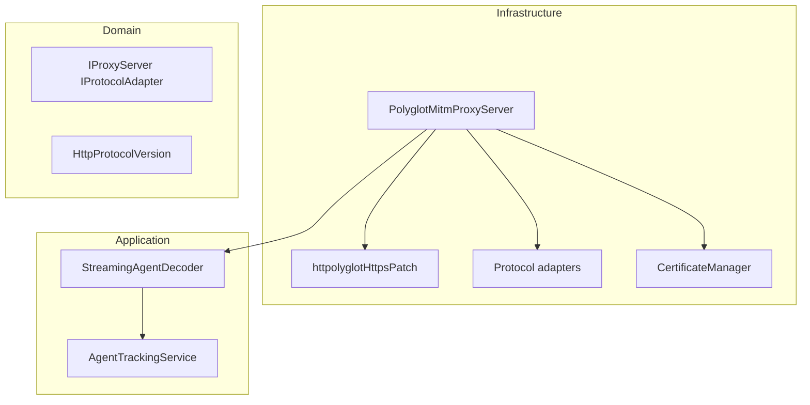
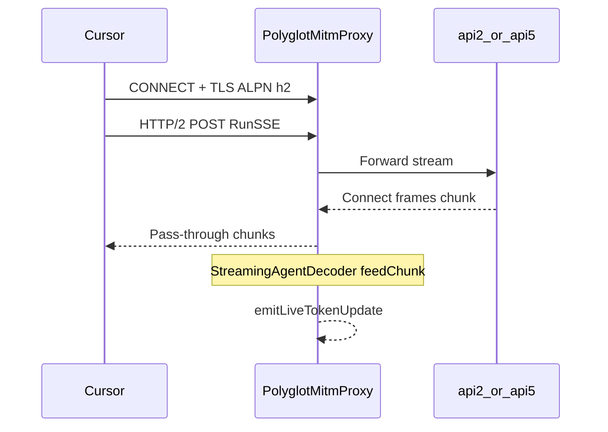

# HTTP/2 MITM proxy implementation

Technical reference for multi-protocol interception (HTTP/1.0, HTTP/1.1, HTTP/2) in cursor-accounts.

**Last reviewed:** 2026-06-04

---

## Overview

| Component | Role |
|-----------|------|
| [`http-mitm-proxy`](https://github.com/joeferner/node-http-mitm-proxy) | CONNECT tunneling, per-host leaf certs, request/response hooks |
| [`@httptoolkit/httpolyglot`](https://github.com/httptoolkit/httpolyglot) | ALPN + HTTP/2 termination on MITM TLS sockets |
| [`PolyglotMitmProxyServer`](../src/proxy/polyglotMitmProxyServer.ts) | Default child-process server (patches HTTPS factory) |
| [`StreamingAgentDecoder`](../src/proxy/streamingAgentDecoder.ts) | Connect frame decode (transport-agnostic) |

**Why httpolyglot:** Cursor Composer requires HTTP/2; a plain `https.createServer` MITM leg only speaks HTTP/1.1, so clients negotiate `h2` and traffic may bypass or fail ([forum report](https://forum.cursor.com/t/cursor-http-2-requests-dont-go-through-proxy-setting-in-the-vscode/36594)). Httpolyglot terminates `h2` and HTTP/1.x on the same port after TLS.

---

## Architecture (Clean Architecture)

| Layer | Files |
|-------|--------|
| Domain ports | [`IProxyServer`](../src/domain/ports/IProxyServer.ts), [`IProtocolAdapter`](../src/domain/ports/IProtocolAdapter.ts) |
| Domain types | [`httpProtocol.ts`](../src/domain/types/httpProtocol.ts) |
| Infrastructure | [`polyglotMitmProxyServer.ts`](../src/proxy/polyglotMitmProxyServer.ts), [`httpolyglotHttpsPatch.ts`](../src/proxy/httpolyglotHttpsPatch.ts), [`adapters/`](../src/proxy/adapters/) |
| Decode (shared) | [`streamingAgentDecoder.ts`](../src/proxy/streamingAgentDecoder.ts) |

See also [CLEAN-ARCHITECTURE-PRINCIPLES.md](CLEAN-ARCHITECTURE-PRINCIPLES.md).

---

## Protocol support

| HTTP version | Typical Cursor RPC | MITM leg | Live `token_delta` |
|--------------|-------------------|----------|-------------------|
| HTTP/1.0 | `RunPoll` (legacy) | Yes | Batch at response end |
| HTTP/1.1 | `RunSSE`, `BidiAppend` on `api2` | Yes | Incremental on `RunSSE` |
| HTTP/2 | `Run` / `RunSSE` on `agent.api5` | Yes (ALPN `h2`) | Incremental on `RunSSE` |

JSONL records include optional `protocolVersion`: `HTTP/1.0` | `HTTP/1.1` | `HTTP/2`.

---

## ALPN and TLS

1. Client sends `CONNECT host:443`.
2. Proxy completes tunnel; client starts TLS to MITM leaf cert.
3. `https.createServer` options include `ALPNProtocols: ['h2', 'http/1.1', 'http/1.0']` (see [`DEFAULT_ALPN_PROTOCOLS`](../src/domain/types/httpProtocol.ts)).
4. Httpolyglot `tlsListener` routes `alpnProtocol === 'h2'` to `http2.createServer`, else HTTP/1.x.

Per-host MITM HTTPS listeners use SNI leaf certs (http-mitm-proxy default). `forceSNI` is not enabled — it increased spurious HTTP parse errors with the httpolyglot patch.

---

## Request flow (RunSSE)

Inner protobuf is identical across HTTP versions; only framing and carrier differ.

---

## Troubleshooting

| Symptom | Check |
|---------|--------|
| Composer fails behind proxy | CA trusted? Panel CA = `Cursor Accounts MITM Proxy CA` |
| No `protocolVersion: HTTP/2` in logs | Client may still use `api2` + HTTP/1.1; run `scan:proxy-interactive` |
| `HTTPS_CLIENT_ERROR` | Wrong CA or stale host certs under `proxy/certs/certs/` |
| ALPN falls back to HTTP/1.1 | Normal for some paths; RunSSE still works on `api2` |

---

## Testing

| Test file | Covers |
|-----------|--------|
| `src/test/proxy/protocolDetection.test.ts` | HTTP version detection |
| `src/test/proxy/httpProtocolAdapters.test.ts` | Pseudo-header mapping |
| `src/test/proxy/httpolyglotHttpsPatch.test.ts` | Patch applied |
| `src/test/proxy/polyglotMitmProxyServer.test.ts` | forceSNI + factory |
| `src/test/proxy/mitmProxyServer.streaming.test.ts` | RunSSE live tokens (regression) |

---

## Related docs

- [PROXY-SETUP.md](PROXY-SETUP.md) — user setup
- [CLI-vs-EXTENSION.md](CLI-vs-EXTENSION.md) — CLI comparison hub
- [TOKENS-AND-USAGE.md](TOKENS-AND-USAGE.md) — billing signals
