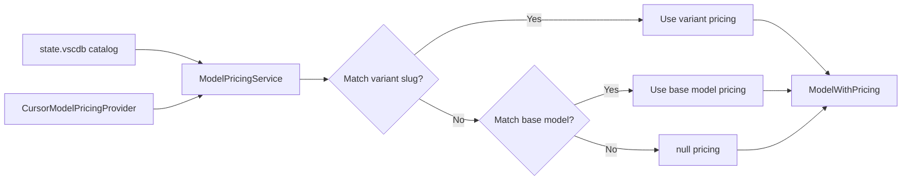
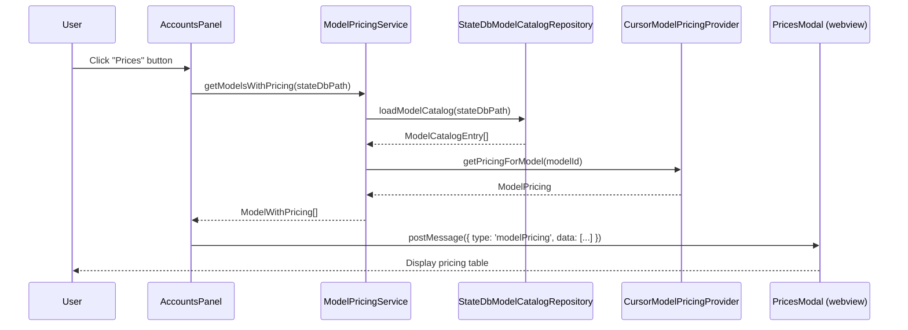

# Model Pricing — How Pricing Data Works in Cursor Accounts

Reference for the model pricing system: where pricing data comes from, how it's stored, and how the extension displays it.

**Last reviewed:** 2026-08-26

**Related:** [ENABLED-MODELS-DETECTION.md](ENABLED-MODELS-DETECTION.md), [FEATURES.md](FEATURES.md), [RESEARCH.md](RESEARCH.md)

---

## Overview

The **Cursor Accounts** extension displays per-model API pricing in the **Prices** modal, accessible from the Accounts panel. This document explains:

1. **Where pricing data comes from** (no public API exists)
2. **How pricing is stored** (hardcoded in the extension)
3. **How models are matched** (catalog entries → pricing lookup)
4. **How to update prices** (versioned manual snapshots from official docs)
5. **Architecture** (ports, providers, service layer)

**Key insight:** There is **no public Cursor API** for a complete model pricing catalog as of 2026-08-26. Pricing is therefore maintained as an explicitly versioned manual snapshot from the official Cursor documentation.

---

## The Pricing Data Challenge

### No Public API

Cursor does **not** expose a public endpoint that returns a complete model pricing catalog. The extension must maintain pricing data internally.

**Evidence from protobuf definitions:**

```protobuf
// proto/aiserver/v1/aiserver.proto
message CheckUsageBasedPrice { ... }  // Per-request price check
message GetPricingHistory { ... }     // Historical pricing data
```

These messages exist for **per-request** or **historical** queries, but there's no `GetModelPricingCatalog` RPC that returns all current model prices.

**Workaround:** The extension hardcodes official pricing from [cursor.com/docs/models-and-pricing](https://cursor.com/docs/models-and-pricing) in `CursorModelPricingProvider`.

---

## Data Sources

### 1. Hardcoded Pricing Table

**File:** `src/modelEfficiency/cursorModelPricingProvider.ts`

**Structure:**

```typescript
const PRICING_SEEDS: readonly PricingSeed[] = [
  {
    modelIds: ['legacy-enterprise-auto', 'enterprise-auto-legacy'],
    displayName: 'Legacy Enterprise Auto',
    provider: 'Cursor',
    inputPer1M: 1.25,
    outputPer1M: 6,
    cacheReadPer1M: 0.25,
    cacheWritePer1M: 1.25,
    hiddenByDefault: true,
    notes: 'Fixed legacy Enterprise Auto pricing through 2026-09-07',
  },
  cursorModel('Composer 2.5', 0.5, 2.5, {
    modelIds: ['composer-2.5'],
    cacheReadPer1M: 0.2,
    hiddenByDefault: false,
  }),
  cursorModel('Composer 2.5 (Fast)', 3, 15, {
    modelIds: ['composer-2.5-fast'],
    cacheReadPer1M: 0.5,
    hiddenByDefault: false,
  }),
  anthropic('Claude 4.5 Sonnet', 3, 15, {
    modelIds: ['claude-4.5-sonnet', 'claude-sonnet-4-5', 'claude-4.5-sonnet-thinking'],
    notes: 'Requires Max Mode on request-based plans',
  }),
  // ... 30+ more entries
];
```

**Data includes:**

| Field | Type | Description |
|-------|------|-------------|
| `modelIds` | `string[]` | All slug aliases for this model (for lookup) |
| `displayName` | `string` | Human-readable name shown in UI |
| `provider` | `'Cursor' \| 'Anthropic' \| 'OpenAI' \| 'Google' \| 'xAI' \| 'Moonshot' \| 'Unknown'` | Model vendor |
| `inputPer1M` | `number` | Input tokens cost ($/1M) |
| `outputPer1M` | `number` | Output tokens cost ($/1M) |
| `cacheReadPer1M` | `number?` | Prompt cache read cost ($/1M) |
| `cacheWritePer1M` | `number?` | Prompt cache write cost ($/1M) |
| `hiddenByDefault` | `boolean` | Whether to hide in UI by default (legacy/rarely-used models) |
| `notes` | `string?` | Usage notes (Max Mode requirements, pricing nuances) |

**Cache pricing defaults:**

For providers with prompt caching (Anthropic, OpenAI, Google):
- `cacheReadPer1M = inputPer1M * 0.1` (90% discount)
- `cacheWritePer1M = inputPer1M * 1.25` (25% premium)

Cursor models have explicit cache pricing.

### 2. Model Catalog from state.vscdb

**File:** `src/modelEfficiency/stateDbModelCatalogRepository.ts`

**Source:** Cursor's internal model catalog from the active profile's `state.vscdb`:

```typescript
const raw = await readItemTableKey(
  stateDbPath,
  APPLICATION_USER_KEY,  // applicationUser JSON
  extensionPath
);
const data = JSON.parse(raw);
const catalog = data.availableDefaultModels2; // ModelCatalogEntry[]
```

**What the catalog provides:**

- List of **all models** available to the user's plan
- **Variants** with parameter configurations (Fast, Thinking, etc.)
- **Display names** with HTML formatting
- **Legacy slugs** for backward compatibility
- **Metadata** (supports agent, supports thinking, etc.)

**What the catalog does NOT provide:**

❌ Pricing information (input/output/cache costs)  
❌ Provider names (Anthropic/OpenAI/Google)  
❌ Usage notes (Max Mode requirements)

See [ENABLED-MODELS-DETECTION.md](ENABLED-MODELS-DETECTION.md) for full catalog documentation.

---

## How Pricing Matches Models

### The Matching Flow



### Step-by-Step

**1. Load catalog from state.vscdb**

```typescript
const catalog = await catalogRepository.loadModelCatalog(stateDbPath, extensionPath);
// Returns ModelCatalogEntry[] with variants
```

**2. For each catalog entry, iterate variants**

```typescript
for (const entry of catalog) {
  const baseModelId = entry.name; // e.g. "composer-2.5"
  
  for (const variant of entry.variants) {
    const variantSlug = variant.legacySlug; // e.g. "composer-2.5-fast"
    // ...
  }
}
```

**3. Try to match variant slug first**

```typescript
const variantModelId = variant.legacySlug ?? baseModelId;
let pricing = pricingProvider.getPricingForModel(variantModelId);
```

**Lookup in hardcoded map:**

```typescript
// CursorModelPricingProvider
getPricingForModel(modelId: string): ModelPricing | null {
  const normalized = modelId.toLowerCase().trim();
  return PRICING_MAP.get(normalized) ?? null;
}
```

**4. Fallback to base model if variant not found**

```typescript
if (!pricing) {
  pricing = pricingProvider.getPricingForModel(baseModelId);
}
```

**Example:**
- Variant: `composer-2.5-fast`
- Exact variant pricing is found before the base-model fallback
- Result: the fast variant receives `$3/$15` pricing and `$0.50` cache-read pricing

**5. Combine catalog display data + pricing**

```typescript
return {
  baseModelId: 'composer-2.5',
  variantName: 'fast=true',
  displayName: 'Composer 2.5 Fast',  // From catalog (HTML stripped)
  pricing: {
    modelId: 'composer-2.5-fast',
    displayName: 'Composer 2.5 (Fast)', // From pricing provider
    provider: 'Cursor',
    inputPer1M: 3,
    outputPer1M: 15,
    cacheReadPer1M: 0.5
  },
  parameters: [{ id: 'fast', value: 'true' }]
};
```

### Fallback Behavior

**If catalog is empty or unreadable:**

```typescript
if (catalog.length === 0) {
  return this.pricingProvider.getAllModelPricing().map(pricing => ({
    baseModelId: pricing.modelId,
    displayName: pricing.displayName,
    pricing
  }));
}
```

Result: Show **only the hardcoded pricing table** (no catalog-specific variants). This happens when:
- `state.vscdb` doesn't exist
- User data dir is invalid
- Database is corrupted
- `applicationUser` key missing

---

## Architecture

### Clean Architecture Pattern

```
┌─────────────────────────────────────────────────────────┐
│                   Presentation Layer                     │
│  webview/src/components/PricesModal.tsx                 │
│  - Display pricing table                                 │
│  - Filter by provider / model                            │
└────────────────┬────────────────────────────────────────┘
                 │
┌────────────────▼────────────────────────────────────────┐
│                   Application Layer                      │
│  src/services/modelPricingService.ts                    │
│  - getModelsWithPricing()                               │
│  - getEnabledModelsWithPricing()                        │
│  - Orchestrate catalog + pricing                        │
└────────────────┬────────────────────────────────────────┘
                 │
    ┌────────────┴────────────┐
    │                         │
┌───▼─────────────┐  ┌────────▼──────────────────────────┐
│   Domain Port   │  │         Domain Port               │
│IModelCatalog    │  │   IModelPricingProvider           │
│Repository       │  │   - getPricingForModel()          │
│- loadModel      │  │   - getAllModelPricing()          │
│  Catalog()      │  │                                   │
└───┬─────────────┘  └────────┬──────────────────────────┘
    │                         │
┌───▼──────────────────────┐ ┌▼───────────────────────────┐
│   Infrastructure Layer   │ │   Infrastructure Layer     │
│StateDbModelCatalog       │ │CursorModelPricingProvider  │
│Repository                │ │- Hardcoded pricing table   │
│- Read state.vscdb        │ │- Map-based lookup          │
│- Parse JSON              │ │- Provider ordering         │
└──────────────────────────┘ └────────────────────────────┘
```

### Ports (Interfaces)

#### IModelPricingProvider

```typescript
export interface IModelPricingProvider {
  /**
   * Get the provenance of the catalog used for all returned prices.
   * @returns Immutable version, source URL, retrieval date, and coverage
   */
  getCatalogMetadata(): ModelPricingCatalogMetadata;

  /**
   * Get pricing for a specific model by ID.
   * @param modelId Model slug (e.g. 'composer-2.5', 'claude-sonnet-4-5')
   * @returns Pricing data or null if not found
   */
  getPricingForModel(modelId: string): ModelPricing | null;

  /**
   * Get all available model pricing (deduplicated by display name + rates).
   * @returns All pricing entries, sorted by provider then display name
   */
  getAllModelPricing(): ModelPricing[];
}
```

**Port location:** `src/domain/ports/IModelPricingProvider.ts`

#### IModelCatalogRepository

```typescript
export interface IModelCatalogRepository {
  /**
   * Load model catalog from state database.
   * @param stateDbPath Path to state.vscdb file
   * @param extensionPath Extension path for sqlite3 binary
   * @returns Parsed model catalog entries with variants
   */
  loadModelCatalog(
    stateDbPath: string,
    extensionPath: string
  ): Promise<ModelCatalogEntry[]>;

  /**
   * Load raw applicationUser JSON from state database.
   * @param stateDbPath Path to state.vscdb file
   * @param extensionPath Extension path for sqlite3 binary
   * @returns Raw JSON string or null if not found
   */
  loadModelCatalogRaw(
    stateDbPath: string,
    extensionPath: string
  ): Promise<string | null>;
}
```

**Port location:** `src/domain/ports/IModelCatalogRepository.ts`

### Adapters (Implementations)

#### CursorModelPricingProvider

**File:** `src/modelEfficiency/cursorModelPricingProvider.ts`

**Responsibilities:**
1. Maintain hardcoded pricing from official docs
2. Expand model ID aliases (e.g. `['gpt-5', 'gpt-5-high']` → 2 entries)
3. Normalize model IDs for lookup (lowercase, trim)
4. Deduplicate pricing by display name + rates
5. Sort by provider (Cursor → Anthropic → OpenAI → Google → xAI → Moonshot)

**Data source:** [cursor.com/docs/models-and-pricing](https://cursor.com/docs/models-and-pricing)

**Catalog snapshot:** `cursor-docs-2026-08-26`

**Retrieved on:** `2026-08-26`

**Coverage:** current models visible in the official pricing table plus
explicitly marked legacy compatibility entries. The official page contains a
larger expandable catalog; entries that are not verified in the visible table
must not be described as current.

**Update frequency:** Review immediately after a pricing/model announcement;
otherwise at least quarterly. Every update must change the catalog version and
retain the previous version in Git history.

#### StateDbModelCatalogRepository

**File:** `src/modelEfficiency/stateDbModelCatalogRepository.ts`

**Responsibilities:**
1. Read `applicationUser` from `state.vscdb`
2. Parse `availableDefaultModels2` JSON
3. Return `ModelCatalogEntry[]` with variants

**Dependencies:**
- `readItemTableKey()` — SQLite reader with retry logic
- `parseModelCatalog()` — JSON parser with validation

---

## Provider-Specific Pricing Rules

### Cursor Models

**Provider:** `'Cursor'`

**Models:** `grok-4.5`, `grok-4.6`, `composer-1`, `composer-1.5`,
`composer-2`, `composer-2.5`

**Cache pricing:** Explicit (not calculated from input rate)

**Example:**

```typescript
cursorModel('Composer 2.5', 0.5, 2.5, {
  modelIds: ['composer-2.5'],
  cacheReadPer1M: 0.2,  // Explicit
  hiddenByDefault: false,
})
cursorModel('Composer 2.5 (Fast)', 3, 15, {
  modelIds: ['composer-2.5-fast'],
  cacheReadPer1M: 0.5,  // Explicit
  hiddenByDefault: false,
})
```

**Notes:**
- Normal `Auto` has no single fixed rate: Cursor bills it at the rate of the
  model selected for each request. The provider intentionally returns no
  pricing for `auto` or `default`.
- Legacy Enterprise Auto is retained under explicit legacy IDs through
  `2026-09-07` and remains hidden by default.
- Fast variants are separate catalog entries whenever Cursor publishes a
  different rate.

### Anthropic Models

**Provider:** `'Anthropic'`

**Models:** Claude 4.x, 4.5, 4.6, 4.7, 4.8 (Haiku, Sonnet, Opus)

**Cache pricing:** Calculated (10% read, 125% write)

**Example:**

```typescript
anthropic('Claude 4.5 Sonnet', 3, 15, {
  modelIds: ['claude-4.5-sonnet', 'claude-sonnet-4-5', 'claude-4.5-sonnet-thinking'],
  notes: 'Requires Max Mode on request-based plans',
})
// cacheReadPer1M: 3 * 0.1 = 0.3
// cacheWritePer1M: 3 * 1.25 = 3.75
```

**Notes:**
- Thinking variants count as **2 requests** on legacy request-based plans
- Max Mode required for Opus/high-tier Sonnet on request-based plans

### OpenAI Models

**Provider:** `'OpenAI'`

**Models:** GPT-5, GPT-5.x, GPT-5.x Codex, variants (Mini, Nano, Fast)

**Cache pricing:** Calculated (10% read, 125% write)

**Example:**

```typescript
openAi('GPT-5.3 Codex', 1.75, 14, {
  modelIds: ['gpt-5.3-codex', 'gpt-5.3-codex-high'],
  hiddenByDefault: false,
  notes: 'Requires Max Mode on request-based plans',
})
```

**Notes:**
- Fast mode: **2x pricing** (e.g. GPT-5 Fast = `$2.5/$20` vs GPT-5 = `$1.25/$10`)
- Mini/Nano: Lower pricing for simpler tasks
- 90% cache discount on some models (GPT-5.4+)

### Google Models

**Provider:** `'Google'`

**Models:** Gemini 2.5, 3.x, 3.x Pro (Flash, Pro, Pro Image Preview)

**Cache pricing:** Calculated (10% read)

**Example:**

```typescript
google('Gemini 3.1 Pro', 2, 12, {
  modelIds: ['gemini-3.1-pro'],
  hiddenByDefault: false,
})
```

**Notes:**
- Image output priced separately (e.g. Gemini 3 Pro Image Preview: `$120/1M` image tokens)
- Flash variants optimized for speed at lower cost

### xAI Models

**Provider:** `'xAI'`

**Models:** Grok 4.x, Grok Build

**Cache pricing:** Fixed `0.2` per 1M (not calculated)

**Example:**

```typescript
{
  modelIds: ['grok-build-0.1'],
  displayName: 'Grok Build 0.1',
  provider: 'xAI',
  inputPer1M: 1,
  outputPer1M: 2,
  cacheReadPer1M: 0.2,
  hiddenByDefault: false,
  notes: '2x cost when input exceeds 200k tokens',
}
```

**Notes:**
- Long context penalty: **2x cost** when input > 200k tokens
- Max Mode required for some variants

### Moonshot Models

**Provider:** `'Moonshot'`

**Models:** Kimi K2.5

**Cache pricing:** Fixed `0.1` per 1M

**Example:**

```typescript
{
  modelIds: ['kimi-k2.5'],
  displayName: 'Kimi K2.5',
  provider: 'Moonshot',
  inputPer1M: 0.6,
  outputPer1M: 3,
  cacheReadPer1M: 0.1,
  hiddenByDefault: true,
}
```

---

## Pricing Data Maintenance

### Update Process

**Frequency:** Immediately after a pricing announcement, and at least
quarterly otherwise.

**Steps:**

1. **Check official docs:** [cursor.com/docs/models-and-pricing](https://cursor.com/docs/models-and-pricing)
2. **Compare with current table:** `src/modelEfficiency/cursorModelPricingProvider.ts`
3. **Update changed entries:**
   - Adjust `inputPer1M` / `outputPer1M`
   - Update `notes` if requirements change (Max Mode, etc.)
   - Add new models if announced
   - Mark deprecated models as `hiddenByDefault: true`
4. **Run tests:** `pnpm test -- modelPricingProvider.test.ts`
5. **Manual verification:**
   - Open Prices modal in dev mode
   - Spot-check 5-10 models against official docs
   - Verify cache pricing calculations (Anthropic/OpenAI/Google)
6. **Update catalog identity:** Change `CURSOR_MODEL_PRICING_CATALOG_VERSION`
   and `CURSOR_MODEL_PRICING_RETRIEVED_ON` together with the reviewed entries.
7. **Run the complete audit:** `CI=true pnpm run audit`
8. **Commit:** `git commit -m "chore: update model pricing from official docs (2026-MM-DD)"`

### When to Update

✅ **Update immediately if:**
- Cursor announces new model releases (e.g. Sonnet 4.9, GPT-5.6)
- Major pricing changes (>20% difference)
- New provider added (e.g. Meta, Cohere)

⏱️ **Update quarterly if:**
- Minor adjustments (<20%)
- Cache pricing logic changes
- Max Mode requirements change

❌ **Do NOT update for:**
- Plan-level discounts (per-user, not per-model)
- Temporary promotions (unless permanent)
- Beta/preview model pricing (mark with note instead)

### Version Control

**Commit message format:**

```
chore: update model pricing from official docs (2026-06-05)

Changes:
- GPT-5.3 Codex: $1.50/$12 → $1.75/$14
- Claude 4.8 Opus: removed fast mode penalty
- Gemini 3.1 Pro: added to catalog

Source: https://cursor.com/docs/models-and-pricing
```

**File header:**

```typescript
/**
 * Hardcoded Cursor model pricing from the reviewed official documentation
 * snapshot.
 *
 * Source: https://cursor.com/docs/models-and-pricing
 * Catalog version: cursor-docs-2026-08-26
 * Retrieved on: 2026-08-26
 *
 * The catalog contains current visible entries plus legacy compatibility
 * entries. Legacy entries must not be described as current.
 */
```

---

## UI Implementation

### Prices Modal Flow



### Data Shape Sent to Webview

**Type:** `ModelPricingDisplayData[]` (defined in `packages/types/src/contracts/modelPricingMessages.ts`)

```typescript
export interface ModelPricingDisplayData {
  baseModelId: string;          // 'composer-2.5'
  displayName: string;          // 'Composer 2.5 Fast'
  provider: string;             // 'Cursor'
  inputPer1M: number | null;    // 0.5
  outputPer1M: number | null;   // 2.5
  cacheReadPer1M: number | null | undefined;  // 0.2
  cacheWritePer1M: number | null | undefined; // 0.25
  notes?: string;               // 'Auto + Composer pool pricing'
  variantName?: string;         // 'fast=true'
  parameters?: Array<{ id: string; value: string }>; // [{ id: 'fast', value: 'true' }]
}
```

### Webview Display Logic

**File:** `webview/src/components/PricesModal.tsx`

**Features:**
1. **Provider filter** — show only Cursor/Anthropic/OpenAI/Google/xAI/Moonshot
2. **Parameter filter** — filter by `fast`, `thinking`, `context`, `effort`
3. **Search** — filter by model display name
4. **Sorting** — by provider (fixed order), then display name (alphabetical)
5. **Null pricing** — show "—" when pricing data missing
6. **Notes tooltip** — hover to see Max Mode requirements, etc.

**Filter state:**

```typescript
const [filters, setFilters] = useState<PricesModalFilters>({
  provider: undefined,
  fast: undefined,
  thinking: undefined,
  context: undefined,
  effort: undefined,
});
```

**Filter logic:**

```typescript
function filterModels(
  models: ModelPricingDisplayData[],
  filters: PricesModalFilters
): ModelPricingDisplayData[] {
  return models.filter(model => {
    if (filters.provider && model.provider !== filters.provider) {
      return false;
    }
    
    // Check if model has the required parameter value
    for (const [dimension, value] of Object.entries(filters)) {
      if (dimension === 'provider' || !value) continue;
      
      const parameter = model.parameters?.find(p => p.id === dimension);
      if (!parameter || parameter.value !== value) {
        return false;
      }
    }
    
    return true;
  });
}
```

---

## Testing

### Unit Tests

**File:** `src/test/modelEfficiency/cursorModelPricingProvider.test.ts`

**Coverage:**
- ✅ Lookup by model ID (exact match)
- ✅ Lookup by alias (e.g. `gpt-5` → `gpt-5-high`)
- ✅ Case-insensitive matching
- ✅ Returns null for unknown models
- ✅ Deduplication (same display name + rates)
- ✅ Provider ordering (Cursor first, Unknown last)

**File:** `src/test/services/modelPricingService.test.ts`

**Coverage:**
- ✅ Combines catalog + pricing
- ✅ Falls back to base model pricing if variant not found
- ✅ Strips HTML from catalog display names
- ✅ Extracts variant parameter values
- ✅ Returns hardcoded pricing when catalog empty

### Integration Tests

**File:** `src/test/modelPricingIntegration.test.ts`

**Coverage:**
- ✅ Real `state.vscdb` fixture with catalog
- ✅ Match catalog variants to pricing
- ✅ Handle missing pricing gracefully (null)

### Manual Testing Checklist

- [ ] Open Prices modal from Accounts panel
- [ ] Verify normal Auto is shown without a fabricated fixed price
- [ ] Verify Cursor models (Grok 4.6, Grok 4.5, Composer 2.5 and Fast) display correctly
- [ ] Verify Anthropic models (Claude Sonnet 5, Claude Opus 5) display correctly
- [ ] Verify OpenAI models (GPT-5.6 Luna, Sol and Terra) display correctly
- [ ] Verify Google models (Gemini 3.1 Pro, Gemini 3.7 Flash) display correctly
- [ ] Test provider filter (select "Anthropic" → only Claude models)
- [ ] Test parameter filter (select "Fast" → only fast variants)
- [ ] Verify cache pricing shown (cacheReadPer1M, cacheWritePer1M columns)
- [ ] Verify notes tooltip (hover → see Max Mode requirements)
- [ ] Verify null pricing shows "—" (e.g. unknown model from catalog)

---

## Limitations & Known Issues

### No Real-Time Pricing

**Issue:** Pricing is hardcoded, not fetched from Cursor API.

**Impact:**
- Pricing may be outdated (lag of days/weeks after Cursor updates docs)
- No automatic notification of pricing changes
- User may see incorrect estimates if using outdated extension version

**Mitigation:**
- Versioned manual snapshots with an explicit source URL and retrieval date
- Immediate review after model or pricing announcements, plus quarterly review
- Version extension on major pricing changes
- Persist the pricing snapshot version and calculation source with calculated
  cost records. Migration 010 adds this provenance to completed turns,
  minute-bucket aggregates, and the delta idempotency ledger; heterogeneous
  aggregates are marked `mixed` rather than assigned a false snapshot.

### Plan-Level Discounts Not Reflected

**Issue:** Pricing shows per-token rates, not user's effective rate.

**Impact:**
- Pro plan users may have included pools (not shown)
- Business plan users may have volume discounts (not shown)
- Pricing modal shows "sticker price," not "your price"

**Mitigation:**
- Add disclaimer: "Rates shown are base per-token prices. Your plan may include discounts or included pools."
- Link to Cursor Settings → Usage for actual billing

### Variant Pricing Ambiguity

**Issue:** Cursor may publish a distinct price for a variant, while the local
model catalog only exposes the variant relationship.

**Impact:**
- Falling back to the base model can understate or overstate cost
- Modal doesn't explain speed/quality tradeoffs

**Mitigation:**
- Resolve exact variant slugs before the base-model fallback
- Maintain separate entries whenever Cursor publishes separate rates
- Add a regression test for every currently documented fast variant

### Missing Models

**Issue:** If user's plan includes beta/preview models, they may not be in hardcoded table.

**Impact:**
- Modal shows "—" (null pricing) for new models
- User can't see pricing for models they can actually use

**Mitigation:**
- Fallback to `hiddenByDefault: true` pricing if model matches known provider pattern
- Show "Contact support for pricing" for truly unknown models

---

## Future Improvements

### Phase 1: Enhanced Pricing Data (Current Release)

✅ **Implemented:**
- Hardcoded pricing table with 30+ models
- Catalog + pricing matching service
- Webview modal with filters
- Provider/parameter-based filtering

### Phase 2: Enabled Models Filter

🔄 **In Progress:**
- Parse `modelOverrideEnabled` / `modelOverrideDisabled` from `state.vscdb`
- Add "Show only enabled models" checkbox
- Filter modal to user's active models only

See [ENABLED-MODELS-DETECTION.md](ENABLED-MODELS-DETECTION.md) for implementation plan.

### Phase 3: Cost Estimation

💡 **Proposed:**
- Integrate with proxy traffic logs ([TOKENS-AND-USAGE.md](TOKENS-AND-USAGE.md))
- Calculate actual cost per Agent session: `(input_tokens * inputPer1M + output_tokens * outputPer1M + cached_tokens * cacheReadPer1M) / 1_000_000`
- Display in status bar tooltip: "Last chat: ~$0.08"
- Add to efficiency analysis: "You could save $X by using Composer 2.5 instead of Opus"

### Phase 4: Public Pricing API (If Cursor Adds It)

💡 **Proposed:**
- Create `CursorApiModelPricingProvider` adapter
- Fetch pricing from `GET /api/models/pricing` (hypothetical endpoint)
- Fall back to hardcoded table if API unavailable
- Invalidate cache every 24h

**Interface:**

```typescript
export interface IModelPricingProvider {
  getPricingForModel(modelId: string): Promise<ModelPricing | null>;
  getAllModelPricing(): Promise<ModelPricing[]>;
}
```

(Add `async` to port, update all implementations)

---

## Related Documentation

| Document | Relation |
|----------|----------|
| [ENABLED-MODELS-DETECTION.md](ENABLED-MODELS-DETECTION.md) | How Cursor stores enabled/disabled model toggles (complements pricing display) |
| [FEATURES.md](FEATURES.md) | User-facing feature overview (includes Prices modal) |
| [RESEARCH.md](RESEARCH.md) | API research (notes lack of public pricing endpoint) |
| [TOKENS-AND-USAGE.md](TOKENS-AND-USAGE.md) | Token usage tracking (future: combine with pricing for cost estimates) |
| [MODEL-EFFICIENCY.md](MODEL-EFFICIENCY.md) | Model efficiency analysis (future: recommend cheaper alternatives based on pricing) |
| [ARCHITECTURE.md](ARCHITECTURE.md) | System architecture (pricing as a domain service) |

**Code references:**
- Hardcoded pricing: `src/modelEfficiency/cursorModelPricingProvider.ts`
- Service layer: `src/services/modelPricingService.ts`
- Port interfaces: `src/domain/ports/IModelPricingProvider.ts`, `src/domain/ports/IModelCatalogRepository.ts`
- Catalog repository: `src/modelEfficiency/stateDbModelCatalogRepository.ts`
- Webview UI: `webview/src/components/PricesModal.tsx`
- Type definitions: `packages/types/src/contracts/modelPricingMessages.ts`, `packages/types/src/entities/ModelPricing.ts`

---

## Quick Reference

### Add a New Model

1. Open `src/modelEfficiency/cursorModelPricingProvider.ts`
2. Add entry to `PRICING_SEEDS`:

```typescript
anthropic('Claude 4.9 Sonnet', 3, 15, {
  modelIds: ['claude-4.9-sonnet', 'claude-sonnet-4-9'],
  notes: 'Requires Max Mode on request-based plans',
})
```

3. Run tests: `pnpm test -- modelPricingProvider.test.ts`
4. Commit with source URL in message

### Update a Model Price

1. Find model in `PRICING_SEEDS` by `displayName`
2. Update `inputPer1M` / `outputPer1M`
3. Update `notes` if requirements changed
4. Update file header `Retrieved: YYYY-MM-DD`
5. Run tests and commit

### Debug Missing Pricing

1. Check if model is in catalog: `availableDefaultModels2`
2. Check variant `legacySlug` matches hardcoded `modelIds`
3. Check case-sensitivity (all lowercase in map)
4. Add debug log in `ModelPricingService.buildFromCatalog()`:

```typescript
console.log('Matching variant:', variantModelId, '→', pricing);
```

5. If still missing, add to `PRICING_SEEDS`

---

## Changelog

| Date | Change |
|------|--------|
| 2026-06-05 | Initial documentation; pricing table covers 30+ models from official docs |
| 2026-06-05 | Added `getEnabledModelsWithPricing()` for filtering to enabled models |

---

**Maintainer notes:**
- Review this document when pricing structure changes (e.g. Cursor moves to credit-based billing)
- Update provider list if new vendors added (e.g. Meta Llama, Mistral)
- Re-evaluate "no public API" assumption every 6 months (check protobuf for new RPCs)
