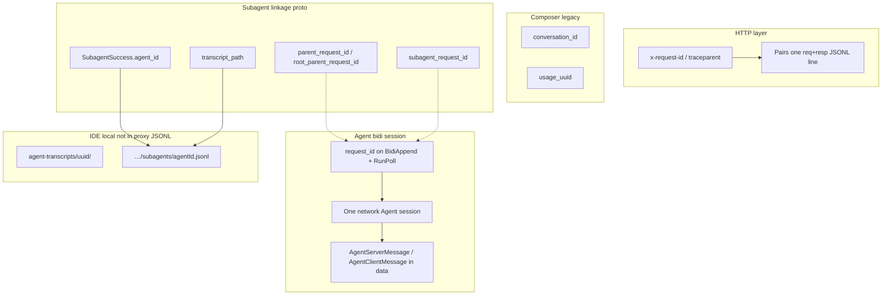
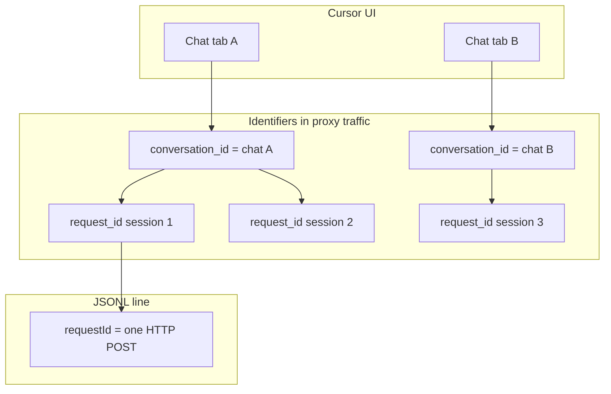

# Proxy: Agent IDs, Chats, and Parallel Subagents

How identifiers in MITM logs relate to Agent sessions, parent chats, parallel subagents, and token attribution. For token field definitions see [TOKENS-AND-USAGE.md](TOKENS-AND-USAGE.md). For CLI vs extension gaps see [CLI-vs-EXTENSION.md](CLI-vs-EXTENSION.md). For raw log shape see [PROXY-JSONL-SCHEMA.md](PROXY-JSONL-SCHEMA.md).

**Last reviewed:** 2026-06-04 (validated against local `proxy-2026-06-03-*.jsonl` captures)

---

## ID taxonomy



| ID | Where captured | Extension uses today? | Role |
|----|----------------|----------------------|------|
| `x-request-id` / `traceparent` | HTTP headers → JSONL `requestId` | Yes (duration, log pairing) | One HTTP POST round-trip |
| `request_id` | `BidiAppend`, `RunPoll`, `BidiPoll` payloads | **Yes** — primary Agent session key | Entire bidi Agent run (parent **or** subagent) |
| `conversation_id` | `AgentRunRequest`, `StreamComposer`, `StreamChat` | Partial (`ConversationContext`) | Stable chat/composer id (legacy + Agent metadata) |
| `conversation_group_id` | `AgentRunRequest` | No | Groups related conversations (proto) |
| `usage_uuid` | Stream chunks, composer responses | Logged only | Lookup key for `GetTokenUsage` RPC |
| `append_seqno` / `seqno` | `BidiAppend` / `RunPoll` | Yes (insights) | Ordering within a `request_id` session |
| `subagent_request_id` | `PreparedTaskSubagent` (server-side prep) | **No** | Intended bidi id for spawned subagent |
| `parent_request_id` / `root_parent_request_id` | `PreparedTaskSubagent` | **No** | Link subagent bidi session to parent |
| `SubagentSuccess.agent_id` | `ExecClientMessage.subagent_result` on parent `BidiAppend` | **No** | Subagent instance id (matches IDE transcript filename) |
| `SubagentSuccess.transcript_path` | Same | **No** | Path to IDE subagent JSONL |
| `SubagentStartRequestQuery.is_parallel_worker` | `InteractionQuery` (server → client) | **No** | Marks parallel worker subagent |
| `parallel_tool_call_id` | Tool call messages (`aiserver` proto) | **No** | Parallel tool batch correlation |

---

## Chat windows and agent identifiers

**Yes — the docs now cover this explicitly.** If you see different UUIDs when switching between Agent chat tabs, that is expected. The proxy logs **do not** use a single “chat window id” field on every line; you must decode protobuf and know which id means what.

### What you see in the logs vs what it means



| Identifier | Scope | Changes when… | Best for |
|------------|-------|---------------|----------|
| **`conversation_id`** | One **Agent/Composer chat tab** (stable chat identity) | You open a **new** chat tab; subagents get their **own** `conversation_id` | “Which **window/tab** is this?” |
| **`conversation_group_id`** | Links a **child** session to its **parent** chat | Set on subagent `runRequest`; value is usually the parent’s `conversation_id` | “Which parent chat spawned this subagent?” |
| **`request_id`** (bidi) | One **network Agent session** (`BidiAppend` + `RunPoll`) | New agent run, reconnect, **parallel subagent**, or session restart — **even within the same chat** | Token streams, live status bar, `summarize:session-tokens` |
| **`requestId`** (JSONL HTTP) | One **HTTP POST** | Every single RPC request | Pair req/resp lines, duration |
| **`generation_id`** | One **generation** within a conversation (proto) | New model generation step | Fine-grained turn grouping (not extracted by extension) |
| **`SubagentSuccess.agent_id`** | One **subagent instance** | Each Task/subagent launch | Matches `agent-transcripts/…/subagents/<agentId>.jsonl` |

**Important:** The extension live status bar and proxy output hints show **`agent=<first 8 chars of bidi request_id>`**, not `conversation_id`. Two tabs therefore always look different in the UI if they use different bidi sessions — even when you expect “the same project”.

### Where `conversation_id` appears in captured traffic

Not on every JSONL line. It is inside decoded **`BidiAppend`** payloads when the client sends `AgentClientMessage.runRequest`:

| Path (decoded, camelCase) | When present |
|-----------------------------|--------------|
| `runRequest.conversationId` | Start/continue of an Agent turn |
| `runRequest.conversationGroupId` | Subagent sessions (points to parent chat id) |
| `runRequest.conversationState…` | Checkpoint / resume metadata |

Plain-text grep on raw JSONL **misses** these fields when bodies are protobuf/base64. Use `pnpm run analyze:proxy-traffic` or proto decode scripts.

The extension extracts `conversation_id` only for legacy **`StreamComposer` / `StreamChat`** paths into `ConversationContext` ([`extractConversationContext`](../src/proxy/proxyInsightExtractor.ts)). It does **not** surface `runRequest.conversationId` from Agent bidi traffic in insights today.

### Empirical mapping (local logs, June 2026)

From `proxy-2026-06-03-1780530421985.jsonl`:

| Pattern | Example | Meaning |
|---------|---------|---------|
| One chat → **many** `request_id`s | Chat `a4387fcb…` → 6 bidi sessions (`794c57ba…`, `33e356b2…`, …) | Same tab, multiple network sessions over time (new turns/restarts) |
| Two chats → **different** `conversation_id`s | `a4387fcb…` vs `829c05cf…` | Two open Agent tabs interleaved in one log file |
| Subagent → own `conversation_id` + **`conversation_group_id`** | Child `dc48d3b4…`, group `829c05cf…` | Subagent worker linked to parent chat `829c05cf…` |
| Transcript folder | `agent-transcripts/829c05cf-…/` | Folder UUID often equals **parent** `conversation_id` (from `subagent_result.transcriptPath`) |

When **multiple chat windows** are open, all traffic goes to the **same** proxy log (per machine/profile). Lines are interleaved by timestamp; filter by `conversation_id` or by clustering `request_id` time ranges to isolate one tab.

### How to tie a log session to a chat tab

1. **List bidi sessions** in a time window:
   ```bash
   pnpm run summarize:session-tokens -- ~/.cursor-accounts/proxy/logs/<log>.jsonl
   ```
   Output lists all `request_id` UUIDs — each is one network session, not necessarily one chat tab.

2. **Decode `BidiAppend` → `runRequest.conversationId`** for the `request_id` you care about (first append of that session usually carries it).

3. **Optional — IDE transcripts:** if subagents ran, `subagent_result.transcriptPath` contains `agent-transcripts/<parent-uuid>/`; that `<parent-uuid>` matches the parent chat’s `conversation_id`.

4. **Do not use** JSONL `requestId` (HTTP header) as the chat id — it changes on every POST and is unrelated to the Agent tab.

### Legacy Composer chats

Older **Composer / StreamChat** traffic (not Agent bidi) uses `conversation_id` on stream RPCs directly. A legacy composer tab and an Agent tab for the “same” work may show **different** id schemes. Prefer Agent bidi fields when both appear in one capture.

---

## Agent session lifecycle (HTTP/1 / api2)

Observed in real logs with `cursor.general.disableHttp2: true`:

1. Client opens session: **`BidiAppend`** with a new UUID `request_id`.
2. Client sends framed **`AgentClientMessage`** blobs in `data` (`run_request`, `exec_client_message`, heartbeats, later `subagent_result`, etc.).
3. Client polls **`RunPoll`** (same `request_id` on requests).
4. Server responds with **`BidiPollResponse`**: `seqno`, optional `data` → **`AgentServerMessage`** (`interaction_update`, checkpoints, exec messages).
5. Token signals arrive inside **`InteractionUpdate`** on RunPoll **responses** (see [TOKENS-AND-USAGE.md](TOKENS-AND-USAGE.md)).

Each distinct `request_id` with sustained `BidiAppend` traffic = **one independent Agent network session**.

---

## Parallel subagents — what the proxy actually shows

### Empirical pattern (June 2026 captures)

When the parent Agent launches **parallel Task subagents** (e.g. multiple locale translation workers):

| Observation | Evidence |
|-------------|----------|
| Each subagent gets its **own `request_id`** and full `BidiAppend`/`RunPoll` stream | Log `proxy-2026-06-03-1780529195876.jsonl`: 13 concurrent `request_id`s; parent `cecdd311…` overlapped with `59016b32…`, `f763b304…`, `288aecd1…`, etc. |
| Subagent **`token_delta` peaks** appear on **subagent** `request_id`s, not the parent | Same log: parent max `token_delta` ≈ **480**; subagent `cc9489b7…` max ≈ **3746** |
| Parent receives results via **`subagent_result`** on **`BidiAppend` requests** (client → server) | `ExecClientMessage.subagent_result.success` with `agentId`, `finalMessage`; background subagents also carry `transcriptPath` |
| `PreparedTaskSubagent.parent_request_id` **not observed** in decoded client/server frames in these logs | Likely prepared server-side or on a path not emitted to client |
| `turn_ended` **absent** on all analyzed sessions | 0 events across ~273 MB of captures; billing breakdown not on RunPoll path |

Example **`subagent_result`** (decoded inner field names, camelCase):

```json
{
  "subagentResult": {
    "success": {
      "agentId": "dc48d3b4-3685-420a-8bfa-2ae13e9639ec",
      "backgroundReason": "SubagentBackgroundReason_SUBAGENT_BACKGROUND_REASON_AGENT_REQUEST",
      "transcriptPath": "/Users/…/.cursor/projects/…/agent-transcripts/829c05cf-…/subagents/dc48d3b4-….jsonl"
    }
  }
}
```

### Parallel vs sequential subagents

| Mode | Network signature | Token attribution |
|------|-------------------|-------------------|
| **Parallel** | Multiple `request_id`s with **overlapping timestamps** and high `BidiAppend` counts | Each session has its own `token_delta` stream; status bar **sums all** ([`agentLiveUsageStatusBar.ts`](../src/ui/agentLiveUsageStatusBar.ts)) |
| **Sequential** | New `request_id` after prior session ends; or same parent id with subagent results between tool rounds | Parent + one active subagent at a time; still separate ids if subagent uses own bidi session |
| **Background** | Subagent runs while parent continues; result arrives as `subagent_result` with `transcriptPath` | Subagent tokens on subagent `request_id`; parent may show low `token_delta` during wait |

Detect parallel overlap offline: group `BidiAppend` by `request_id`, compare `[first_ts, last_ts]` ranges (see `summarize:session-tokens` listing multiple ids per log window).

---

## Chats vs Agent sessions vs IDE transcripts

Three different artifacts:

| Artifact | Location | Primary chat identifier |
|----------|----------|-------------------------|
| **Proxy JSONL** | `~/.cursor-accounts/proxy/logs/` | **`conversation_id`** in decoded `runRequest` (chat tab); **`request_id`** per network session |
| **Parent agent transcript** | `~/.cursor/projects/<proj>/agent-transcripts/<uuid>.jsonl` | Folder `<uuid>` ≈ parent **`conversation_id`** |
| **Subagent transcript** | `…/agent-transcripts/<uuid>/subagents/<agentId>.jsonl` | `<agentId>` = **`SubagentSuccess.agent_id`**; folder `<uuid>` = parent chat |

The proxy **does not read** IDE transcript files. Correlation is manual:

1. Find `subagent_result.success.transcriptPath` in decoded `BidiAppend` (parent `request_id`).
2. Match `agentId` in path to subagent transcript filename.
3. Match parent transcript folder UUID to **`conversation_id`** of the parent chat tab.

See [Chat windows and agent identifiers](#chat-windows-and-agent-identifiers) for why one tab can produce many `request_id`s in the same log.

---

## Inner message types (typical Agent session)

From decoded `AgentClientMessage` / `AgentServerMessage` frequency in heavy logs:

| Inner field | Direction | Typical role |
|-------------|-----------|--------------|
| `kvClientMessage` / `kvServerMessage` | Both | KV/state sync |
| `execClientMessage` / `execServerMessage` | Both | Tool execution, **`subagentResult`** |
| `execClientControlMessage` / `execServerControlMessage` | Both | Exec stream control |
| `interactionUpdate` | Server → client | **`token_delta`**, text/tool/thinking deltas |
| `runRequest` | Client → server | Start/continue turn; subagent **model config** |
| `clientHeartbeat` | Client → server | Keepalive |
| `conversationCheckpointUpdate` | Server → client | **`token_details`** (context window snapshot) |
| `conversationAction` | Client → server | User actions |

Subagent **configuration** on session start (not execution):

- `runRequest.selectedSubagentModels`
- `runRequest.canCreateCloudSubagents`
- `runRequest.customSubagents` / `customSubagentsInfoComplete` (in nested `requestContext`)

---

## Extension behavior today

[`AgentLiveUsageStatusBar`](../src/ui/agentLiveUsageStatusBar.ts):

- Keys sessions by **`agent.requestId`** (bidi `request_id`; fallback: HTTP `requestId`, `'active'`).
- **Does not** key by `conversation_id` — two open chat tabs always appear as separate bidi sessions in the status bar.
- **Sums** `token_delta`-derived totals across **all** active sessions → correct for “total activity” but **does not** label parent vs subagent or per-tab.
- Counter-reset heuristic (peak ≥ 300 → drop ≤ 150) tracks **multi-turn within one `request_id`**, not parent/child links.
- Does **not** parse `subagent_result`, `parent_request_id`, or `PreparedTaskSubagent`.

[`extractAgentInnerInsights`](../src/proxy/proxyInsightExtractor.ts) only extracts:

- `InteractionUpdate.token_delta`
- `InteractionUpdate.turn_ended`
- `conversation_checkpoint_update.token_details`

---

## Protobuf reference (subagent-related)

Key messages in [`proto/agent/v1/agent.proto`](../proto/agent/v1/agent.proto):

| Message | Relevant fields |
|---------|-----------------|
| `PreparedTaskSubagent` | `subagent_id`, `subagent_request_id`, `parent_request_id`, `root_parent_request_id`, `tool_call_id` |
| `SubagentArgs` | `tool_call_id`, `subagent_type`, `parent_conversation_id`, `root_parent_conversation_id`, `run_in_background`, `environment` |
| `SubagentStartRequestQuery` | `is_parallel_worker`, `parent_conversation_id`, `conversation_id`, `tool_call_id` |
| `SubagentSuccess` | `agent_id`, `final_message`, `transcript_path`, `background_reason` |
| `SubagentResult` | `success` / `error` wrapper on `ExecClientMessage` |
| `AgentRunRequest` | `conversation_id`, `conversation_group_id`, `selected_subagent_models`, `subagent_type_name` |

Cloud/legacy paths in [`proto/aiserver/v1/aiserver.proto`](../proto/aiserver/v1/aiserver.proto): `SubagentInfo`, `CloudSubagentParentReference`, `parallel_tool_call_id` — not extracted by extension.

---

## Practical analysis recipes

### List Agent sessions in a log window

```bash
pnpm run summarize:session-tokens -- ~/.cursor-accounts/proxy/logs/<log>.jsonl
# → "Agent Bidi request_id(s): N" with UUID list
```

### Compare parent vs subagent streaming counters

Decode all `RunPoll` responses and group `token_delta` max by correlating with the most recent `BidiAppend.request_id` on the same connection pattern (see analyze script pattern in repo scripts).

Empirical result on parallel translation job:

| Session (prefix) | Role (inferred) | Max `token_delta` |
|------------------|-----------------|-------------------|
| `cecdd311` | Parent orchestrator | 480 |
| `cc9489b7` | Subagent worker | 3746 |
| `38333805` | Subagent worker | 1871 |

Summing peaks **double-counts** work already billed per subagent on the server.

### Find subagent completions

Search decoded `BidiAppend` inner messages for `subagentResult` / `subagent_result` (requires proto decode — plain text grep misses binary bodies).

### Group traffic by chat tab (`conversation_id`)

Decode `BidiAppend` request bodies and read `runRequest.conversationId`. Cluster all bidi `request_id`s that share the same `conversation_id` to reconstruct one Agent chat tab’s network activity. Expect **multiple** `request_id`s per tab after restarts or long sessions.

Example from local logs: chat `a4387fcb-8a88-4981-89ba-bc66962153c6` appeared under bidi sessions `794c57ba…`, `33e356b2…`, `5b76d8ef…`, etc. — one tab, many network sessions.

---

## Gaps and future work

| Gap | Impact |
|-----|--------|
| No `conversation_id` in proxy insights | Cannot filter live UI or output by chat tab without decode |
| No extraction of `parent_request_id` ↔ `subagent_request_id` | Cannot build subagent tree from logs alone |
| `subagent_result` in live UI | `agent_id` extracted to `subagentRequestId` on decode; transcript path and status bar labels not implemented |
| Parallel sessions summed in status bar | Inflated “live tokens” vs parent-only view |
| `turn_ended` rarely on wire | No per-turn billed breakdown in proxy |
| HTTP/2 / `api5` path | May miss nested `RunPoll` frames; see [TOKENS-AND-USAGE.md](TOKENS-AND-USAGE.md) |

---

## Related documentation

| Document | Topic |
|----------|--------|
| [TOKENS-AND-USAGE.md](TOKENS-AND-USAGE.md) | `token_delta`, billing channels, validation |
| [PROXY-JSONL-SCHEMA.md](PROXY-JSONL-SCHEMA.md) | JSONL fields and body spill |
| [PROXY-SETUP.md](PROXY-SETUP.md) | Capture checklist |
| [USAGE-EVENTS-API.md](USAGE-EVENTS-API.md) | Per-request billed tokens + `chargedCents` |
