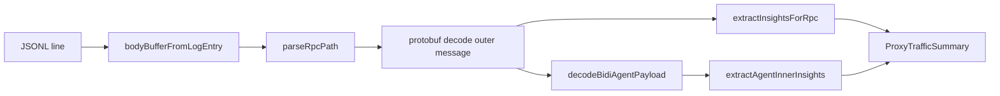

# Proxy JSONL Log Schema

Reference for every field written by the MITM proxy to `~/.cursor-accounts/proxy/logs/`. For what those logs *mean* for tokens, billing, and agent sessions, see [TOKENS-AND-USAGE.md](TOKENS-AND-USAGE.md) and [PROXY-AGENT-IDS-AND-SUBAGENTS.md](PROXY-AGENT-IDS-AND-SUBAGENTS.md).

**Last reviewed:** 2026-06-04

**Prerequisite:** JSONL files are written only when **`cursorAccounts.proxy.developmentMode`** is `true` (default `false`). Normal extension use receives traffic via IPC from the proxy child; see [PROXY-SETUP.md](PROXY-SETUP.md#traffic-to-the-extension-ipc-vs-jsonl).

## Storage layout

| Path | Contents |
|------|----------|
| `~/.cursor-accounts/proxy/logs/proxy-YYYY-MM-DD-<timestamp>.jsonl` | One JSON object per line (`ProxyLogEntry`) |
| `~/.cursor-accounts/proxy/logs/bodies/<key>.bin` | Raw request/response bodies spilled when inline limit exceeded |
| `~/.cursor-accounts/proxy/certs/` | MITM CA and leaf certificates |
| `~/.cursor-accounts/proxy/proxy-state.json` | Per-profile proxy runtime state |

Implementation: [`src/proxy/requestLogger.ts`](../src/proxy/requestLogger.ts), [`src/proxy/bodyCapture.ts`](../src/proxy/bodyCapture.ts), [`src/proxy/sharedProxyPaths.ts`](../src/proxy/sharedProxyPaths.ts).

### Rotation and size limits

- New file opened on logger init and when total storage exceeds **Proxy: Max Log Size MB** (default 500).
- Oldest `proxy-*.jsonl` files deleted first; then oldest `bodies/*.bin` if still over cap.
- Inline body limit: **Proxy: Max Body Log MB** (default 4). Larger bodies → `bodyFile` spill.

---

## `ProxyLogEntry` — one JSONL line

TypeScript definition: [`src/proxy/types.ts`](../src/proxy/types.ts) (`ProxyLogEntry`).

### Core fields

| Field | Type | Required | Description |
|-------|------|----------|-------------|
| `timestamp` | ISO 8601 string | yes | When the event was logged (UTC) |
| `direction` | `"request"` \| `"response"` \| `"error"` | yes | HTTP direction or proxy error |
| `url` | string | yes | Full request URL, or `"unknown"` on some errors |
| `host` | string | yes | Host header, or `"unknown"` |
| `headers` | `Record<string, string>` | yes | Normalized HTTP headers (arrays joined with `", "`) |
| `method` | string | request/error | HTTP method (e.g. `POST`) |
| `statusCode` | number | response | HTTP status code |

### Body fields (mutually combinable)

Bodies are captured **after** gzip/brotli decompression when applicable (`bodyDecompressed: true`).

| Field | When set | Description |
|-------|----------|-------------|
| `body` | Text / JSON inline | UTF-8 string (Connect JSON or plain text) |
| `bodyBase64` | Binary inline | Base64-encoded raw bytes |
| `bodyEncoding` | Inline bodies | `"utf8"` or `"base64"` |
| `bodyRawBytes` | Any capture | Original byte length before encoding |
| `bodyDecompressed` | Decompressed | `true` if `content-encoding` was stripped |
| `bodyTruncated` | Inline only | `true` if inline storage was truncated (rare; prefer spill) |
| `bodyFile` | Spilled | Relative path under log dir, e.g. `bodies/4063b763-9702-415c-8f90-5f8e24c47e55-request.bin` |

Spill key pattern: `{x-request-id}-{request|response}` when `x-request-id` / `traceparent` is present; otherwise a random suffix.

### Classification flags

| Field | Type | Description |
|-------|------|-------------|
| `isConnectRpc` | boolean | `content-type` looks like Connect/gRPC/proto |
| `isCursorHost` | boolean | Host matches `*.cursor.sh`, `*.cursor.com`, `*.cursorapi.com` |
| `requestId` | string | From `x-request-id` or W3C `traceparent` (trace id segment) |
| `protocolVersion` | `"HTTP/1.0"` \| `"HTTP/1.1"` \| `"HTTP/2"` | Client↔proxy leg (ALPN / `httpVersion`); see [HTTP2-PROXY-IMPLEMENTATION.md](HTTP2-PROXY-IMPLEMENTATION.md) |

`isCursorHost` is informational for statistics; **all** hosts are logged, not only Cursor.

### Error-only fields

| Field | Description |
|-------|-------------|
| `errorKind` | e.g. `HTTPS_CLIENT_ERROR`, `PROXY_ERROR` |
| `errorMessage` | OpenSSL / proxy error text |

Common at session start before CA trust: `SSLV3_ALERT_CERTIFICATE_UNKNOWN` (`direction: "error"`, `host: "unknown"`).

---

## Example lines (redacted)

### Connect RPC request (`BidiAppend`)

```json
{
  "timestamp": "2026-06-03T23:31:45.293Z",
  "direction": "request",
  "method": "POST",
  "url": "https://api2.cursor.sh/aiserver.v1.BidiService/BidiAppend",
  "host": "api2.cursor.sh",
  "statusCode": undefined,
  "headers": {
    "content-type": "application/connect+proto",
    "authorization": "Bearer eyJ…",
    "x-request-id": "a1b2c3d4-e5f6-7890-abcd-ef1234567890"
  },
  "bodyBase64": "…",
  "bodyEncoding": "base64",
  "bodyRawBytes": 8421,
  "bodyDecompressed": true,
  "isConnectRpc": true,
  "isCursorHost": true,
  "requestId": "a1b2c3d4-e5f6-7890-abcd-ef1234567890"
}
```

Decoded outer message (conceptual): `BidiAppendRequest` with `request_id`, `append_seqno`, hex `data` holding nested `AgentClientMessage`.

### Connect RPC response (`RunPoll`)

```json
{
  "timestamp": "2026-06-03T23:35:01.552Z",
  "direction": "response",
  "method": "POST",
  "url": "https://api2.cursor.sh/agent.v1.AgentService/RunPoll",
  "host": "api2.cursor.sh",
  "statusCode": 200,
  "headers": {
    "content-type": "application/connect+proto"
  },
  "bodyBase64": "…",
  "bodyEncoding": "base64",
  "bodyRawBytes": 128,
  "isConnectRpc": true,
  "isCursorHost": true
}
```

Decoded outer message: `BidiPollResponse` with `seqno`, optional `eof`, hex `data` → nested `AgentServerMessage` (often `InteractionUpdate.token_delta`).

### Large body spill

```json
{
  "timestamp": "2026-06-03T23:36:53.005Z",
  "direction": "request",
  "method": "POST",
  "url": "https://api2.cursor.sh/aiserver.v1.BidiService/BidiAppend",
  "host": "api2.cursor.sh",
  "headers": { "content-type": "application/connect+proto" },
  "bodyFile": "bodies/44365081-9fc7-48e9-a04f-4bb7b9f06607-request.bin",
  "bodyRawBytes": 5242880,
  "isConnectRpc": true,
  "isCursorHost": true,
  "requestId": "44365081-9fc7-48e9-a04f-4bb7b9f06607"
}
```

Analysis tools resolve `bodyFile` relative to the log directory: [`scripts/lib/proxy-log-body.mjs`](../scripts/lib/proxy-log-body.mjs).

### TLS error (no body)

```json
{
  "timestamp": "2026-06-03T23:07:33.472Z",
  "direction": "error",
  "url": "unknown",
  "host": "unknown",
  "headers": {},
  "errorKind": "HTTPS_CLIENT_ERROR",
  "errorMessage": "…SSLV3_ALERT_CERTIFICATE_UNKNOWN…"
}
```

---

## Pairing requests and responses

Two correlation mechanisms:

| Mechanism | Scope | Field |
|-----------|-------|-------|
| HTTP trace | Single HTTP round-trip | `requestId` on request + response lines |
| Agent session | Entire bidi conversation | `request_id` inside `BidiAppend` / `RunPoll` protobuf (different from HTTP `requestId`) |
| Chat tab (Agent) | Stable per Agent window | `conversation_id` inside decoded `runRequest` — **not** on every JSONL line; see [PROXY-AGENT-IDS-AND-SUBAGENTS.md](PROXY-AGENT-IDS-AND-SUBAGENTS.md#chat-windows-and-agent-identifiers) |

Different Agent chat tabs use different `conversation_id` values; each tab may also spawn multiple bidi `request_id`s over time. The extension output shows `agent=<request_id prefix>`, not the chat tab id.

Duration in live UI: [`extractRequestId`](../src/proxy/proxyTrafficFormat.ts) + `requestStartedAt` map in [`mitmProxyServer.ts`](../src/proxy/mitmProxyServer.ts).

---

## What is **not** in JSONL

| Data | Where it lives |
|------|----------------|
| **AI model names** | Embedded in decoded protobuf payloads; see [PROXY-MODEL-DETECTION.md](PROXY-MODEL-DETECTION.md) |
| Composer UI metadata, conversation titles | Cursor `state.vscdb` (local) |
| Agent chat transcripts (IDE) | `~/.cursor/projects/<project>/agent-transcripts/` |
| Decoded insights | Computed at tail time — not persisted as separate fields in JSONL |
| Redacted secrets in Output channel | [`redactSensitive`](../src/proxy/proxyInsightExtractor.ts) applied on decode, not on raw log write |

Raw JSONL may contain **live JWTs**, cookies, and prompts. Treat as secret. See [PRIVACY.md](PRIVACY.md).

---

## Decode pipeline (log → insights)



Modules: [`proxyDecode.ts`](../src/proxy/proxyDecode.ts), [`bidiAgentDecode.ts`](../src/proxy/bidiAgentDecode.ts), [`proxyInsightExtractor.ts`](../src/proxy/proxyInsightExtractor.ts).

---

## Analysis commands

```bash
# Decode coverage + insight samples
pnpm run analyze:proxy-traffic ~/.cursor-accounts/proxy/logs/proxy-2026-06-03-*.jsonl

# Session window: token_delta peaks vs GetCurrentPeriodUsage delta
pnpm run summarize:session-tokens ~/.cursor-accounts/proxy/logs/<log>.jsonl

# Proto regression on logs
pnpm run verify:proto-jsonl

# Detect interactive Agent RPCs
pnpm run scan:proxy-interactive
```

---

## Related documentation

| Document | Topic |
|----------|--------|
| [PROXY-SETUP.md](PROXY-SETUP.md) | Enable proxy, CA, log paths |
| [TOKENS-AND-USAGE.md](TOKENS-AND-USAGE.md) | Token/billing signals in decoded traffic |
| [PROXY-AGENT-IDS-AND-SUBAGENTS.md](PROXY-AGENT-IDS-AND-SUBAGENTS.md) | `request_id`, chat tab ids, parallel subagents |
| [PRIVACY.md](PRIVACY.md) | Sensitive data handling |
