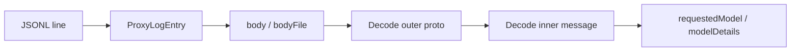

# Proxy Model Detection — Where Models Live in JSONL Logs

Reference for detecting and extracting AI model information from MITM proxy JSONL logs.

**Last reviewed:** 2026-06-05

For overall JSONL schema, see [PROXY-JSONL-SCHEMA.md](PROXY-JSONL-SCHEMA.md). For Agent session identifiers, see [PROXY-AGENT-IDS-AND-SUBAGENTS.md](PROXY-AGENT-IDS-AND-SUBAGENTS.md).

---

## Overview

The proxy JSONL logs contain **HTTP-level metadata** (URL, headers, status) but **not decoded model information** as top-level fields. The model is **embedded inside protobuf payloads** that must be decoded from the `body` or `bodyFile` fields.



---

## Where Models Are Located

### 1. Agent Traffic (Primary Path)

**RPC:** `aiserver.v1.BidiService/BidiAppend` (HTTP/1) or `agent.v1.AgentService/Run` / `RunSSE` (HTTP/2)

**Direction:** `request` (client → server)

**Location:** Inside decoded `AgentClientMessage` → `runRequest` field

#### Fields

| Proto Field | Type | Description | Example |
|-------------|------|-------------|---------|
| `runRequest.requested_model` | `RequestedModel` | User-selected model configuration | `{ modelId: "claude-sonnet-4-5" }` |
| `runRequest.model_details` | `ModelDetails` | Full model metadata | `{ modelId: "composer-2.5", displayName: "Composer 2.5" }` |
| `runRequest.dev_raw_model_slug` | `string` | Debug/dev slug override | `"gpt-4o"` |
| `runRequest.subagent_type_name` | `string` | Subagent type (if applicable) | `"explore"`, `"generalPurpose"` |
| `runRequest.selected_subagent_models` | `RequestedModel[]` | Models for subagent dispatch | Array of model configs |

**Proto definition:** [`proto/agent/v1/agent.proto:340-363`](../proto/agent/v1/agent.proto)

```protobuf
message AgentRunRequest {
  ModelDetails model_details = 3;
  optional RequestedModel requested_model = 9;
  optional string subagent_type_name = 11;
  repeated RequestedModel selected_subagent_models = 14;
  repeated ModelDetails selected_subagent_model_details = 15;
  optional string dev_raw_model_slug = 18;
  // ...
}
```

#### ModelDetails vs RequestedModel

| Message | Purpose | Key Fields |
|---------|---------|------------|
| `ModelDetails` | Server-provided model metadata | `model_id`, `display_model_id`, `display_name`, `display_name_short`, `aliases` |
| `RequestedModel` | Client's model selection/config | `model_id`, `max_mode`, `parameters[]`, credentials |

**Proto definitions:**
- [`ModelDetails`](../proto/agent/v1/agent.proto) (line 2578)
- [`RequestedModel`](../proto/agent/v1/agent.proto) (line 3543)

#### Extraction Path

```javascript
// 1. Filter JSONL line
if (entry.url.includes('BidiAppend') && entry.direction === 'request') {
  // 2. Decode outer message (BidiAppendRequest)
  const outer = decodeBidiAppendRequest(entry.body);
  
  // 3. Decode inner AgentClientMessage from `data` field (hex protobuf)
  const inner = decodeAgentClientMessage(outer.data);
  
  // 4. Extract from runRequest
  const runRequest = inner.runRequest;
  const modelId = runRequest?.requestedModel?.modelId 
               ?? runRequest?.modelDetails?.modelId;
  const displayName = runRequest?.modelDetails?.displayName;
  const subagentType = runRequest?.subagentTypeName;
}
```

**Implementation reference:** [`scripts/calibrate-proxy-tokens.mjs`](../scripts/calibrate-proxy-tokens.mjs) lines 360-380

---

### 2. Composer / Legacy Chat

**RPCs:** `aiserver.v1.AiService/StreamComposer`, `StreamChat`, `StreamChatContext`

**Direction:** `response` (server → client)

**Location:** `metadata.model_name` in decoded response stream

#### Fields

| Proto Field | Type | Description |
|-------------|------|-------------|
| `metadata.model_name` | `string` | Model name for this stream | `"claude-sonnet-4"`, `"gpt-4o"` |
| `metadata.token_usage` | `TokenUsage` | Token counts (input/output/cache) | Associated with model |

**Current extraction:** [`src/proxy/proxyInsightExtractor.ts:154-158`](../src/proxy/proxyInsightExtractor.ts)

```typescript
modelName:
  (metadata?.model_name as string | undefined) ??
  (metadata?.modelName as string | undefined) ??
  (decoded.model_name as string | undefined) ??
  (decoded.modelName as string | undefined)
```

---

### 3. RunSSE (HTTP/2 Agent Path)

**RPC:** `agent.v1.AgentService/RunSSE`

**Direction:** `response` (server stream)

**Model Location:** **Not in RunSSE response**. The model was already specified in the prior `BidiAppend` request that initiated the session.

**Why:** `RunSSE` request only carries a `BidiRequestId` (session reference). The `runRequest` with model config was sent earlier via `BidiAppend`.

**Cross-reference pattern:**
1. Find `BidiAppend` request with matching `request_id`
2. Decode that request's `runRequest` to get the model
3. Associate all `RunSSE` frames for that `request_id` with the same model

---

## Current Extension Behavior

| Path | Extracted? | Field Mapped |
|------|-----------|--------------|
| **Composer / StreamChat** | ✅ Yes | `metadata.model_name` → `insights.tokens.modelName` |
| **Agent runRequest** | ❌ No | Not extracted (decoder exists but not wired to insights) |
| **Subagent type** | ✅ Partial | `conversation_id` / `request_id` extracted, but not model config |

**Code locations:**
- ✅ Legacy model extraction: [`src/proxy/proxyInsightExtractor.ts:154-158`](../src/proxy/proxyInsightExtractor.ts)
- ❌ Agent model (missing): `extractConversationAndSubagentIds` only extracts IDs, not `runRequest.requestedModel`
- Available decoders: [`src/proxy/bidiAgentDecode.ts`](../src/proxy/bidiAgentDecode.ts), [`scripts/lib/bidi-agent-decode.mjs`](../scripts/lib/bidi-agent-decode.mjs)

---

## Extraction Examples

### Example 1: BidiAppend with model

From `proxy-2026-06-05-*.jsonl`:

```json
{
  "timestamp": "2026-06-05T10:05:54.123Z",
  "direction": "request",
  "url": "https://api2.cursor.sh/aiserver.v1.BidiService/BidiAppend",
  "body": "...", // base64 Connect payload
  "requestId": "fdbedbce-1234-5678-abcd-ef1234567890"
}
```

**Decoded `runRequest`:**

```javascript
{
  conversationId: "fdbedbce",
  requestedModel: {
    modelId: "claude-sonnet-4-5",
    maxMode: false,
    parameters: []
  },
  modelDetails: {
    modelId: "claude-sonnet-4-5",
    displayName: "Claude Sonnet 4.5",
    displayNameShort: "Sonnet 4.5"
  }
}
```

### Example 2: Subagent (explore)

```javascript
{
  conversationId: "c9259236",
  subagentTypeName: "explore",
  modelDetails: {
    modelId: "composer-2.5",
    displayName: "Composer 2.5"
  },
  conversationGroupId: "parent-conversation-id" // links to parent
}
```

**Interpretation:** This is an `explore` subagent launched by a parent Agent chat, running `composer-2.5`.

### Example 3: StreamComposer (legacy)

```json
{
  "direction": "response",
  "url": "https://api2.cursor.sh/aiserver.v1.AiService/StreamComposer",
  "body": "{\"metadata\":{\"model_name\":\"gpt-4o\",\"token_usage\":{...}}}"
}
```

**Extraction:** Direct JSON parse → `metadata.model_name = "gpt-4o"`

---

## Observed Model Distribution (Sample)

From `proxy-2026-06-05-1780653836806.jsonl` (15 `runRequest` frames):

| Model | Occurrences | Context |
|-------|-------------|---------|
| `composer-2.5` | 6 | Main Agent + 3× `explore` subagents |
| `claude-sonnet-4-5` | 9 | Main Agent sessions |

**Note:** One conversation (`1b0c5a9e`) switched models mid-session:
- Started with `composer-2.5` (4 frames)
- Switched to `claude-sonnet-4-5` (1 frame)

This indicates model changes within the same chat tab (`conversation_id`).

---

## Implementation Gaps

### Missing: Agent Model Extraction

**Problem:** Extension does not extract `runRequest.requestedModel` or `modelDetails` from Agent bidi traffic.

**Impact:**
- Status bar cannot show "using claude-sonnet-4-5" for current Agent sessions
- Model efficiency tracking (`modelEfficiency/`) cannot attribute tokens to specific Agent models
- User cannot see which model a subagent is running

**Fix Required:**

1. Extend `extractConversationAndSubagentIds` → `extractAgentRunRequestInfo` to include model fields
2. Add to `AgentSessionInfo` type:
   ```typescript
   export interface AgentSessionInfo {
     // ... existing fields ...
     requestedModelId?: string;
     modelDisplayName?: string;
     subagentTypeName?: string;
   }
   ```
3. Wire to `proxyInsightExtractor.ts` → `insights.agent.modelId`
4. Expose in `AgentLiveUsageStatusBar` tooltip

**Estimated effort:** ~2 hours (decoder already exists, just needs wiring)

---

## Cross-References

| Document | Relation |
|----------|----------|
| [PROXY-JSONL-SCHEMA.md](PROXY-JSONL-SCHEMA.md) | JSONL line structure, body fields |
| [PROXY-AGENT-IDS-AND-SUBAGENTS.md](PROXY-AGENT-IDS-AND-SUBAGENTS.md) | `conversation_id`, `request_id`, subagent linkage |
| [TOKENS-AND-USAGE.md](TOKENS-AND-USAGE.md) | Token signals; model affects cost per token |
| [MODEL-EFFICIENCY.md](MODEL-EFFICIENCY.md) | Tracking model usage for efficiency (needs model detection) |
| [ENABLED-MODELS-DETECTION.md](ENABLED-MODELS-DETECTION.md) | User's enabled/disabled model toggles from picker (distinct from runtime model detection) |

**Note:** This document covers **runtime model detection** (what model was used in a specific request). For **picker configuration** (which models the user has enabled/disabled), see [ENABLED-MODELS-DETECTION.md](ENABLED-MODELS-DETECTION.md).

**Code:**
- Protobuf definitions: [`proto/agent/v1/agent.proto`](../proto/agent/v1/agent.proto)
- Decoders: [`src/proxy/bidiAgentDecode.ts`](../src/proxy/bidiAgentDecode.ts), [`scripts/lib/bidi-agent-decode.mjs`](../scripts/lib/bidi-agent-decode.mjs)
- Insight extraction: [`src/proxy/proxyInsightExtractor.ts`](../src/proxy/proxyInsightExtractor.ts)
- Manual extraction: [`scripts/calibrate-proxy-tokens.mjs`](../scripts/calibrate-proxy-tokens.mjs)

---

## Analysis Commands

### Decode models from a log

```bash
# Extract all models from runRequest frames
node --input-type=module <<'EOF'
import fs from 'node:fs';
import path from 'node:path';
import protobuf from 'protobufjs';
import { bodyBufferFromEntry } from './scripts/lib/proxy-log-body.mjs';
import { decodeBidiAgentInner } from './scripts/lib/bidi-agent-decode.mjs';
import { buildRpcTypeMap, parseConnectRpcPath, resolveRpcMessageType } from './scripts/lib/proxy-rpc.mjs';

const PROTO_FILES = ['proto/agent/v1/agent.proto', 'proto/aiserver/v1/aiserver.proto'];
const logPath = process.argv[2];
const root = await protobuf.load(PROTO_FILES);
const rpcMap = buildRpcTypeMap(root, protobuf.Service);
const lines = fs.readFileSync(logPath, 'utf8').split('\n').filter(Boolean);

for (const line of lines) {
  const entry = JSON.parse(line);
  if (!entry.url.includes('BidiAppend') || entry.direction !== 'request') continue;
  
  const rpcPath = parseConnectRpcPath(entry.url);
  const Type = resolveRpcMessageType(rpcPath, 'request', rpcMap);
  const raw = bodyBufferFromEntry(entry, path.dirname(logPath));
  
  const outer = /* decode Type from raw */;
  const inner = await decodeBidiAgentInner(outer, rpcPath, 'request');
  const rr = inner?.runRequest;
  
  if (rr) {
    console.log({
      conversationId: rr.conversationId?.slice(0,8),
      modelId: rr.requestedModel?.modelId ?? rr.modelDetails?.modelId,
      displayName: rr.modelDetails?.displayName,
      subagentType: rr.subagentTypeName
    });
  }
}
EOF
```

### Count models per log window

```bash
pnpm run calibrate:proxy-tokens -- ~/.cursor-accounts/proxy/logs/<log>.jsonl
# → Shows "runRequest frames: N" + model breakdown
```

See [`scripts/calibrate-proxy-tokens.mjs`](../scripts/calibrate-proxy-tokens.mjs) for full implementation.

---

## FAQ

### Why isn't the model in the JSONL top-level?

The proxy logs **raw HTTP traffic**, not decoded application-layer insights. Decoding every protobuf payload on write would:
- Slow down logging (blocking RPC throughput)
- Bloat log size (proto → JSON expansion)
- Require proto definitions at runtime (extension doesn't bundle protobuf schemas)

Current design: log raw, decode on-demand for insights.

### Can I get the model without decoding?

**No.** The model is inside a protobuf message inside a Connect envelope. There's no HTTP header or URL parameter.

Exception: Legacy `StreamComposer` has `metadata.model_name` in JSON response bodies.

### Why does RunSSE not include the model?

The `RunSSE` RPC is a **session continuation**. The session was initialized with `BidiAppend` carrying the `runRequest`. The server already knows the model from that request.

To get the model for a `RunSSE` stream, you must find the originating `BidiAppend` request with the same `request_id`.

### How do I link a subagent to its model?

1. Decode `BidiAppend` request for the subagent `request_id`
2. Read `runRequest.subagentTypeName` (e.g., `"explore"`)
3. Read `runRequest.modelDetails.modelId` (e.g., `"composer-2.5"`)
4. Optionally link to parent via `runRequest.conversationGroupId`

See [PROXY-AGENT-IDS-AND-SUBAGENTS.md](PROXY-AGENT-IDS-AND-SUBAGENTS.md) for parent/child relationships.

---

## Next Steps (Backlog)

- [ ] Implement `extractAgentRunRequestInfo` in `proxyInsightExtractor.ts`
- [ ] Add `modelId` / `modelDisplayName` to `AgentSessionInfo` type
- [ ] Surface model in `AgentLiveUsageStatusBar` tooltip
- [ ] Log model changes (same `conversation_id`, different `requestedModel`)
- [ ] Track model distribution in `modelEfficiency/` database
- [ ] Document model-specific token costs (GPT-4o vs Sonnet pricing differs)
