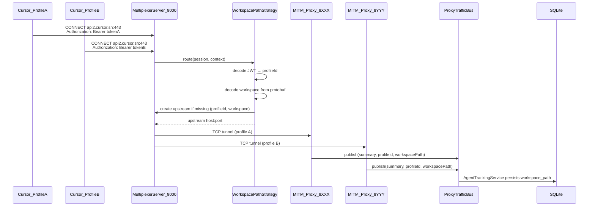

# Proxy Multiplexer Architecture (Clean Architecture)

**Last reviewed:** 2026-06-06

## Overview

The multiplexer is the **only** proxy architecture. The legacy per-profile direct MITM proxy path has been removed.

A **single global router** listens on port **9000** for all profiles. It creates MITM upstream proxies on demand for each unique `(profileId, workspacePath)` pair, so token and traffic metrics stay isolated per project and per account without changing Cursor itself.

## Key principles

- **One global multiplexer**: shared router on port **9000** for all profiles
- **Profile identification via JWT**: `Authorization` header decoded to email → `ProfileManager` lookup
- **Dynamic upstreams per (profile, workspace)**: MITM proxies on ports 8000–8999, created on first workspace detection
- **Proxy via settings.json**: `http.proxy` set to `http://127.0.0.1:9000` (not `--proxy-server` CLI args)
- **Workspace-based metrics**: tokens and costs stored with `workspace_path` in SQLite
- **Clean Architecture**: Domain → Application → Infrastructure with dependency inversion

## Architecture layers

| Layer | Responsibility | Key modules |
|-------|----------------|-------------|
| Domain | Entities, routing ports, business rules | `src/domain/entities/*`, `src/domain/ports/*`, `src/domain/services/*` |
| Application | Lifecycle orchestration, DTOs | `src/application/services/*`, `src/application/types/*` |
| Infrastructure | Node.js TCP/HTTP server, strategies, storage | `src/proxy/multiplexer/*` |
| Facade | Extension integration | `src/application/services/multiplexerRegistry.ts`, `src/services/profileMultiplexerService.ts` |

### Domain layer

- **Entities**: `Upstream`, `Session`, `RoutingDecision`, `HealthStatus`
- **Ports**: `IRoutingStrategy`, `IUpstreamPool`, `ISessionStore`, `IMultiplexerServer`, `IProxyTrafficBus`, `IProxyManager`
- **Services**: `UpstreamSelector`, `RoutingPolicyEngine`

No dependencies on Application or Infrastructure.

### Application layer

- **Services**: `MultiplexerService`, `RoutingOrchestrator`, `UpstreamHealthMonitor`, `ProxyTrafficBus`, `MultiplexerRegistry`
- **DTOs**: `MultiplexerConfig`, `MultiplexerMetrics`, `RoutingEvent`

Depends only on Domain ports.

### Infrastructure layer

- **Server**: `MultiplexerServer` (HTTP + TCP CONNECT tunnels)
- **Routing**: `WorkspacePathStrategy`, `StickySessionStrategy`, etc.
- **Upstream management**: `UpstreamPool`, `HealthChecker`, `PortAllocator`
- **Storage**: `InMemorySessionStore`, `FileConfigLoader`

Implements Domain ports.

## Data flow

## Profile identification

When `workspace-path` routing is active:

1. Extract `Authorization` header from the request context
2. Decode JWT payload (`decodeJwtPayload`) to obtain `email` or `sub`
3. Resolve `profileId` via `ProfileManager.findProfileByEmail()`
4. If no profile is found, fall back to `sticky-session` (socket-based binding)

Upstream pool indexes workspaces by composite key `profileId:workspacePath`.

## Routing strategies

| Strategy | Isolation | Overhead |
|----------|-----------|----------|
| `workspace-path` | Per (profile, workspace) via JWT + protobuf | ~2–5ms on first BidiAppend |
| `sticky-session` | Per window (source IP:port) | ~0ms |
| `token-hash` | Per Cursor account | ~0ms |
| `round-robin` | Load distribution | ~0ms |
| `least-connections` | Load balancing | <1ms |
| `hybrid` | Combined rules | varies |

Default: `workspace-path` with fallback `sticky-session`.

## Port allocation

- **Global multiplexer router**: **9000** (shared by all profiles)
- **Upstream MITM proxies**: 8000–8999 (dynamic per `(profileId, workspacePath)`)
  - Ports allocated per profile index within the upstream range

## Garbage collection

Upstreams with no activity for 30 minutes and zero active connections are stopped and removed automatically (5-minute GC interval). Stopping upstreams for one profile does **not** stop the global multiplexer.

## Configuration

- VS Code setting: `cursorAccounts.proxy.multiplexer.routingStrategy`
- Router logs: `~/.cursor-accounts/proxy/logs/router-global-*.jsonl`
- Output channel **Cursor MITM Proxy**: auth, routing, upstream, and settings events

## Extension integration

On extension activation:

1. `extension.ts` calls `MultiplexerRegistry.ensureStarted()` — starts the global router on port 9000

When a profile window launches with proxy enabled:

1. `ProfileLauncher` calls `multiplexerRegistry.ensureStarted()` (no-op if already running)
2. `ProfileSettingsManager.applyProxySettings(userDataDir, 'http://127.0.0.1:9000')` writes `http.proxy` to the profile's `settings.json`
3. Cursor launches **without** `--proxy-server` (proxy comes from settings)
4. `WorkspacePathStrategy` extracts `profileId` from JWT and creates upstream MITM proxies per workspace on demand
5. Upstream proxies emit IPC traffic to `ProxyManager` with `workspacePath`
6. `AgentTrackingService` persists metrics with workspace, repository, and branch metadata

When proxy is disabled for a profile:

1. `MultiplexerRegistry.stopUpstreamsForProfile(profileId)` stops only that profile's upstreams
2. `ProfileSettingsManager.restoreProxySettings(userDataDir)` restores the original `settings.json`

See also: [PROXY-MULTIPLEXER-SETUP.md](PROXY-MULTIPLEXER-SETUP.md), [PROXY-MULTIPLEXER-MIGRATION.md](PROXY-MULTIPLEXER-MIGRATION.md), [ADR-002-MULTIPLEXER-PER-USER.md](ADR-002-MULTIPLEXER-PER-USER.md).

## Clean Architecture validation

| Check | Status |
|-------|--------|
| Domain does not import Application or Infrastructure | ✓ |
| Application imports only Domain ports | ✓ |
| Infrastructure implements Domain ports | ✓ |
| VS Code configuration isolated in Application/Infrastructure | ✓ |
| Domain tests avoid VS Code APIs | ✓ |
| Application tests use port mocks | ✓ |
| Infrastructure tests exercise real adapters | ✓ |
