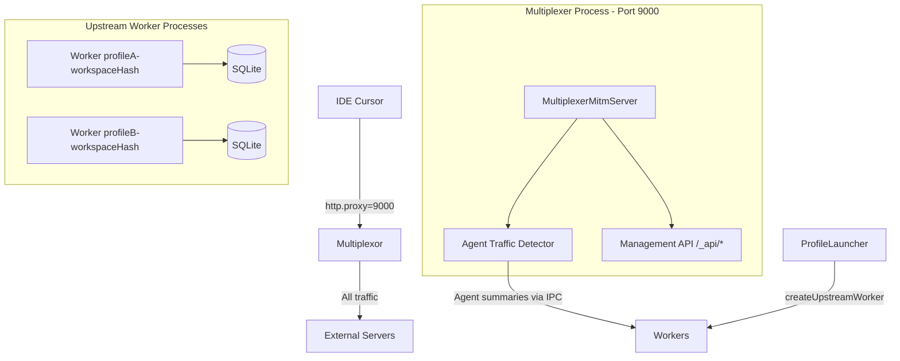

# Proxy Multiplexer Architecture (Clean Architecture)

**Last reviewed:** 2026-06-10

## Overview

The multiplexer is the **only** proxy architecture. A **single global MITM router** listens on port **9000** for all profiles. It proxies **all** IDE traffic (Cursor API, GitHub, npm, etc.) transparently.

**Upstream workers** are separate analysis processes (not proxies). They receive agent traffic summaries from the multiplexer via IPC and persist token metrics to SQLite with a persistent Better SQLite3 connection.

## Key principles

- **One global MITM multiplexer**: `MultiplexerMitmServer` (`PolyglotMitmProxyServer`) on port **9000**
- **All traffic proxied**: CONNECT/HTTP MITM for every host; no routing to per-workspace proxy ports
- **Agent traffic detection**: multiplexer inspects decoded traffic and forwards summaries to upstream workers
- **Upstream workers per (profile, workspace)**: forked child processes with persistent DB connections
- **Workers created at window launch**: `ProfileLauncher` creates a worker when opening a profile+workspace
- **Management API**: all extension windows query state via HTTP/WebSocket on `/_api/*`

## Architecture

## Layers

| Layer | Responsibility | Key modules |
|-------|----------------|-------------|
| Domain | Ports, worker registry interface | `IUpstreamWorkerRegistry`, `IMultiplexerServer` |
| Application | Lifecycle, metrics | `MultiplexerService`, `MultiplexerRegistry`, `MetricsAggregator` |
| Infrastructure | MITM server, workers, API | `MultiplexerMitmServer`, `UpstreamWorkerManager`, `ManagementApiServer` |
| Facade | Extension integration | `ProfileMultiplexerService`, `ProfileLauncher` |

## Data flow

1. IDE sends all HTTP(S) traffic to `http://127.0.0.1:9000`
2. `MultiplexerMitmServer` terminates TLS and forwards to real servers
3. When agent traffic is detected (RunSSE, token deltas, BidiAppend, etc.):
   - Extract `profileId` from JWT `Authorization` header
   - Extract `workspacePath` from protobuf (BidiAppend) or bind to registered worker
   - Send `ProxyTrafficSummary` to matching upstream worker via IPC
4. Upstream worker runs `AgentTrackingService` and writes to SQLite

## Upstream worker lifecycle

| Event | Action |
|-------|--------|
| Profile window launched with workspace | `ProfileLauncher` → `MultiplexerRegistry.createUpstreamWorker()` |
| Agent traffic detected | Multiplexer → `UpstreamWorkerManager.notifyAgentTraffic()` |
| Profile proxy stopped | `DELETE /_api/upstreams/profile/:profileId` |
| Idle GC (30 min, no traffic) | `MultiplexerRegistry.cleanupIdleUpstreams()` |

## Configuration

Profiles use `http.proxy = http://127.0.0.1:9000` in `settings.json` (via `ProfileSettingsManager`).

See also:

- [PROXY-MULTIPLEXER-MANAGEMENT-API.md](PROXY-MULTIPLEXER-MANAGEMENT-API.md)
- [CLEAN-ARCHITECTURE-PRINCIPLES.md](CLEAN-ARCHITECTURE-PRINCIPLES.md)
