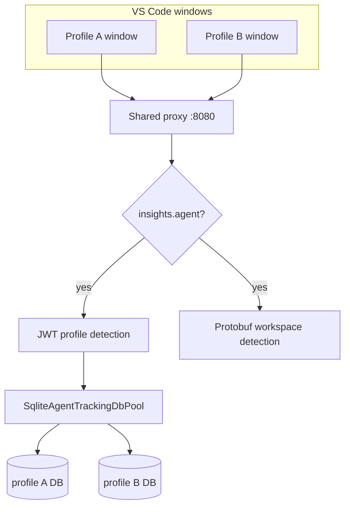

# Shared multi-profile proxy

**Last reviewed:** 2026-06-10

## Overview

All VS Code/Cursor windows and profiles share **one MITM proxy process** on `127.0.0.1:8080`. The proxy detects which profile and workspace each agent request belongs to, then persists metrics to the correct per-profile SQLite database.

## Architecture

## Clean Architecture layers

| Layer | Component | Responsibility |
|-------|-----------|----------------|
| Domain | `IAgentTrackingDbPool` | Contract for per-profile repository pool |
| Domain | `IAgentTrackingRepository` | Agent/conversation/token persistence |
| Application | `ProxyTrafficSummary.profileId` | Detected profile on traffic events |
| Application | `ProxyAgentTrackingIngress` | Filter + route agent metrics to pool |
| Infrastructure | `SqliteAgentTrackingDbPool` | Lazy better-sqlite3 connections per profile |
| Infrastructure | `BetterSqliteAgentTrackingRepository` | SQL upserts/inserts |

## Profile detection

1. **Filter:** Only traffic with `summary.insights.agent` is enriched (not all HTTP traffic).
2. **JWT:** `Authorization: Bearer` header → decode `sub` → map `userId → profileId`.
3. **Cache:** Resolved `profileId` is cached by bidi `requestId` for RunSSE streams without repeated JWT decoding.

## Workspace detection

Agent RPC protobufs may include:

- `workspace_id` / `workspaceId`
- `workspace_root_path` / `workspaceRootPath`
- `relative_workspace_path` / `relativeWorkspacePath`

These are exposed as `summary.workspaceId` and `insights.workspace`.

## Database pool

- One **better-sqlite3 connection per distinct profile**, not per window.
- DB path: `{userDataDir}/User/globalStorage/cursor-accounts-efficiency.db`
- Opened lazily on first agent metrics for that profile.
- Closed on proxy shutdown via `dbPool.closeAll()`.

## Extension host behavior

- `ProxyManager.ensureSharedProxy()` starts the single child process.
- All proxy-enabled profiles get `http.proxy=http://127.0.0.1:8080`.
- Traffic ingress connects to the shared API WebSocket (`profileId=shared` runtime key).
- Extension **does not double-write** when shared proxy is active; child persists via pool.
- UI refresh events (`onConversationUsagePersisted`) still fire from detected `summary.profileId`.

## Configuration passed to child

`ProxyServerConfig` includes:

| Field | Purpose |
|-------|---------|
| `userIdToProfileId` | JWT user → profile mapping |
| `profileDbPaths` | Profile → SQLite DB path |
| `extensionPath` | Migrations and bundled sqlite3 binary |
| `profileId` | `'shared'` for API envelope fallback |

## Related docs

- [PROXY-SETUP.md](PROXY-SETUP.md) — installation and certificates
- [PROXY-API-REFERENCE.md](PROXY-API-REFERENCE.md) — localhost API
- [ARCHITECTURE.md](ARCHITECTURE.md) — overall extension structure
- [TESTING-MULTI-WINDOW.md](TESTING-MULTI-WINDOW.md) — manual multi-window tests
