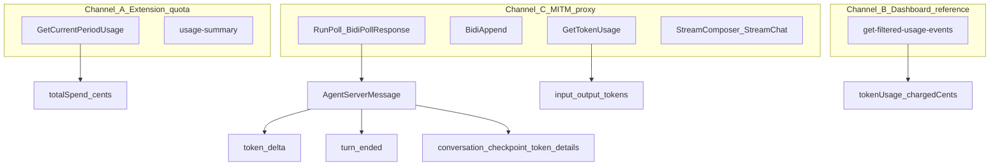
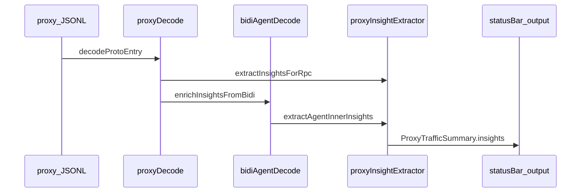

# Tokens and Usage — Reference

Canonical reference for **what token and billing signals exist**, where they appear (quota APIs, dashboard, MITM proxy), and how to interpret them. For proxy setup, see [PROXY-SETUP.md](PROXY-SETUP.md). For the dashboard usage table API, see [USAGE-EVENTS-API.md](USAGE-EVENTS-API.md).

**Last reviewed:** 2026-06-04

## Overview

Cursor Accounts observes usage through **three channels** that measure different things:



| Channel | Used by extension today? | Granularity | Best for |
|---------|--------------------------|-------------|----------|
| A — Quota APIs | **Yes** (status bar) | Period totals (cents, %) | Live quota bar, included/bonus spend |
| B — Dashboard usage events | **No** (documented only) | Per request (tokens + `chargedCents`) | Reconciling cost of a session |
| C — MITM proxy | **Optional** (research) | Per RPC / streaming frames | Debugging Agent traffic, live counters |

**Do not compare** `token_delta` peaks from Channel C directly to dollars from Channel A or B. Empirically, a heavy ~18 min Agent session can show `token_delta` peaks around 3–4k while `GetCurrentPeriodUsage.totalSpend` moves by **~$7** in the same window — ratios of 100× or more are normal because the streaming counter is not billed usage.

---

## Glossary — signals and billing relevance

| Signal | Typical source | Billing-grade? | Meaning |
|--------|----------------|----------------|---------|
| `token_delta.tokens` | `InteractionUpdate` inside `RunPoll` → `BidiPollResponse.data` | **No** | Streaming **progress counter** while the model generates (UI / live status) |
| `turn_ended.input_tokens` / `output_tokens` | Same `InteractionUpdate` | **Yes, when present** | Per-turn input/output breakdown |
| `turn_ended.cache_read_tokens` / `cache_write_tokens` | Same | **Yes, when present** | Cache token breakdown for the turn |
| `token_details.used_tokens` | `conversation_checkpoint_update` on `AgentServerMessage` | **No** | Context window usage snapshot (not a dashboard row) |
| `usage_uuid` | `StreamComposer` / `StreamChat` / stream chunks | Lookup key | ID for a follow-up `GetTokenUsage` RPC |
| `GetTokenUsageResponse` | `DashboardService/GetTokenUsage` | **Yes** | `input_tokens` / `output_tokens` for one `usage_uuid` |
| `metadata.token_usage` / `TokenUsage` | Legacy chat streams | **Partial** | `input_tokens`, `output_tokens`, cache fields; `total_cents` exists in proto but is **not** mapped to extension insights today |
| `planUsage.totalSpend` | `GetCurrentPeriodUsage` | **Yes (period)** | Cumulative spend in **cents** for the billing period (included + bonus + on-demand components) |
| `tokenUsage` + `chargedCents` | `get-filtered-usage-events` | **Yes (per row)** | Dashboard table: tokens and charged cents per AI request |

---

## Channel A — Extension quota (period spend)

The status bar uses aggregate billing, not per-request tokens.

### Endpoints

| Endpoint | Host | Auth |
|----------|------|------|
| `POST …/DashboardService/GetCurrentPeriodUsage` | `api2.cursor.sh` | Bearer JWT (`cursorAuth/accessToken`) |
| `GET /api/usage-summary` | `cursor.com` | `WorkosCursorSessionToken` cookie (from JWT) |

Implementation: [`src/api/quotaClient.ts`](../src/api/quotaClient.ts), mappers in [`src/api/quotaMappers.ts`](../src/api/quotaMappers.ts).

### Key fields (`GetCurrentPeriodUsage`)

| Field | Unit | Notes |
|-------|------|-------|
| `planUsage.totalSpend` | cents | Total period spend (included + bonus + beyond-limit usage counted in total) |
| `planUsage.includedSpend` | cents | Usage against included allowance |
| `planUsage.bonusSpend` | cents | Bonus / provider-subsidized usage |
| `planUsage.limit` | cents | Included limit (personal plans) |
| `planUsage.apiPercentUsed` / `autoPercentUsed` / `totalPercentUsed` | % | Mode breakdown for status bar |
| `spendLimitUsage` | cents | On-demand / team pool (enterprise **Monthly Usage**) |
| `billingCycleStart` / `billingCycleEnd` | ms strings | Current period bounds |

Polling defaults to **60s** (`cursorAccounts.refresh.intervalSeconds`). A delta in `totalSpend` between two samples in a log window estimates **all Cursor usage** in that interval (every model call, not one chat).

See [HOW-IT-WORKS.md](HOW-IT-WORKS.md) and [RESEARCH.md](RESEARCH.md) for refresh behavior and field mappings.

---

## Channel B — Dashboard usage events (per request)

The web dashboard table at [cursor.com/dashboard/usage](https://cursor.com/dashboard/usage) is backed by:

`POST https://cursor.com/api/dashboard/get-filtered-usage-events`

Each event can include `tokenUsage` (input/output/cache) and `chargedCents`. The **Cursor Accounts extension does not call this endpoint** today.

Full reference: [USAGE-EVENTS-API.md](USAGE-EVENTS-API.md).

Use Channel B to validate Channel A/C: filter `startDate` / `endDate` to your MITM log window and sum `chargedCents` and token fields across pages.

---

## Channel C — MITM proxy (network observation)

Requires [PROXY-SETUP.md](PROXY-SETUP.md). Logs live under `~/.cursor-accounts/proxy/logs/`. JSONL field reference: [PROXY-JSONL-SCHEMA.md](PROXY-JSONL-SCHEMA.md). Agent/subagent IDs: [PROXY-AGENT-IDS-AND-SUBAGENTS.md](PROXY-AGENT-IDS-AND-SUBAGENTS.md).

### Traffic matrix (which RPCs carry tokens)

| Traffic | Typical host | Connect path | Token-related payload |
|---------|--------------|--------------|------------------------|
| Period billing | `api2.cursor.sh` | `aiserver.v1.DashboardService/GetCurrentPeriodUsage` | `planUsage.*` (cents), no per-request tokens |
| Token lookup | `api2.cursor.sh` | `aiserver.v1.DashboardService/GetTokenUsage` | `input_tokens`, `output_tokens` |
| **Agent (HTTP/1)** | `api2.cursor.sh` | `agent.v1.AgentService/RunPoll` | Nested `AgentServerMessage` in poll `data` |
| **Agent (HTTP/1)** | `api2.cursor.sh` | `aiserver.v1.BidiService/BidiAppend` | Client payloads; `request_id` for session |
| **Agent (HTTP/2)** | `agent.api5.cursor.sh` | `agent.v1.AgentService/Run` / `RunSSE` | Session shell; nested usage depends on framing |
| **Composer / legacy chat** | `api2.cursor.sh` | `aiserver.v1.AiService/StreamComposer`, `StreamChat`, … | `metadata.token_usage`, `usage_uuid` |
| Agent snapshots | `api2.cursor.sh` | `OnlineMetricsService/ReportAgentSnapshot` | Metrics only, not chat token deltas |

Prefer **HTTP/1** (`cursor.general.disableHttp2: true`) when capturing Agent on `api2` via `RunPoll` / `BidiAppend`.

### RPC → extracted insights

| RPC | Direction | `insights.agent` / `insights.tokens` |
|-----|-----------|--------------------------------------|
| `BidiService/BidiAppend` | request | `requestId`, `appendSeqno`, client `data` preview |
| `AgentService/RunPoll` | response | Decoded inner message → `token_delta`, `turn_ended`, or `token_details` |
| `AgentService/Run` / `RunSSE` | both | Session fields; inner decode when `data` present |
| `BidiService/BidiPoll` | response | Same inner decode as RunPoll |
| `BidiService/StreamBidi` | both | Same carrier rules as RunPoll (extension TS only) |
| `AiService/StreamComposer` / `StreamChat` | response | `extractTokenUsage` + optional `usage_uuid` |
| `DashboardService/GetTokenUsage` | response | `input_tokens`, `output_tokens` |
| `DashboardService/GetCurrentPeriodUsage` | response | `billing` only |

Routing: [`extractInsightsForRpc`](../src/proxy/proxyInsightExtractor.ts) in `proxyInsightExtractor.ts`.

---

## MITM decode pipeline



| Step | Module | Functions |
|------|--------|-----------|
| 1 | [`src/proxy/proxyDecode.ts`](../src/proxy/proxyDecode.ts) | `decodeProtoEntry`, `enrichInsightsFromBidi`, `parseRpcPath` |
| 2 | [`src/proxy/bidiAgentDecode.ts`](../src/proxy/bidiAgentDecode.ts) | `bidiDataToBuffer`, `decodeBidiAgentPayload`, `bidiInnerRoleForRpc` |
| 3 | [`src/proxy/proxyInsightExtractor.ts`](../src/proxy/proxyInsightExtractor.ts) | `extractAgentInnerInsights`, `extractTokenUsage`, `extractAgentSessionInfo`, `estimateTokenCostUsd` |
| 4 | [`src/proxy/trafficSummaryBuilder.ts`](../src/proxy/trafficSummaryBuilder.ts) | `buildTrafficSummary` |
| 5 | [`src/proxy/proxyTrafficFormat.ts`](../src/proxy/proxyTrafficFormat.ts) | `formatInsightHint` — `N tok (live)` vs `N tok (turn)` |
| 6 | [`src/ui/agentLiveUsageStatusBar.ts`](../src/ui/agentLiveUsageStatusBar.ts) | Live status bar item (separate from quota bar) |

Protobuf sources: [`proto/agent/v1/agent.proto`](../proto/agent/v1/agent.proto), [`proto/aiserver/v1/aiserver.proto`](../proto/aiserver/v1/aiserver.proto). Regeneration and log analysis: [`proto/README.md`](../proto/README.md).

### Bidi / Agent HTTP/1 lifecycle

1. Client sends **`BidiAppend`** with `request_id` (one Agent session) and framed client messages in `data`.
2. Client polls **`RunPoll`**; responses carry **`BidiPollResponse`** with hex/base64 `data`.
3. Each `data` blob decodes to **`agent.v1.AgentServerMessage`** (server → client) or **`AgentClientMessage`** (client → server on append).

Multiple `request_id` values in one log window mean multiple Agent **network sessions**, **parallel subagents**, or restarts — not necessarily multiple chat tabs. To identify the **chat tab**, decode `runRequest.conversationId` from `BidiAppend` (see [PROXY-AGENT-IDS-AND-SUBAGENTS.md](PROXY-AGENT-IDS-AND-SUBAGENTS.md#chat-windows-and-agent-identifiers)). The live status bar sums tokens across all sessions regardless of tab.

### Inner message: `InteractionUpdate`

Defined in `agent.proto` (`InteractionUpdate`):

| Field | Message | Extension `usageEvent` |
|-------|---------|------------------------|
| 8 | `TokenDeltaUpdate` (`int32 tokens`) | `token_delta` → `streamingTokens` |
| 14 | `TurnEndedUpdate` (optional int64 in/out/cache) | `turn_ended` → `inputTokens`, `outputTokens`, cache fields |

Other update types (text deltas, tool calls, thinking, etc.) are ignored for billing insights.

### Inner message: checkpoint `token_details`

`AgentServerMessage.conversation_checkpoint_update` may include `ConversationTokenDetails`:

- `used_tokens` — mapped to `streamingTokens` with `usageEvent: 'token_details'`
- `max_tokens` — not surfaced in insights today

### Precedence in `extractAgentInnerInsights`

If a single inner message contains both `token_delta` and `turn_ended`, **`token_delta` wins** (only streaming counter is returned). Checkpoint `token_details` is used only when no `interaction_update` usage is found.

### Why `turn_ended` is often missing in logs

Heavy HTTP/1 captures (hundreds of MB, hundreds of `token_delta` events) frequently show **zero** `turn_ended` frames. Possible reasons (not mutually exclusive):

- Server does not emit `turn_ended` on the HTTP/1 `RunPoll` path for all turn types
- Turns still in progress at end of capture
- Tool-heavy or multi-step flows batch billing server-side only into dashboard rows

When `turn_ended` is absent, rely on Channel B or period `totalSpend` deltas for cost validation—not `token_delta` peaks.

### Legacy: `usage_uuid` and `GetTokenUsage`

Streams may attach `usage_uuid`. The extension records it (`usageEvent: 'usage_uuid'`) but **does not** automatically call `GetTokenUsage`. If that RPC appears in logs:

```protobuf
// aiserver.v1.GetTokenUsageRequest
string usage_uuid = 1;

// aiserver.v1.GetTokenUsageResponse
int32 input_tokens = 1;
int32 output_tokens = 2;
```

### `aiserver.v1.TokenUsage` (Composer metadata)

```protobuf
message TokenUsage {
  int32 input_tokens = 1;
  int32 output_tokens = 2;
  int32 cache_write_tokens = 3;
  int32 cache_read_tokens = 4;
  float total_cents = 5;
  // ...
}
```

`extractTokenUsage` maps in/out (and cache via nested `usage`) into `TokenUsageInfo`. **`total_cents` is not exposed** in `ProxyTrafficInsights` today.

---

## Live cost estimate (extension UI)

When the proxy is running and `cursorAccounts.proxy.showLiveUsageInStatusBar` is true, a **separate** status bar item shows the latest agent token signal and a rough USD estimate.

Formula ([`estimateTokenCostUsd`](../src/proxy/proxyInsightExtractor.ts)):

1. If `inputTokens` + `outputTokens` + cache fields > 0: sum those (billed-style).
2. Else use `streamingTokens` from `token_delta` or `token_details`.
3. `costUsd = totalTokens / 1_000_000 * estimatedDollarsPerMillionTokens` (default **4**).

This is **indicative only**. Real billing uses included/bonus pools, per-model pricing, and dashboard `chargedCents`—not the flat $/M setting.

Settings: [CONFIGURATION.md](CONFIGURATION.md) (proxy section), [PROXY-SETUP.md](PROXY-SETUP.md).

---

## Turn tracking in RunSSE streams (HTTP/2)

**RunSSE:** One HTTP response contains hundreds of `token_delta` frames. The extension scans the full stream, detects turn resets, and persists one row per turn in `agent_tokens`.

**RunPoll (HTTP/1):** Each response is a single frame; one snapshot per response. Turn detection is not applied within a response (documented for future extension).

### Correlation model

| Layer | Key | Role |
|-------|-----|------|
| HTTP | `x-request-id` | Pairs RunSSE request with its response stream |
| Agent | bidi `request_id` | Primary key for agent session and token rows |
| Turn | `turn_index` | Sequence number within one bidi session (0, 1, 2…) |

Attribution to parent vs subagent uses **bidi `request_id`**, not token counter shape. Each parallel subagent has its own `request_id` and independent turn sequence.

### Turn detection algorithm

Ported from [`agentLiveUsageStatusBar.ts`](../src/ui/agentLiveUsageStatusBar.ts) into domain service [`TokenTurnDetectionService`](../src/domain/services/tokenTurnDetectionService.ts):

1. Track peak streaming counter within current turn
2. If peak ≥ **300** and next value ≤ **150** → emit previous peak as completed turn, start new turn
3. After all frames, emit final peak

### Database representation

```sql
SELECT request_id, turn_index, streaming_tokens, http_request_id
FROM agent_tokens
WHERE request_id = 'abc123'
ORDER BY turn_index;
```

Schema details: [DATABASE-SCHEMA.md](DATABASE-SCHEMA.md).

---

## Parallel subagents and token attribution

When the Agent launches **parallel Task subagents**, the MITM proxy observes **separate bidi sessions** — one `request_id` per worker — not nested token frames on the parent id.

### Empirical findings (local JSONL, 2026-06-03)

| Metric | Parent session | Parallel subagent sessions |
|--------|----------------|----------------------------|
| `request_id` | Single UUID for orchestrator | One UUID **per** subagent |
| `BidiAppend` volume | High (heartbeats + tool traffic) | High per worker while running |
| `token_delta` peak | Often **lower** (orchestration only) | Often **higher** (actual model work) |
| Result path | Receives `subagent_result` on `BidiAppend` | `SubagentSuccess.agent_id`, optional `transcript_path` |

Example from `proxy-2026-06-03-1780529195876.jsonl` (~20 min, parallel locale translations):

- **13** distinct bidi `request_id`s in one window.
- Parent `cecdd311…`: max `token_delta` **480**; subagent `cc9489b7…`: max **3746**.
- **`turn_ended`**: 0 events (all sessions).
- Period **`totalSpend` delta**: **$7.35** vs naive sum of `token_delta` peaks **$0.03** (~228× ratio).

### Implications for the extension UI

[`agentLiveUsageStatusBar.ts`](../src/ui/agentLiveUsageStatusBar.ts) aggregates tokens across **all** active `request_id`s. During parallel subagent work this:

- Correctly reflects **total concurrent generation activity**.
- **Overstates** “this chat’s tokens” if interpreted as parent-only.
- Cannot attribute spend to parent vs child without parsing `parent_request_id` / `subagent_result` (not implemented).

For billed cost of a parent turn including subagents, use Channel B (`get-filtered-usage-events`) or Channel A period delta — not summed `token_delta`.

Full ID matrix and protobuf fields: [PROXY-AGENT-IDS-AND-SUBAGENTS.md](PROXY-AGENT-IDS-AND-SUBAGENTS.md).

---

## Analysis scripts

| Script | Command | Purpose |
|--------|---------|---------|
| [`scripts/analyze-proxy-traffic.mjs`](../scripts/analyze-proxy-traffic.mjs) | `pnpm run analyze:proxy-traffic [path]` | Decode counts, sample insights, `token_delta` / `turn_ended` event totals |
| [`scripts/summarize-session-tokens.mjs`](../scripts/summarize-session-tokens.mjs) | `pnpm run summarize:session-tokens [log.jsonl]` | Session report: major `token_delta` peaks, `turn_ended`, `GetCurrentPeriodUsage` delta |
| [`scripts/verify-proto-jsonl.mjs`](../scripts/verify-proto-jsonl.mjs) | `pnpm run verify:proto-jsonl` | Proto decode coverage on logs |
| [`scripts/scan-proxy-interactive.mjs`](../scripts/scan-proxy-interactive.mjs) | `pnpm run scan:proxy-interactive` | Detect whether interactive chat RPCs exist in logs |

Example session validation:

```bash
pnpm run summarize:session-tokens -- ~/.cursor-accounts/proxy/logs/proxy-2026-06-03-*.jsonl
```

Compare the printed **Delta in session window** (cents) to summed `chargedCents` from the dashboard API for the same timestamps.

### Script vs extension gaps

[`scripts/lib/bidi-agent-decode.mjs`](../scripts/lib/bidi-agent-decode.mjs) mirrors TS decode but:

- Does **not** handle `conversation_checkpoint_update` / `token_details`
- Does **not** list `StreamBidi` in `bidiInnerRoleForRpc`

Batch counts from `analyze:proxy-traffic` may under-report checkpoint tokens compared to the live extension.

---

## How to validate numbers are reasonable

1. **Time window** — Note first/last `timestamp` in the JSONL log.
2. **Period spend delta** — Run `summarize:session-tokens`; read `GetCurrentPeriodUsage` start/end `totalSpend` (cents → USD).
3. **Per-request sum (optional)** — Call `get-filtered-usage-events` with `startDate`/`endDate` in ms (see [USAGE-EVENTS-API.md](USAGE-EVENTS-API.md)); paginate and sum `chargedCents` and `tokenUsage`.
4. **Compare magnitude** — Heavy Agent (many `BidiAppend`, tools, long runtime): **$5–15** period delta in ~15–30 minutes can be normal; **$0.01** from naive `token_delta × $4/M` is not.
5. **Never equate** max `token_delta` (e.g. 3746) to total billed tokens for the session.

| Check | Healthy signal | Misleading signal |
|-------|----------------|-------------------|
| Cost | `totalSpend` delta or sum of `chargedCents` | Sum of `token_delta` peaks |
| Tokens per request | Dashboard `tokenUsage` | `token_delta` max per stream |
| Live UI | Order-of-magnitude during generation | Exact invoice |

---

## Known limitations

| Limitation | Impact |
|------------|--------|
| MITM sees **network only** | Composer metadata in `state.vscdb` is invisible |
| HTTP/2 / `api5` | May lack decodable `RunPoll`/`Bidi` nested frames; live counters may be sparse |
| No auto `GetTokenUsage` | `usage_uuid` logged but not resolved unless RPC appears in traffic |
| `turn_ended` often absent | No per-turn billed breakdown in many real logs |
| `token_delta` ≠ billing | Live status bar can under-estimate vs real spend by 100×+ |
| `total_cents` in proto | Not mapped to insights |
| Shallow agent merge | Latest poll overwrites `insights.agent`; no per-turn history in UI |
| Parallel subagents | Each subagent = separate `request_id` + `token_delta`; UI sums all sessions |
| No subagent tree in insights | `parent_request_id`, `subagent_result` not extracted |
| Period `totalSpend` | Includes **all** Cursor usage in the interval, not one conversation |
| Dashboard API | Undocumented; may change without notice |
| Script decode lag | `bidi-agent-decode.mjs` missing `token_details` / `StreamBidi` |

---

## Related documentation

| Document | Topic |
|----------|--------|
| [PROXY-SETUP.md](PROXY-SETUP.md) | Enable proxy, CA, routing, log paths |
| [PROXY-JSONL-SCHEMA.md](PROXY-JSONL-SCHEMA.md) | JSONL line fields, body spill, examples |
| [PROXY-AGENT-IDS-AND-SUBAGENTS.md](PROXY-AGENT-IDS-AND-SUBAGENTS.md) | `request_id`, chat tab `conversation_id`, parallel subagents |
| [USAGE-EVENTS-API.md](USAGE-EVENTS-API.md) | Per-request `tokenUsage` + `chargedCents` |
| [HOW-IT-WORKS.md](HOW-IT-WORKS.md) | Quota fetch, auth, refresh |
| [RESEARCH.md](RESEARCH.md) | API research, quota fields |
| [ARCHITECTURE.md](ARCHITECTURE.md) | Extension structure, proxy subsystem |
| [CONFIGURATION.md](CONFIGURATION.md) | `cursorAccounts.proxy.*` settings |
| [COMMANDS.md](COMMANDS.md) | Proxy commands |
| [PRIVACY.md](PRIVACY.md) | Log retention and sensitive data |
| [TROUBLESHOOTING.md](TROUBLESHOOTING.md) | Quota vs dashboard vs proxy confusion |
| [FEATURES.md](FEATURES.md) | Product feature list |
| [proto/README.md](../proto/README.md) | Protobuf regeneration and decode tooling |
