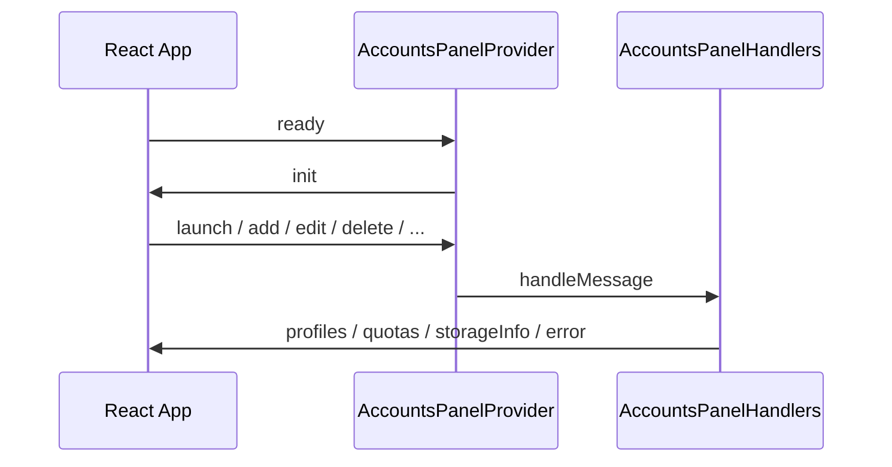

# Accounts panel webview

React UI bundled into `webview-dist/` and loaded by `AccountsPanelProvider` in the extension host.

## Structure

| Path | Role |
|------|------|
| `src/App.tsx` | Root state, `postMessage` handling, panel orchestration |
| `src/api/vscodeApi.ts` | Typed wrapper around `acquireVsCodeApi()` |
| `src/components/` | Presentational components (profiles, forms, storage modal) |
| `src/l10n/` | Runtime i18n from messages injected in panel HTML |
| `src/types.ts` | Re-exports from `@cursor-accounts/types` |

## Components

- **ProfileList** / **ProfileCard** — profile rows, quota, workspaces, GitHub summaries
- **AddProfileForm** / **EditProfileForm** — create and update profiles
- **ImportDialog** — import JSON export
- **StorageManagementModal** — disk breakdown and cleanup actions
- **EmptyState** — zero-profile onboarding

## Message flow



Message types are defined in [`packages/types/src/contracts/webviewMessages.ts`](../packages/types/src/contracts/webviewMessages.ts). Host and webview must stay in sync (`pnpm run test:types-sync` in CI).

## Development

```bash
# From repo root
pnpm run watch:webview   # rebuild on change while debugging F5
pnpm --dir webview test  # Vitest + Testing Library
```

## Testing

- Runner: **Vitest** with **jsdom**
- Setup: `src/test/setup.ts` (jest-dom matchers)
- Prefer testing user-visible behavior (labels, button clicks) over implementation details

## Related documentation

- [ARCHITECTURE.md](../docs/ARCHITECTURE.md) — webview integration and CSP
- [FEATURE-MULTI-PROFILE.md](../docs/FEATURE-MULTI-PROFILE.md) — product flows
